# アリスとテレスのまぼろし工場 (review)

我并不能享受这个故事的观看过程，我觉得人物的行动逻辑尤其是睦実的让我一头雾水，开始反思多处刻意的台词，事情没有那么简单。所以我尝试截取自己纠结的点，一经分析，大吃一惊。

值得一提，要想理解一些微妙的情感，语言问题可能成为很大壁垒。在这个作品中尤为明显。可能会有其他的评论说明标题等问题。本文只对睦実的行动逻辑进行分析。

<!-- 参考这个 [解说](https://syokubunka-studio.jp/alice-telece-title-mean/)， 概括来说是小说的原标题是「狼少女アリスとテレス」，冈田想用两个人名双关「アリストテレス」- (拉丁语Aristotélēs，英语Aristotle) - 亚里士多德。但之后又修改了两个女性的姓名，所以重点可能更在亚里士多德这个名字上，剧中也出现了。

【01:12:58】

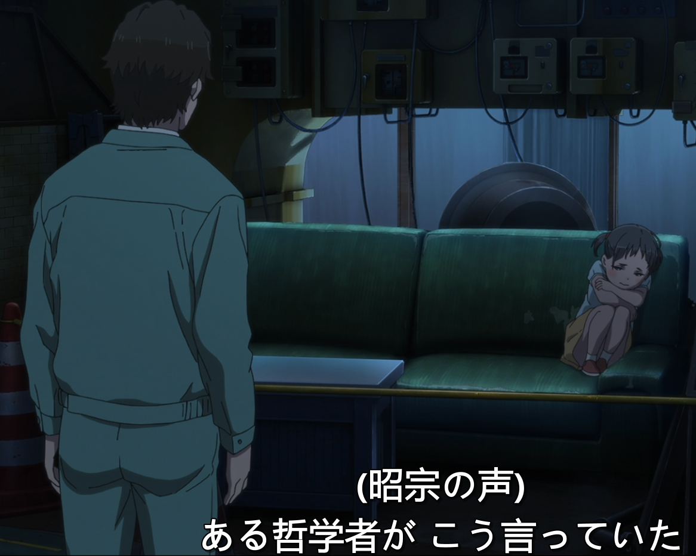
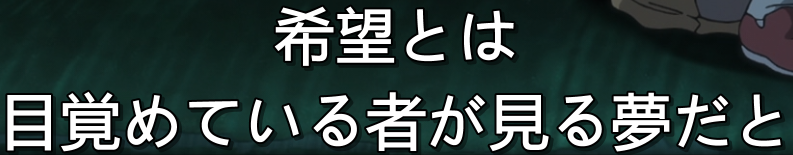

> "Hope is a waking dream" 

这句话如字面意思，强调希望的实现性，和这个动画的主题之一“改变”，相吻合。对说出这句话的父亲来说，便是这个出现的孙女。如果仅仅是这样一句简单的引用，把亚里士多德作为标题是否有些过了？还有更多的亚里士多德的思想值得说明吗？ -->

尽管这和我的思考顺序不一致，但对于讲述来说，我想节省字数，直接给出我关于睦実的结论：
- 睦実非常爱五実，在养育过程中形成了如母亲对女儿般的爱。
- 睦実对男主没感觉。
  
接下来将逐一分析各个情节，支持论证以上结论。
----
【00:43:29】

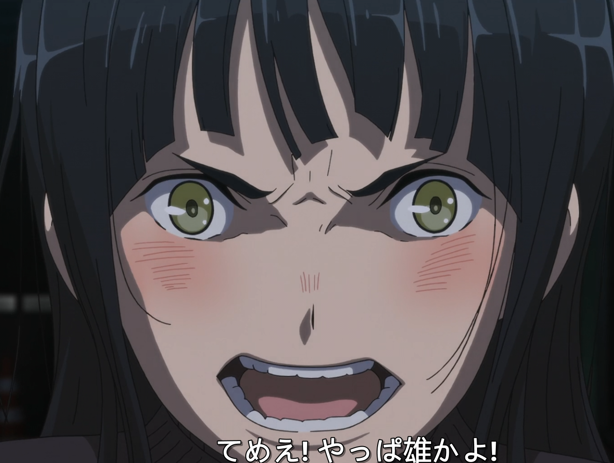

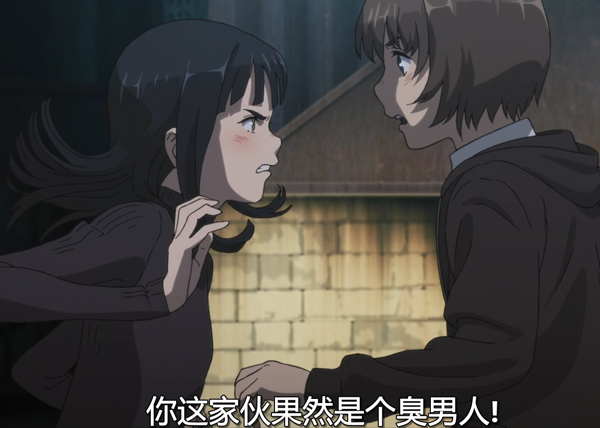

她为什么这么生气？看这表情，动作，听这段配音，生气程度超乎想象的强烈。如果是吃醋男主和其他女生互动，是这种表现吗？如果她不在乎五実，可能这么激烈吗？

这是母亲保护女儿被男人骚扰的声嘶力竭的呐喊，像一只保护孩子的狼妈妈。

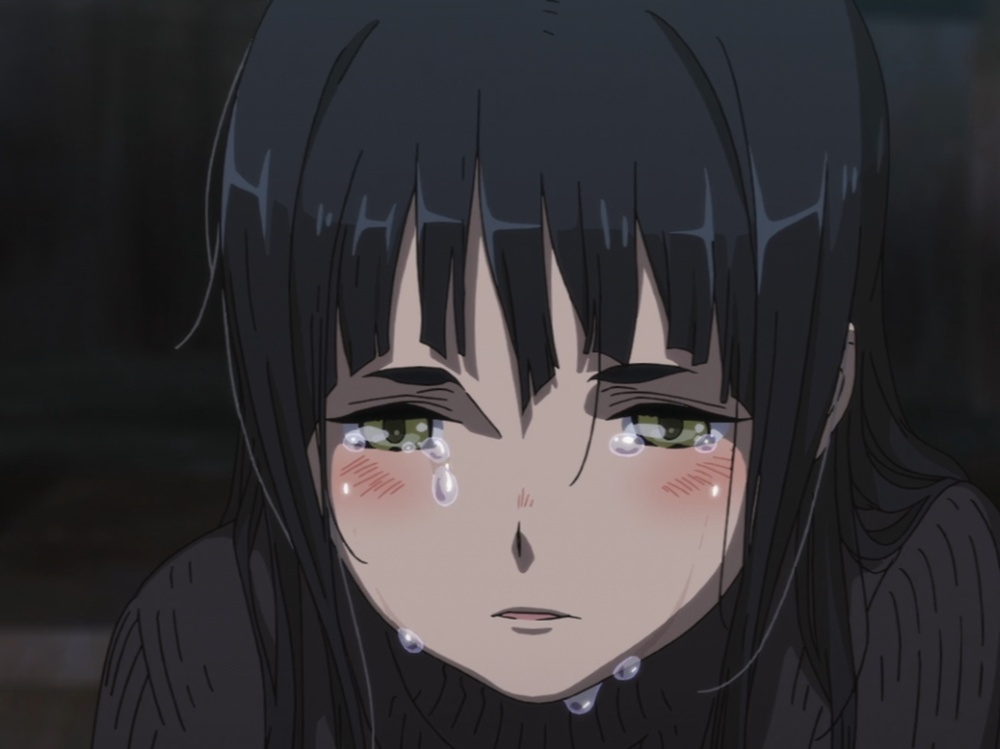

之后男主推开睦実，男主问为什么你在哭？这也是问男性观众，为什么她哭？可能你会想到男主和五実亲热让睦実伤心，可能是被推倒了哭。但仅仅推一下会让刚才那么凶神恶煞的人哭吗？那不站起来再打一架啊。

这是看到自己辛苦养的孩子，随便跟臭男人亲热，还被臭男人起名字，被夺走“我”的孩子的伤心啊。

----

【18:48】

睦実的名字：
> 仲睦（むつ）まじいに現実（み）

但是睦実故意撒谎说是“六の罪”。后面接着这段不知是睦実的自白还是男主的想象的话。

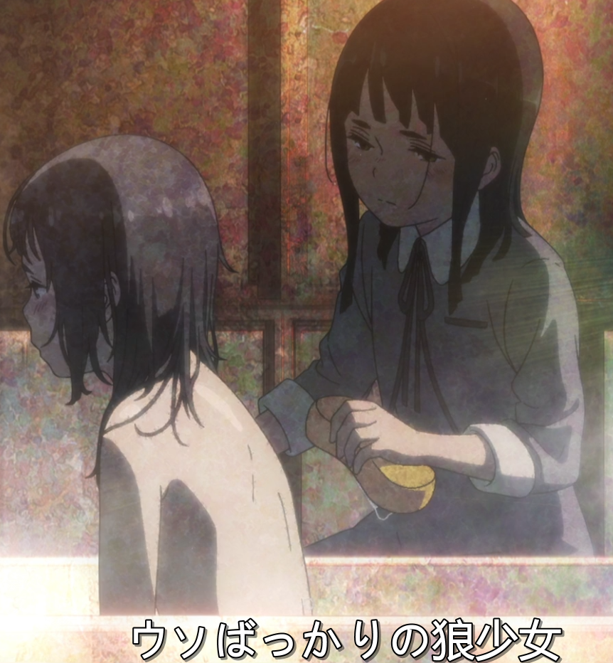

满嘴谎言的狼少女，可见她的谎言不止有这一个，可能还有其他内容。中文翻译为：

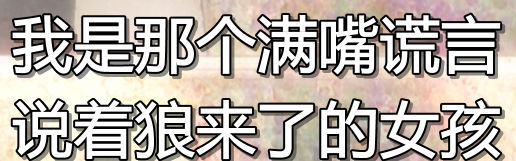

感觉翻译是在尽力想了，但好像狼少女就是“被狼养大的少女”，不会双关到放羊的小孩的寓言吧？英文翻译好像更贴近。

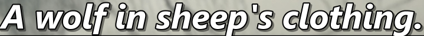

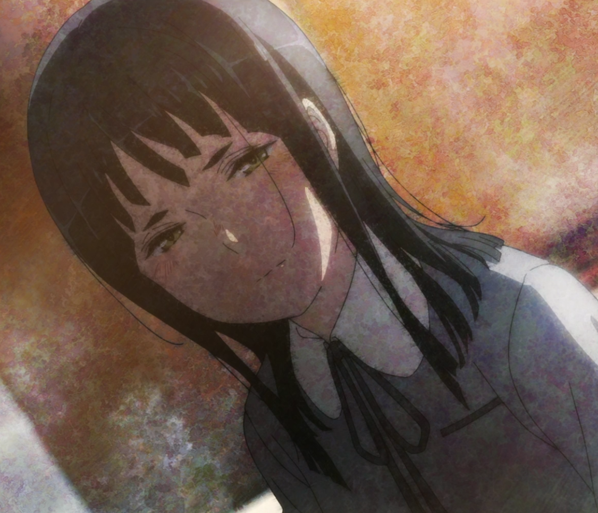

我会认为这里的“狼少女”更像是养着少女的狼，护着女儿的狼。从这个角度解释，原来狼孩的故事就不一样了，凭什么狼养大的孩子要回人类社会（男性视角）呀？谁考虑过狼的想法（女性视角）吗？（有点类似幽灵公主的山犬，好家伙你一个小伙子过来说句话就把我辛苦养的女儿带走？）

----

【00:58:20】

从这里起剧情变得快了起来，两人看到现实中二人坐在一起的场景。才知道睦実早就看到少女带的全家福照片，知道了三人现实里的关系。（观众完全知道应该是在男主爸爸日记那里）所以女主从很早起开始观察男主是因为这件事。

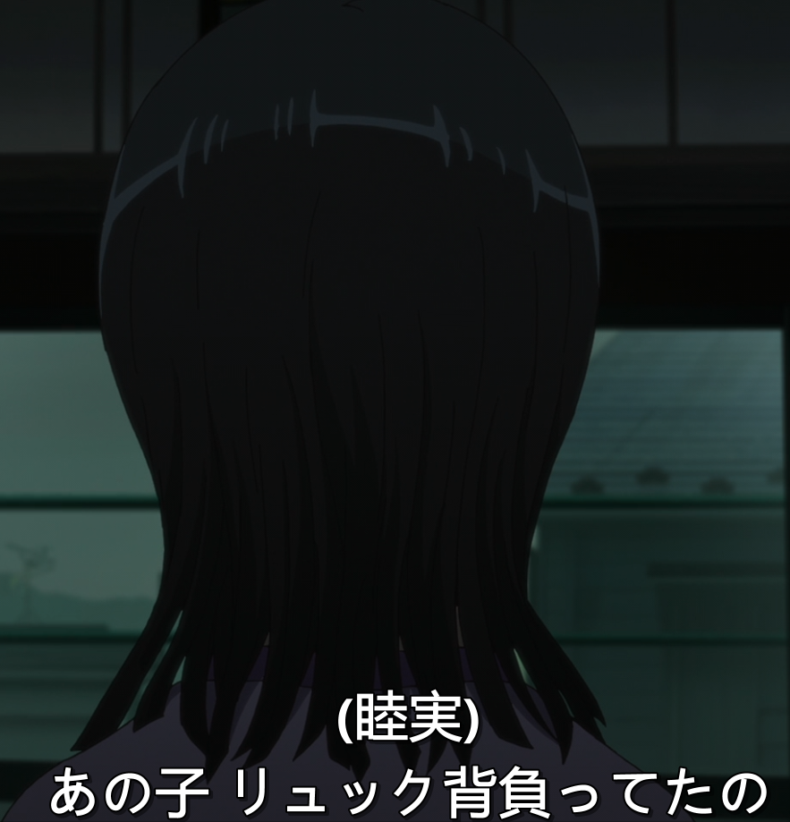

----

【01:03:20】

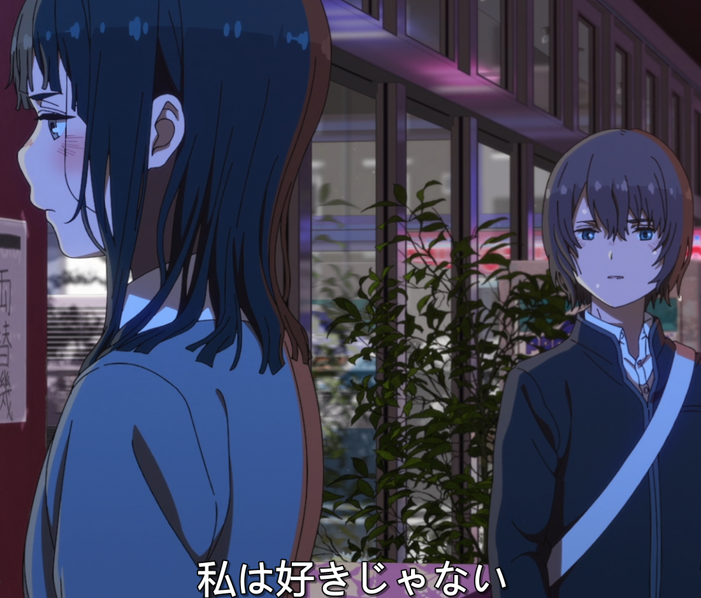


男主告白，睦実超级平静地说出了“不喜欢你”。影视习惯让我下意识觉得睦実是有什么难言之隐，但仔细想想如果这么平静认真的回复不是真心话，什么样才是真心话？当然人会变的，让我们再给男主一些机会。

后来的对话，睦実说自己在这个幻影世界里像没有活着一样，做什么都没意义。补全这层逻辑，可能正是如果她和男主像现实一样恋爱，但没有现实里的未来，这点会让她恶心。后来又说了一次不喜欢，但男主不放弃，大声呼唤爱，至少让女主确认了他喜欢她。

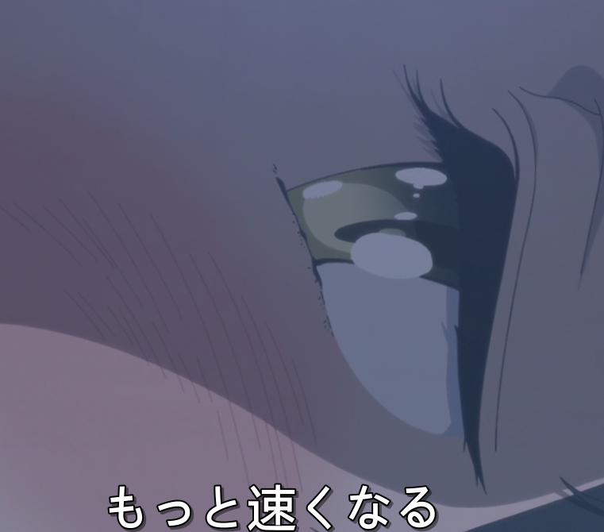

为了刺激，为了心跳，体验活着的感觉，还是亲了，所以，她到底喜欢男主吗？这里承认非常勉强。但确实睦実亲的很爽，我认为这一场景是睦実作为“女人”禁受不住诱惑的表现，恰好这一幕被五実看到，威胁到“母亲”角色，也是现实中常见的两种角色的抵触，或者用心理学上恋父恋母情结的那种说法，恰好在此刻发生。

【01:10:49】

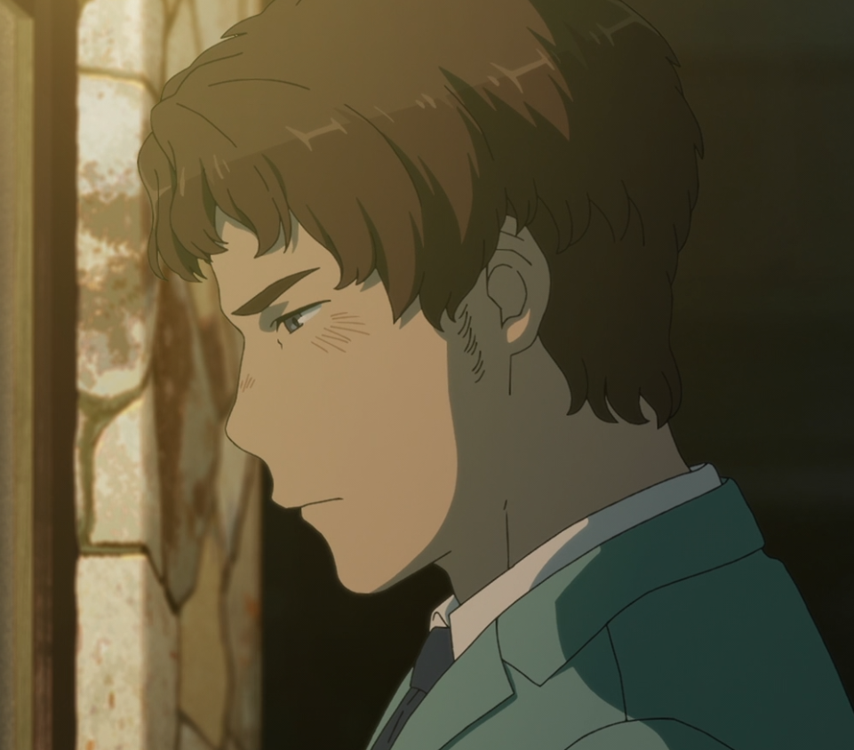

找到父亲日记本这段情节的分镜暗示了本子之前一直被弟弟藏了起来，这时候才给家人。这个弟弟角色也是对男主母亲作为“母亲”角色的挑战，而母亲坚持了这一角色的优先性，算是睦実的一个对照。突然想到，冈田的「あの空」天空之蓝也有类似的主题，体现女性作为母亲角色的牺牲。

----

【01:21:32】

面对婚纱女儿，情不自禁说了句漂亮，仿佛作为母亲嫁出女儿的由衷表达。这里婚纱设定没什么必要，我觉得仅仅是一种演出吧，呼应女儿结婚的时候和父母离别。

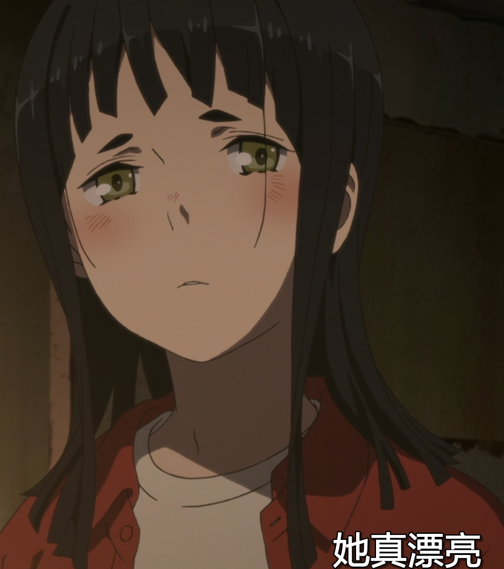

----

【01:24:45】

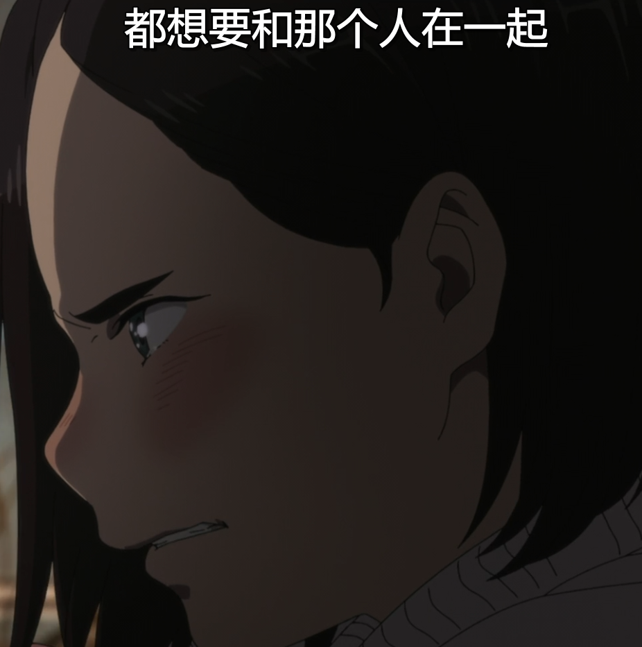

> 什么是爱，是不管今天还是明天，即使变成老太太，也想和他在一起。

感觉这里有什么铺垫的意味，但我没想出来。

----

【01:26:32】

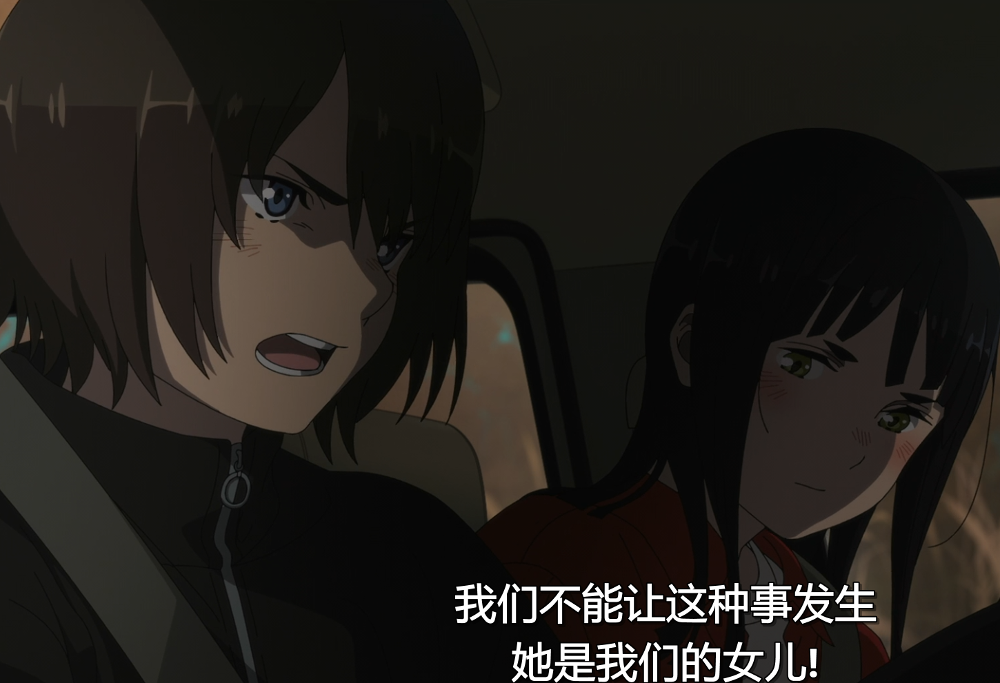

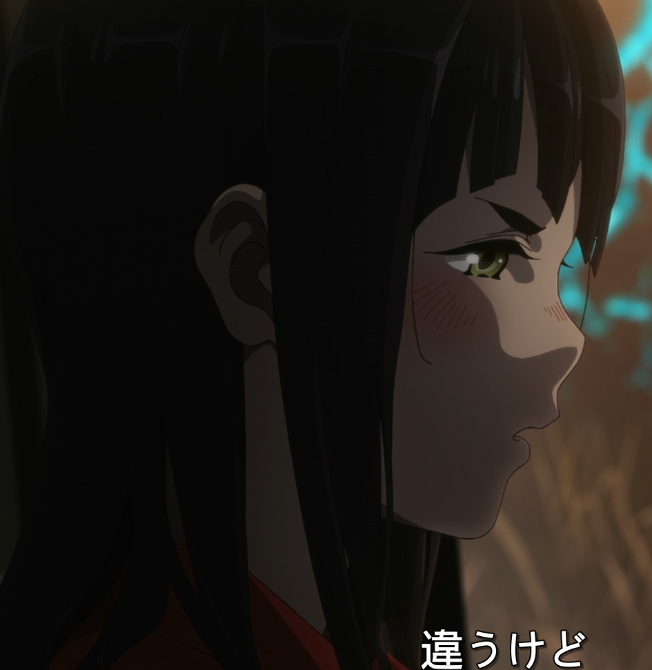

这种紧要关头，还特地说不对，她不是我们的女儿。可能多数人会理解为睦実在说她是现实里父母的孩子，而不是幻影里他们的女儿。

可能有这层意思，但我觉得她想说不是"我们的女儿"而是"我的女儿"。

----

【01:32:51】

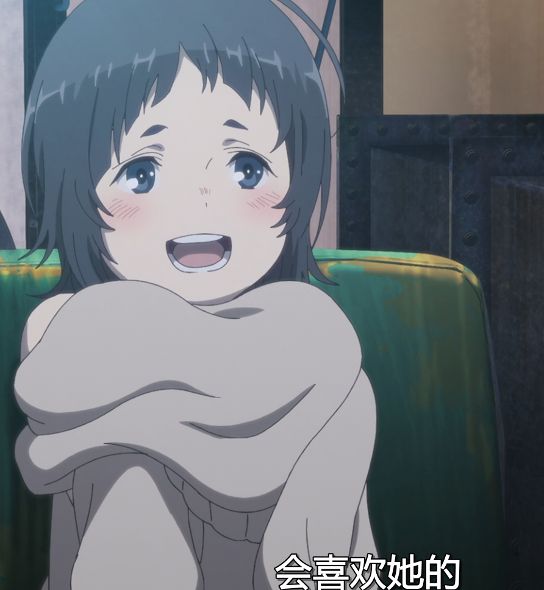

这段闪现展示了从那么小养到这么大的过程，如「あの空」一样，一笔带过。由于是睦実的第一人称自白，应该能确定她如母亲般爱着五実，养出了感情。她起初刻意保持距离，可能是知晓现实中三人的关系，自己又不喜欢男主，如此觉得恶心，控制自己不该产生情感。但最后她失败了。

----
【01:33:40】

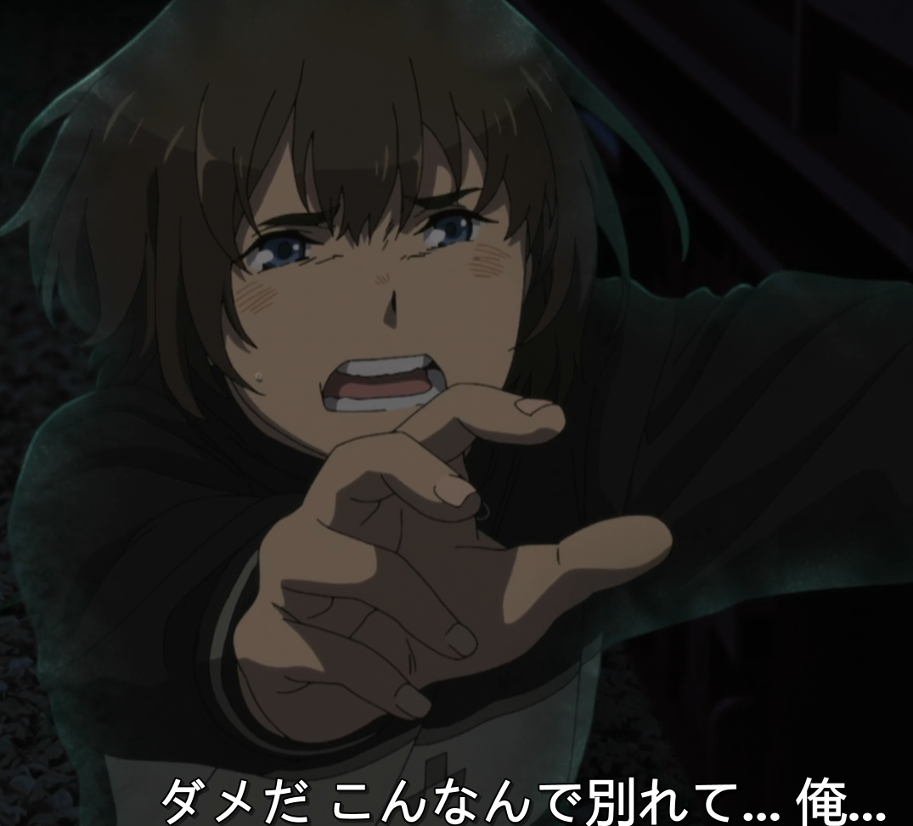

掰手情节恐怕是观众违和感最强的一段，追车过程中连一个睦実的表情描写都没有，描写的尽是男主的破防。仿佛睦実就静静地在那里掰手，显得十分无情。而且，如果认为睦実喜欢男主，这段睦実白白送死的剧情也解释不通。所以我更偏向于认为睦実根本不在乎男主。

后来这段睦実对五実羡慕的叙述也是印证，男主并没有解除睦実觉得没有真正活着的心结，她还是渴望着真实世界。

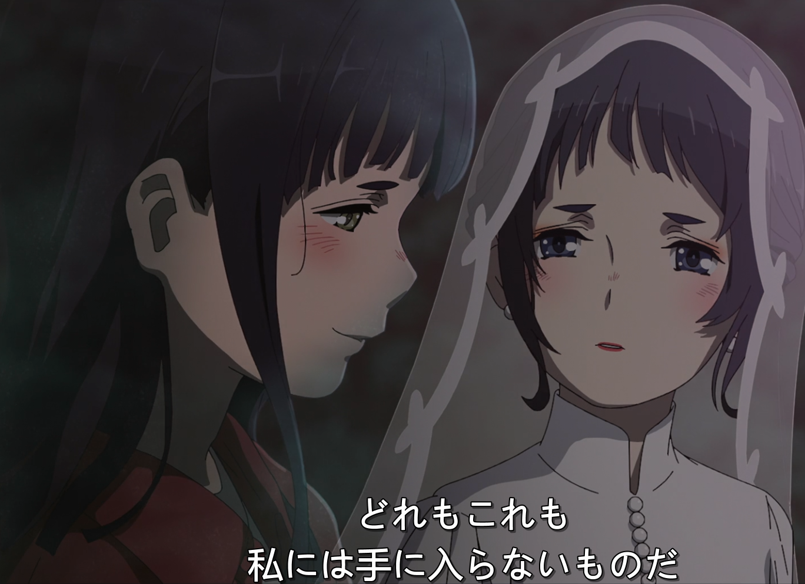

但令人疑惑的是睦実转而刺激五実，说你有那么多东西，至少给我一个，那就是男主的心，并说出了“他喜欢我，我也喜欢他”的话。

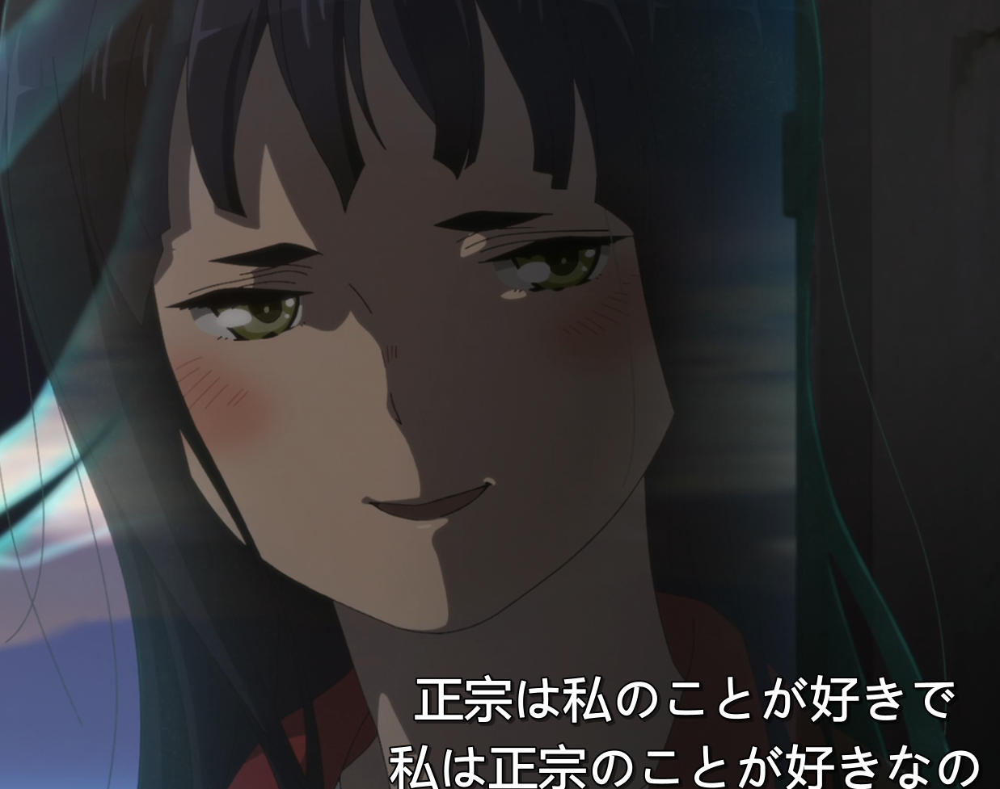

我倾向于认为这里睦実说的“我喜欢正宗”是假话，她想表达的只有“正宗喜欢我”，她的目的只是为了刺激五実，让五実彻底放弃，欺负无知小朋友。瞧瞧她这眼神，真坏。（或许真的嫉妒五実，嫉妒到想使坏的地步）

可是之前睦実说情不自禁地喜欢上了五実，为什么要这样故意刺激五実呢？

倘若五実老是惦记着男主，对她的未来不好。所以说假话刺激她是想让她彻底放弃，面向未来。也可以更加腹黑点理解，（正宗那货我都看不上，你也别老想着她，你的未来里有更配的上的人）

这时，听到五実说最讨厌了，睦実一定又痛苦又开心，自己深沉的爱不被理解，但又知晓女儿会成功割舍，面向未来。

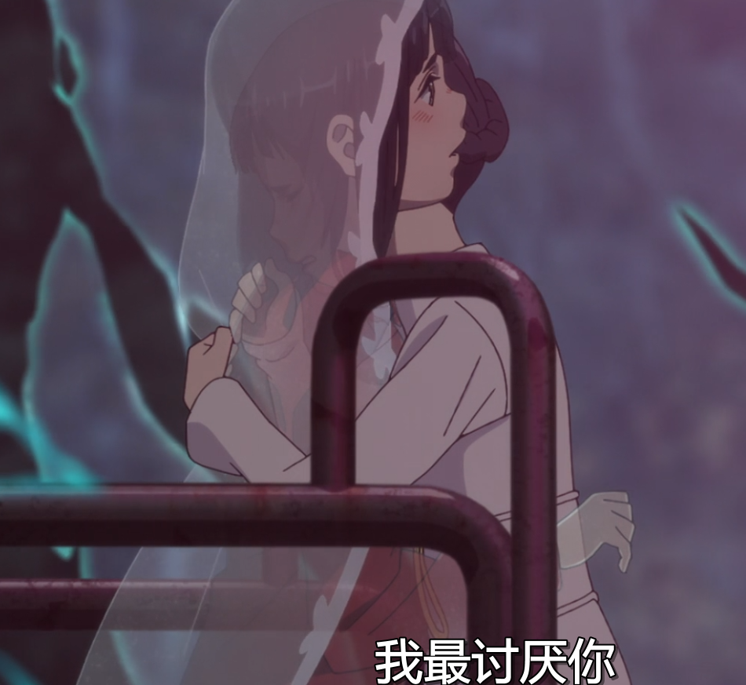

五実把婚纱披给睦実，象征认输，也象征母亲角色的睦実完成了角色使命后又成为了自由的女人。

----

【01:38:26】

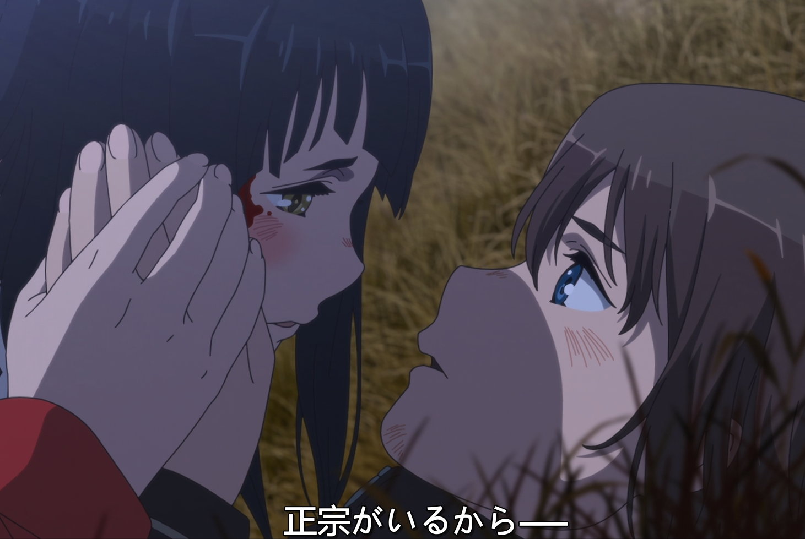

```
真的好疼！因为正宗你在这里，我的细胞告诉我，我还活着，我不在乎世界是否在今天终结，不管我们还剩下多少时间，现在我，活着！
```

跳列车后的这段话是表白吗？难道她真的喜欢他或者说变得喜欢他了？不是不行，从接吻开始就喜欢上，然后因为母亲职责遏制住，到现在又重新释放，似乎能讲通。但是不是太轻浮了？毕竟在追列车时根本不理他，内心还老是跟他抢女儿。所以，我个人持最多是炮友的程度。活着更腹黑的想象，可以这么理解：
- 真的好疼！（跟女儿分别好难过，）因为正宗你（跟我抢女儿，给了我刺激），我的细胞告诉我，我还活着，我不在乎世界是否在今天终结（我不在乎和你接下来的日子），不管我们还剩下多少时间（没女儿都无所谓了），现在我，活着！（现在，我知道女儿幸福了！）

接下来这个镜头也很违和

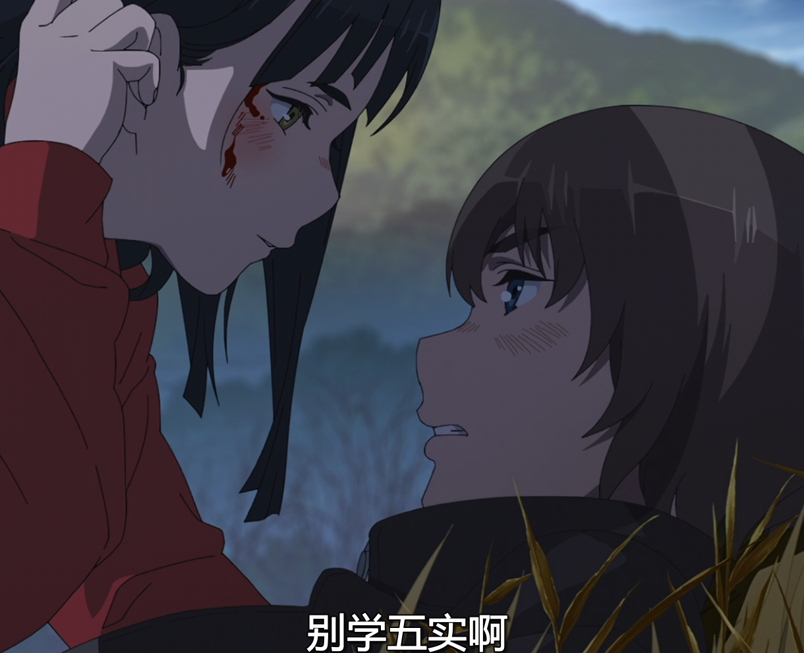

仔细观察，男主说别学五実后，睦実失落了一声，立马躺开，还叹了口气，闭眼。我的天，哪个导演会指导这样的情绪来表现大团圆？！

我的腹黑解释是，睦実听到女儿名字后有点不爽，人都走了你还说，还不让我学。有一种刚变回女人，却又被提醒是母亲的不爽感。

----

【01:44:40】

最后玻璃上的画是女孩与母亲，是这部动画的核心人物。而男主或是现实里的丈夫，都只是画画的人，叙述这两人故事的一个视角，至于通过这个视角理解了多少，就要靠自己了。常常练习，画画也会进步。

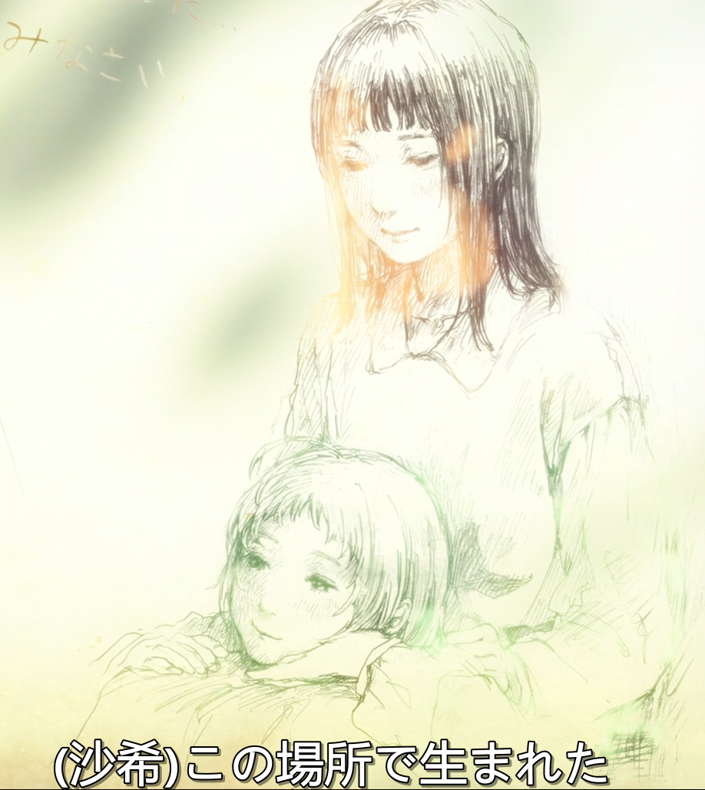

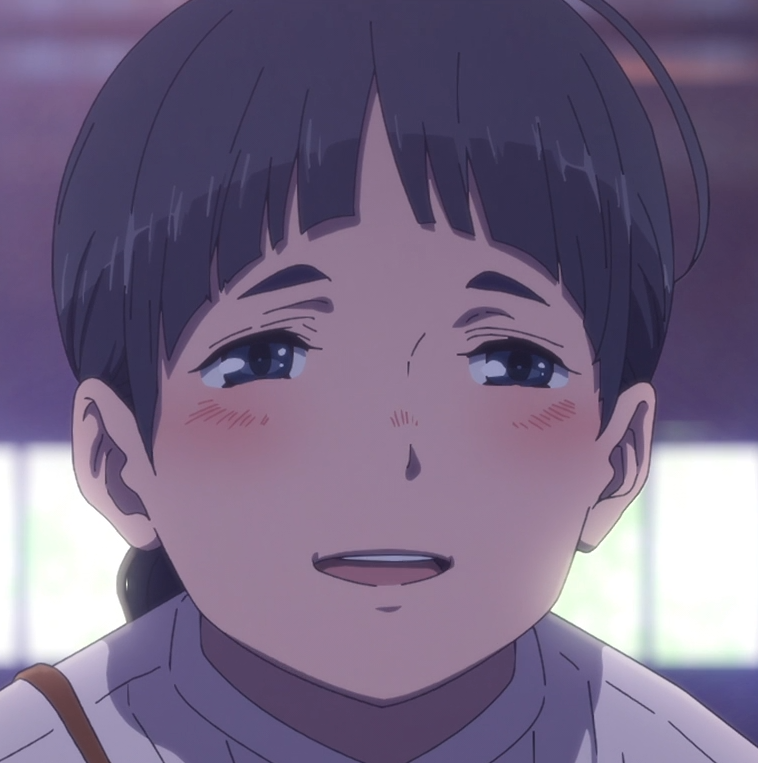
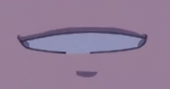
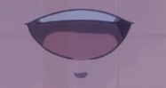

通过唇语，我觉得大概率是男主给他起的名字五実「いつみ」。所以这里连起来是
> 「この場所で生まれた、（いつみ）、私の初めての失恋」

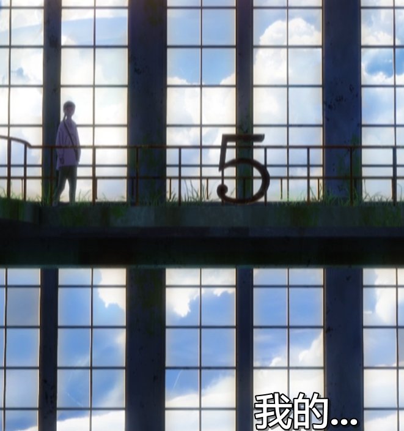

可以注意到镜头里也有一个「５」。

----

不得不说这个动画在叙述上有故意隐瞒的手法，多处让睦実的话断掉，轻描淡写地闪现几个睦実养女儿的场景。不过说来，男主确实没见过好几年养女儿的场景，在元层次的意义上符合你下班回家看到老婆女儿的真实信息密度分布。如果你对老婆处处违和感的表现和话语视而不见，是无法知晓她真实想法的，正如面对这部动画时，男性观众觉得睦実一处两处不理解，可能是制作失误，但如果全片都充满不理解，还用“没有逻辑”总结的话，就无法知晓睦実的真实想法。

以上我从睦実行为违和感的角度分析，试图找到一个隐藏的行为动机，使得她的所有行为融贯。更多涉及母亲和男性视角的主题。其他内容我就不说了。