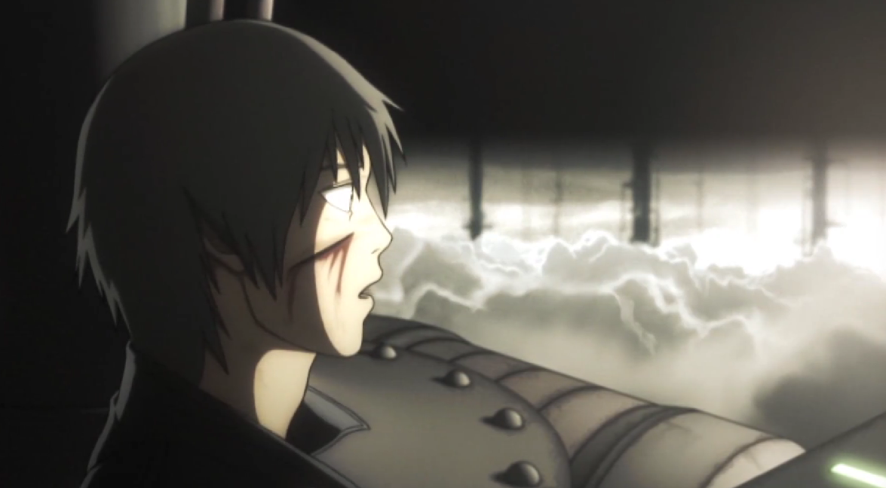
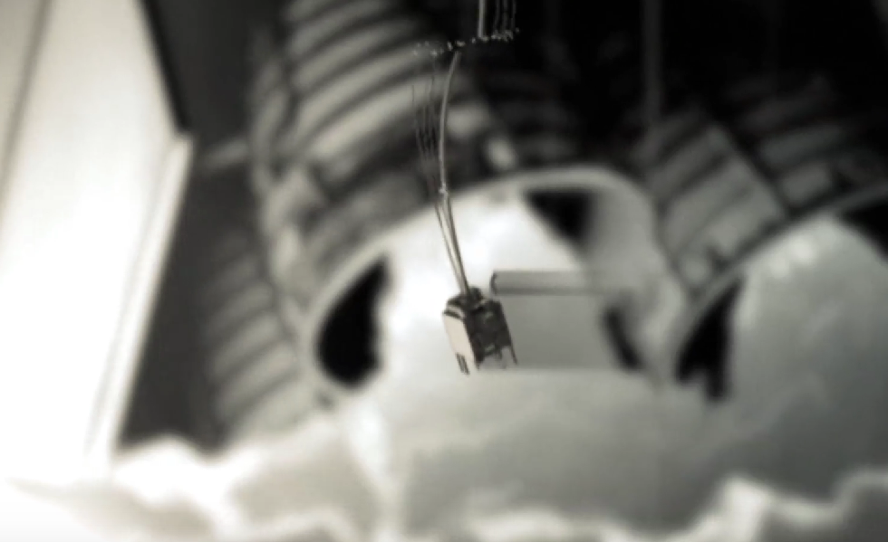

# 『ペイル・コクーン」 - レビュー

遠い昔見たアニメOVAです、今再び見よ。『サカサマのパテマ』『アルモニ』の作者吉浦康裕の作品。私は結構最近この作者知りました、自分見たＳＦアニメいくつが彼のものです。

03:38 09:11は何？色な海賊版見ているが、どちらもそのDOTA2のSSのスキル音あるみたい。

`記録なんで最初から掘り起こされなかったよかったればよかったのよ。これ以上、人間の◯かさを見たい人はいない。`

えええええ、最後のシーン、男の子は登っだじゃなく降っだでしょう。そして月の裏に到着しました。そして、引力の方向かえだ、彼は転んだ。多分そうと思う。以前この方向性はよくわかなっかた。

この作品はとっても美学感じました。カメラの動く方は広い空間感表示しました。クラマクスの歌と降っだ速さは観客の感情をクラマクスにしました。すごいSFアニメだ。