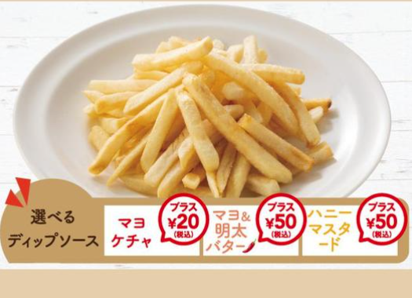

看日本网友说，取景地是ガスト橋良店。因为ガスト是日本最大的家庭餐馆连锁店，餐单都是一样的，我看到其中的内容很熟悉。对这些布景和食物的注意超过了剧情。

> 

> 
 
桌子上的圆筒是用来插单票的，后面右侧有一瓶酱油，酱油左边是呼叫店员的按钮。左侧黄色垒起来的盒子是装餐具的。红色的菜单画的比实际更像书的感觉，实际上是塑料。右侧白色的是餐巾纸。菜单前面黑色的是电子点餐的pad。

> 

玫瑰果茶(ローズヒップティー) 好像是畅饮区袋装的茶，没认真看过。

> 

这些饮料是200多日元畅饮区的东西，如果进店只喝水，不要钱，和其他的家庭餐馆做法一样。打工想喝水可以出来接水喝，饮料也可以，个人比较喜欢喝蔬菜汁，虽然肯定是兑了水了，但其他的饮料要么是碳酸，要么有明显的冲兑感。

> 

这个大份薯条(山盛りポテト)点了两个酱，左边白色+粉色是蛋黄酱和明太酪（マヨ＆明太バター），右边是白色+黄色是蛋黄酱和蜂蜜芥末酱（マヨ＆ハニーマスタード），但从女主的台词来听，以及我的实操经验来说，菜单上应该没有蛋黄酱和蜂蜜芥末酱配在一起的点单，怀疑是不是作画失误了，右边应该是仅有黄色，是单独的一个蜂蜜芥末酱。

> 

说起来我炸薯条的时候ちょいポテト，山盛りポテト总是多给，被同事说了好几次哈哈。炸薯条，最快出餐时间4分钟。

> 

这里女主点了一个西瓜松饼，我现在做，没有这个菜，只有单独烤松饼，在平锅里倒上蛋黄什么的液烤出来的东西。动画里的也许是以前部分地方有的菜品。

> 

收据上写的是「1コ」，但我工作的地方现在写的是「1点」。

汉堡set，不知道是哪个汉堡，一般会直接写出来。从价格看可能是下面这些：

> 

她还点了一份烤肉set，ステーキセット，我现在看不到这个名字的单号，可能是某个时期的set，推测是整块的牛排（サーロイン）或者是小块的牛排（カットステーキ），配个小吃，米饭或者饮料的set吧。

> 

汤（スープ）应该是味噌。沙拉（サラダ）是之前男主说的是涮猪肉莎拉乌冬面（豚しゃぶサラダうどん），可能是以前的菜单，现在没有了。

> 

第二集里柠檬点了红豆圣代（あんこサンデー）

> 

我平时负责油炸和铁板，不负责莎拉和甜品，对这些不太熟悉。

工作体验是，真的很累，我在厨房工作，基本一个人做除去甜点莎拉乌冬的60%的单号，忙碌的时候可能同时来十几个单号，需要同时煎好几个汉堡，好几个鸡排。计算数量，灵活调度，甚至要提前预判。没有了食材，还要现场从冰冻室取出来解冻，整理，没了铁板，还要去洗碗处搬。周六周天不可能有闲的时候。可能是因为人手不足，偶尔还只安排两个人在厨房应对用餐高峰。刚工作时被片假名整的很痛苦，现在我做熟了，效率可以了，店长笑着想给我延长工作时间，一次打工5小时，体验了一次，要死了，希望以后最多4小时。好处是，这个店只有我一个外国人，其他打工的有很多美少女，虽说不怎么说话，但看她们闲的时候吃我炸多的薯条，我感觉很治愈。

