# 对他人解读的转述总结和自己的讨论（逐渐更新中，欢迎讨论）：

## 本层信息来源的频道 [進撃のススメー!! 考察チャンネル](https://www.youtube.com/@susume--kousatu)

### [尤米尔、艾伦等的愿望是什么 - 观点来自于【進撃の巨人考察】エレンに理解できてジークに理解できなかったユミルの気持ち、から分かる「エレンの気持ち」。「モテとは何か」ジークの気持ちとリヴァイの気持ち。](https://www.youtube.com/watch?v=7xU6_TBH4Zo)：

【137话】【终part2. 00:32:34】：吉克：能确定她确实有一些留恋，那是艾伦能理解，而我无法理解的事。

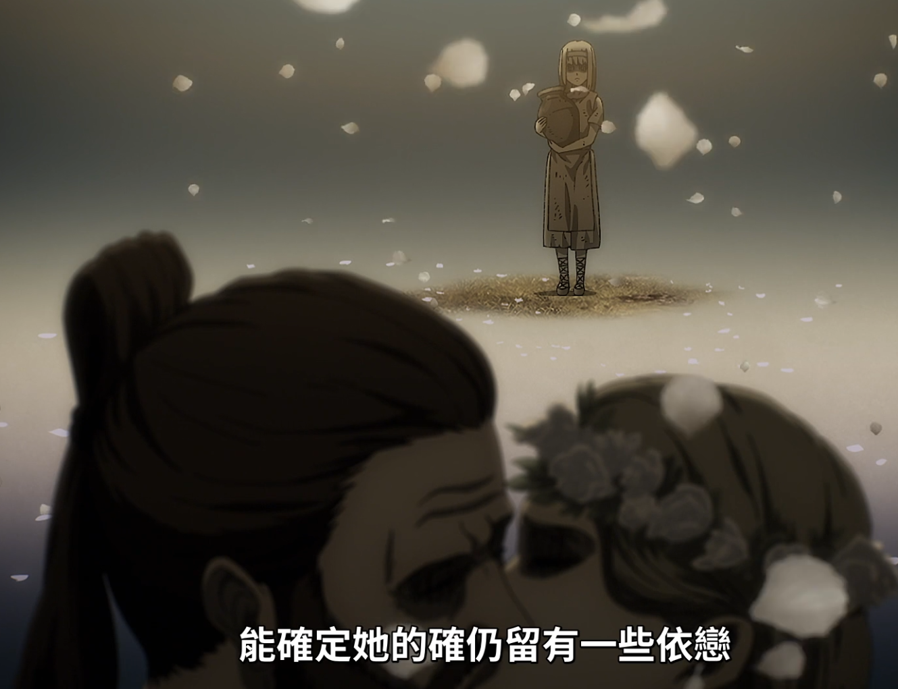

通过图中可知道尤米尔的未練（留恋）是（和弗利茨王）结婚。由于艾伦以往对米卡莎对自己的心意都很迟钝，而这里又说艾伦能理解尤米尔的留恋，只能得出是艾伦某个自己对他人的情感和尤米尔共鸣，那便是
`艾伦想和米卡莎结婚`。

侧面辅证：莱纳和艾伦呈现为里表一对的主人公，而莱纳也对希斯特里亚有一句很冒失的台词:

【x】“想要结婚”。

牵强辅证：【ep64. 19:00】“我也和你一样”这也能应证艾伦想和米卡莎结婚的观点。

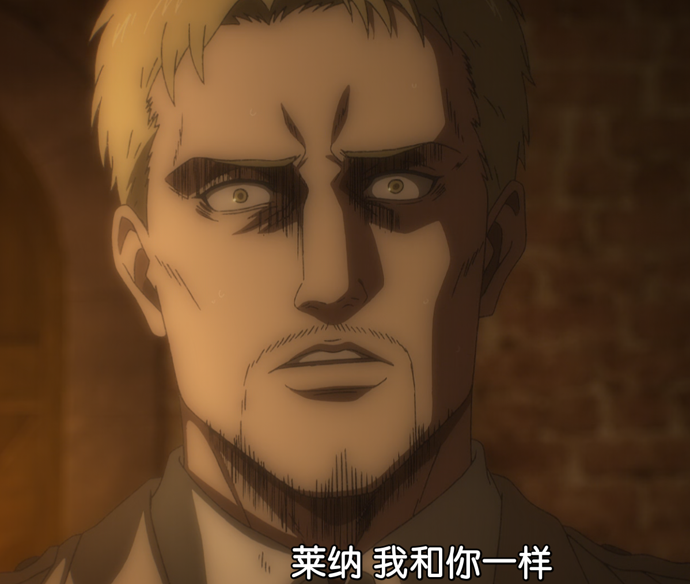

同时也能推断出，吉克虽然能看出别人的恋情，但自己没有恋爱过，所以才能理性地选择安乐死计划。当然本视频还对比了吉克和李维的对话，认为吉克的“モテ”没有包含感情，进一步体现了吉克缺少恋爱的经验。

### [授勋式上艾伦看到了什么 - 观点来自于【進撃の巨人考察】授与式でエレンは未来の記憶を見ていない。「見ていないエレン」と「見ているエレン」。エレン全知全能を検証するシリーズ②の補足。](https://www.youtube.com/watch?v=1PhN6hRXtAg)：

【ep59.14:25】授勋式

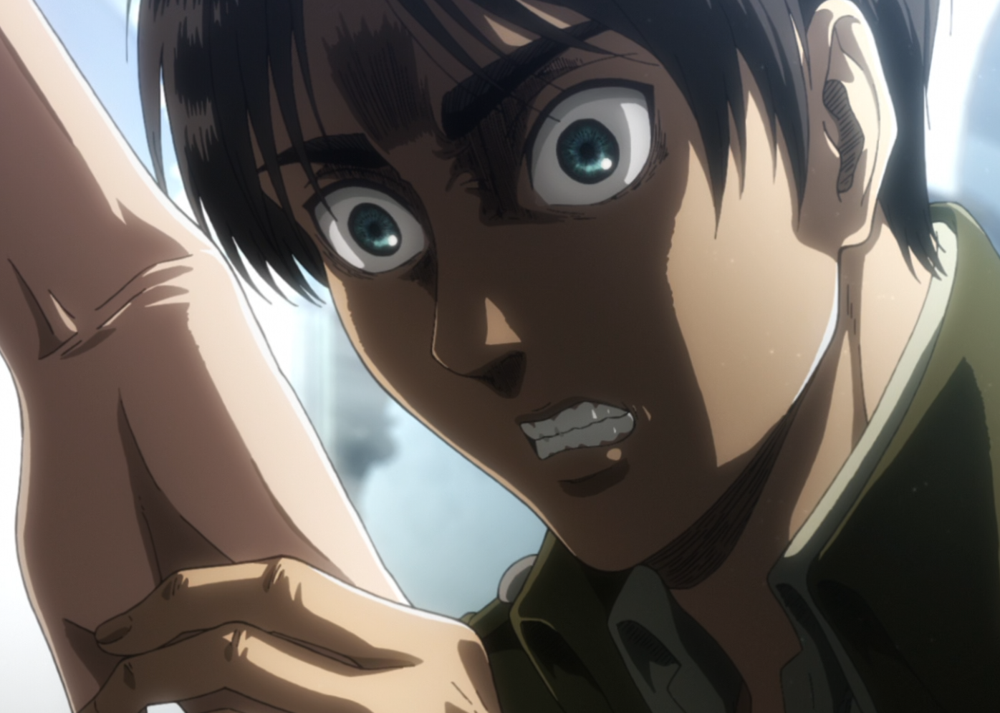

在授勋式上，艾伦是否看到了故事的结局（巨人之力消失，尤米尔释然）？

【终part2. 01:00:28】和阿尔敏的对话

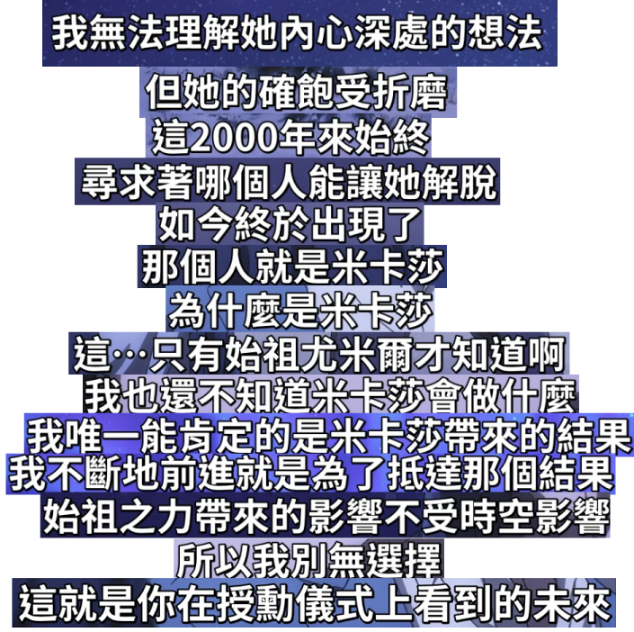

对比这里，可以得知`艾伦确实在授勋式上看到了整个结局`。

【108话】【ep69. 17:55】艾伦商讨进击的巨人继承问题……你说的话矛盾了

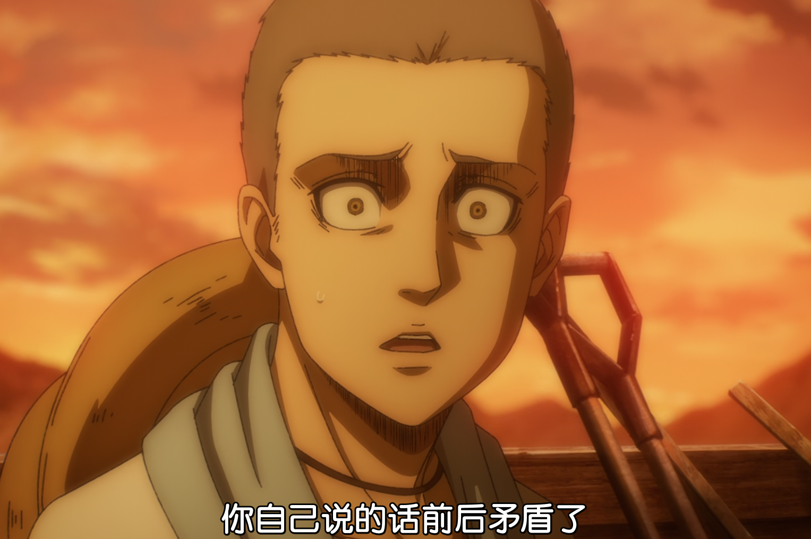

如果在授勋式上看到了整个结局，艾伦就不会讨论进击的巨人继承问题。这里柯尼和莎夏有段无厘头的对话，“矛盾”的用词也有些唐突，如果这是作者刻意为之，实际上指的是`艾伦如果看到巨人消失的未来还讨论继承问题两者是矛盾的`。关于“矛盾”一词，在埃尔文爸爸的台词中也有出现。

【x】埃尔文爸爸的台词

我们能看出，也许《进击的巨人》这个作品也像王控制墙里的人一样，控制着我们观众的记忆，想要发现真相，我们就要像埃尔文爸爸一样，从剧情中寻找矛盾的地方。矛盾的地方用平行世界解释？

### [动画结局部分的时间线 -观点来源于【進撃の巨人考察】未来は確定済み？いいえ。過去も未来も、あなたの目の前で変化しています。【改訂版】「山小屋ルートは100％パラレル」シリーズ・エレン＝全知全能を検証する②](https://www.youtube.com/watch?v=FqV_8zIdjQc&t=1s)：

首先弄清一个本剧的核心设定： **巨人之力无法“看”到阿卡曼人也无法操纵阿卡曼人记忆。** 在“看”方面，证据是：

【终part2. 01:00:28】和阿尔敏的对话

艾伦说看不到米卡莎会做什么，自然指看不到米卡莎把自己砍死这一场景。同时艾伦看到了，因为米卡莎做了什么，导致了巨人之力消失、尤米尔解脱，从剧情需要角度考虑，如果尤米尔能看到米卡莎，尤米尔也不需要在最后才解脱，尤米尔也许可以看到自己解脱，也不清楚自己为什么解脱，所以需要等待到那个时刻。综上，艾伦和尤米尔都无法“看”到米卡莎。

在控制方面:【】【ep47. 04:25】阿卡曼人无法消除记忆

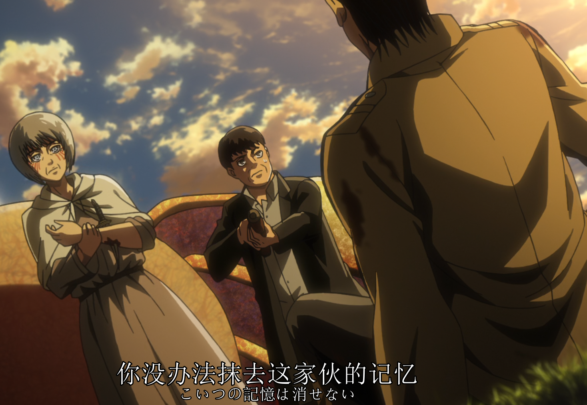

可以知晓阿卡曼人无法被消除记忆，这意味着在任何世界线上发生什么，那个世界线上的`米卡莎具有从始至终的同一性`，其行为动机必须被严格解释，这一点很重要。

最复杂的部分是`阿尔敏和艾伦的谈话`。

【终part1. 00:11:24】

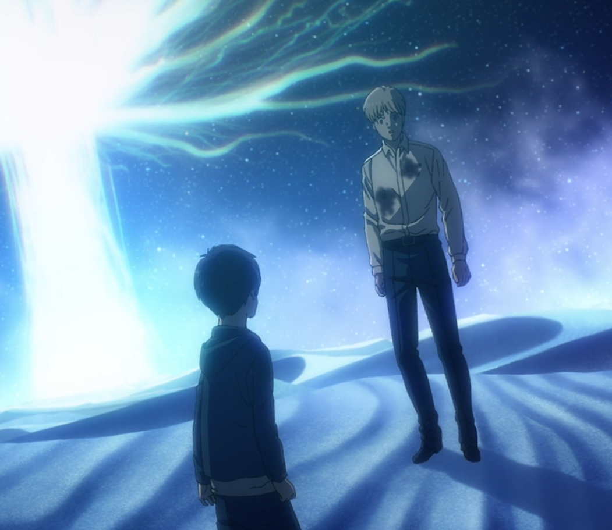

【终part1. 00:11:27】 and 【终part2. 01:08:49】

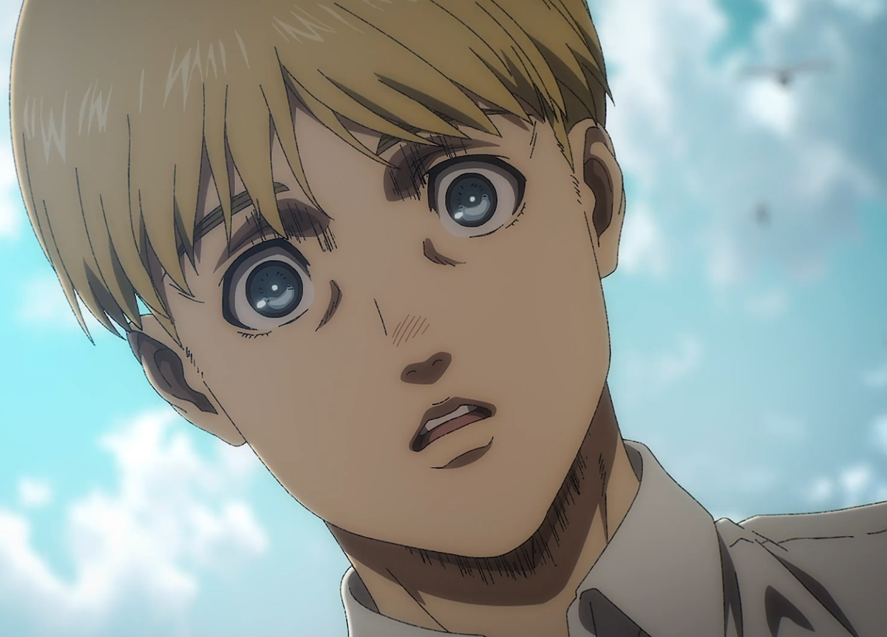

根据镜头提示，这段对话发生在阿尔敏在甲板上的时候。part1中只有艾伦发表“终于到达自由”的部分，可见确实删除了阿尔敏的记忆和观众的记忆。

关键的矛盾点在于：【终part2. 01:09:46】 阿尔敏和米卡莎的说法有矛盾

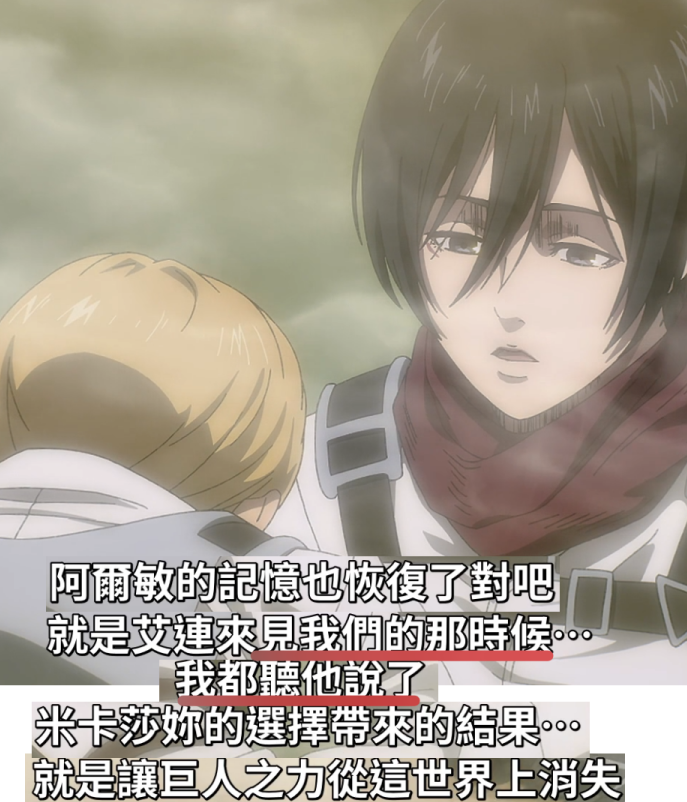

米卡莎明确地说艾伦来见我们的时候，那么这里阿尔敏想起来的事情就不是观众所看到的那次对话，不仅因为那是二人对话，还因为对话中艾伦并没有告诉阿尔敏最后的结果是什么，而阿尔敏这里却说想起来了结果是“巨人之力消失”。可以推测，在那次“艾伦来见我们时”，米卡莎不会被删除记忆，但阿尔敏记忆被削除了，并且这时候艾伦告诉了阿尔敏结果是“巨人之力消失”（甚至艾伦可能在这时告诉了米卡莎自己在巨人的口中）。

【终part2. 00:54:28】艾伦的在嘴巴里

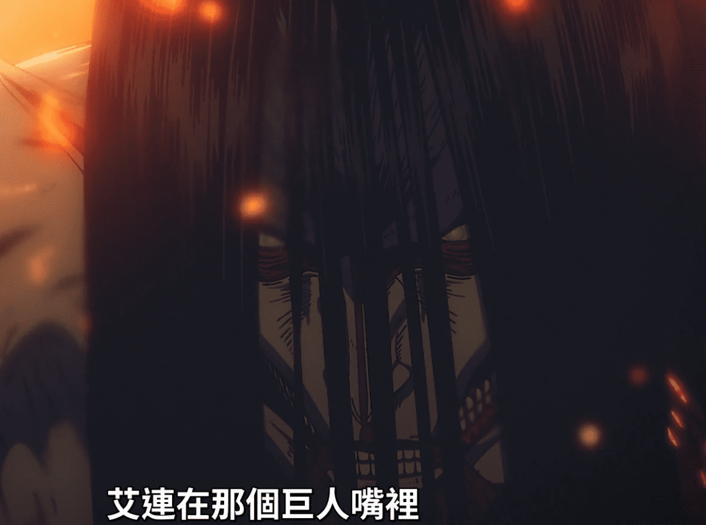

米卡莎直接知道艾伦在嘴巴里是很奇怪的，一定是艾伦告诉她的，尽管这里的镜头接着那个共度余生4年的世界，但认为在另一个世界告诉米卡莎然后这个世界的米卡莎也知道，会让米卡莎也有某种“神力”，这违背基本设定。所以我更倾向于认为这里两个世界的交叉叙事仅仅是一种镜头呼应，没有任何因果联系。那么，这个世界里，艾伦什么时候告诉米卡莎的呢？视频没说（我觉得可能是飞机上艾伦见所有人那次）。

另一方面，【】【终part2. 00:53:10】 逃亡

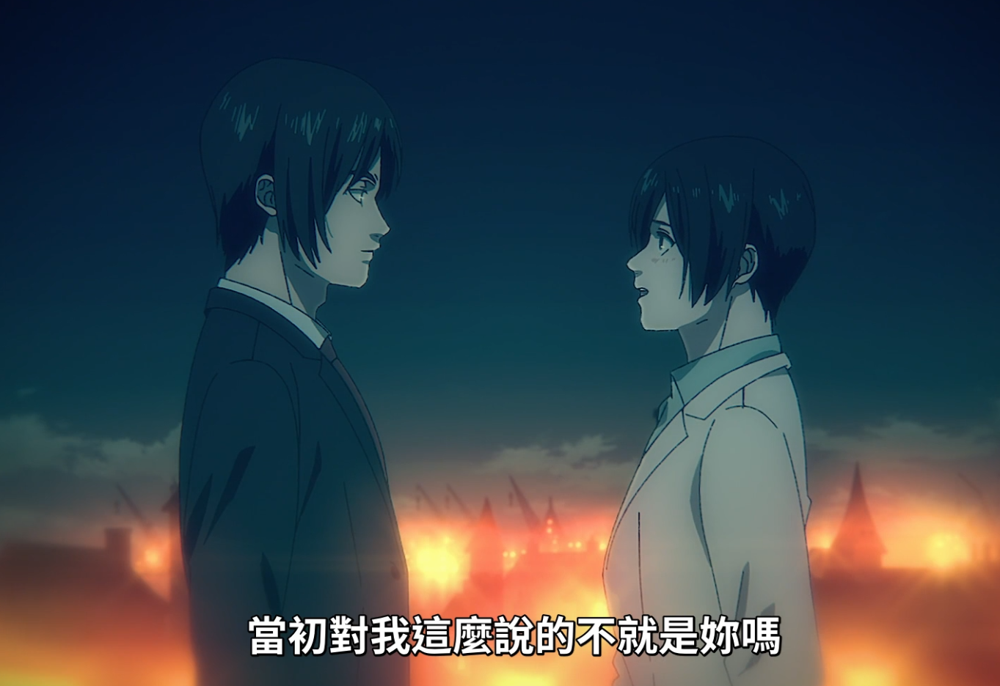

一定发生在“艾伦来看我们”之前，说明这个共度余生4年的世界和观众看到的巨人之力消失的世界是不同的世界，两者为平行关系。

再看阿尔敏的话语，“我都听他说了，米卡莎你选择带来的结果，就是让巨人之力消失”，可是在观众看到的和阿尔敏的对话中，艾伦并没有告诉阿尔敏结果是什么。这说明这一段和观众看到的阿尔敏和艾伦的对话并非发生在同一世界。这两者又是在不同的平行世界里。自然的疑问是，为什么要这样设计？一种解释是，为了演出效果。（防止剧透）艾伦和阿尔敏的谈话可以消除记忆，理应毫无避讳地全盘托出，告诉阿尔敏艾伦所有知道的结果，包括巨人之力消失，但倘若把这句话在对话中就说出来，观众就提前了10分钟得知这一点，似乎观看效果会差一点。所以叙事镜头把俩个平行世界的一部分各取出来放在一起。这个视频里把这种手法称为“自动填充”，仿佛是过去可以改变一般，但更好的解释应该是“我们之前看的是另一个艾伦没有选择的平行世界”，现实世界已经发生的不能改变。

根据视频观点我做了一个表现up主观点的示意图： [所认为的最后部分的时间线图](https://gitmind.com/app/docs/mrn855xb)。

我自己的观点稍有不同，我在视频下方和up主进行了讨论。up主也觉得我的说法有一定道理。我的观点的时间图：[我的观点的时间线图](https://gitmind.com/app/docs/mto84do9)。 

### 原创讨论1：“就是艾伦来见我们的那时候”到底指哪一次？
<!-- 
【】【终part1. 00:40:25】

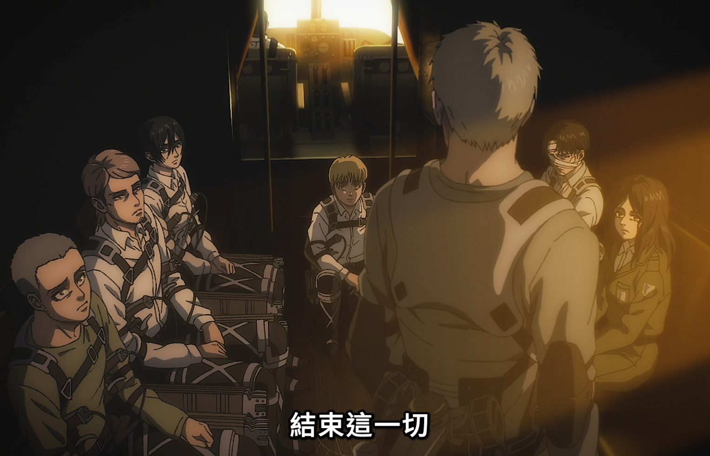

在这里莱纳说，希望谁来结束这一切，然后看向米卡莎，米卡莎“诶”了以下，然后几人被拽入道路世界。 -->

可能的备选答案：

1.像上面所认为的，可能作品里根本没有描写，所以在一个没有展示的平行世界里，这样在3个平行世界里，阿尔敏都和艾伦进行了一次对话。

2.【ep.80 21:09】

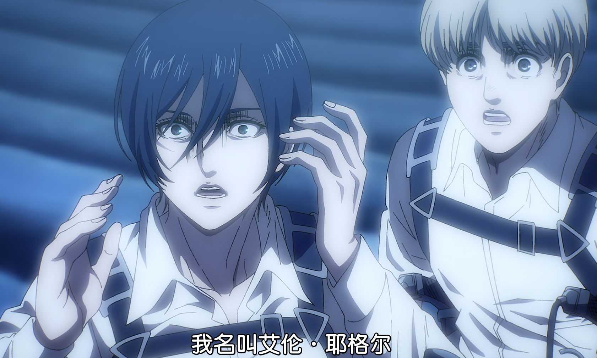

倘若认为可能是这个时候，那更可能是下面这个时候，因为更符合“来见我们”，几个关键人物比较合理。

3.【终part1. 00:40:29】

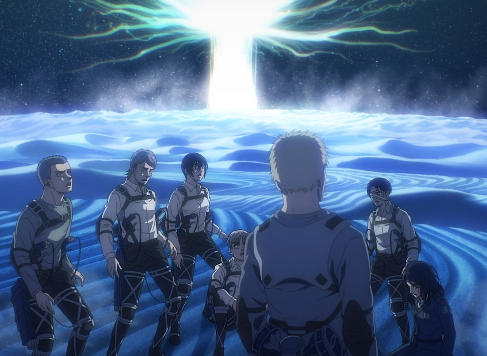

这个时候大家都在飞机上，站在一起，符合“我们”。并且这些人对应着终part2.中恢复记忆的人物，不止阿尔敏和米卡莎，所以这个时候对后面的呼应来说是个不错的时候。但这个解释也有缺陷，这里阿尔敏也在场，加上之前那次接甲板场景的阿尔敏的对话，艾伦和阿尔敏进行了2次对话，这看上去十分没必要。换一种说法，如果“来见我们”发生在这里，那么和阿尔敏的对话完直接接着飞机场景里不就好了吗？为什么要接甲板的场景？还是要用不剧透观众的理由吗？可是这就必须要和阿尔敏对话两次，这会显得略微不自然。设想一种不自然中尽量自然的场景：沙子上，艾伦站在他们中央说：“ **我之前和阿尔敏谈过了，现在再和你们谈一遍，我看到了最后结果，那就是巨人之力消失了，尤米尔也消失了，你们都能活的久一点了，科尼你的妈妈也会变回来……米卡莎，我看不见你做了什么，但是，我觉得我应该告诉你，我在巨人的口中。** ”

补丁：认为“来见我们的时候”指飞机上那次有巨大问题：因为皮克没有被训话。只能推出艾伦只能是每个人单独训话，而不是集体训话，这样使得3相对2的优势没有了。

【终part2. 01:10:38】

第二点是，这时候阿尼没有被召唤到“道路”，但结尾阿尼也有说回想起了对话。让我们回到艾伦发动地鸣后阿尼醒来时的描述：

【ep82. 06:20】

所以这俩点事实证明了，“来见我们的时候”更可能是指发动地鸣后的那次。（我相应修改了我的时间图）

其实，我最早思考这个问题时的直觉答案是艾伦和米卡莎、阿尔敏、贾比坐在圆桌的那一次，更符合“来”见我们（会いに来て時），但那时候艾伦还没有和王室（吉克）接触，无法发动始祖巨人的修改记忆的力量，被我否定了。但也有那么一点点可能是艾伦和吉克接触后，像“改变”格里沙一样，改变了圆桌上的对话内容。但米卡莎的记忆不能改变，后来和阿尔敏对话时提到应该向米卡莎道歉，说明观众看到的是实际发生的且米卡莎具有的记忆。怎么能够说圆很困难。）

不管是哪种答案，这么有冲击力的一段剧情为什么不展示出来？艾伦和米卡莎说“我在巨人口中”的场景，会出现在2024年要加入画集的35卷中吗？

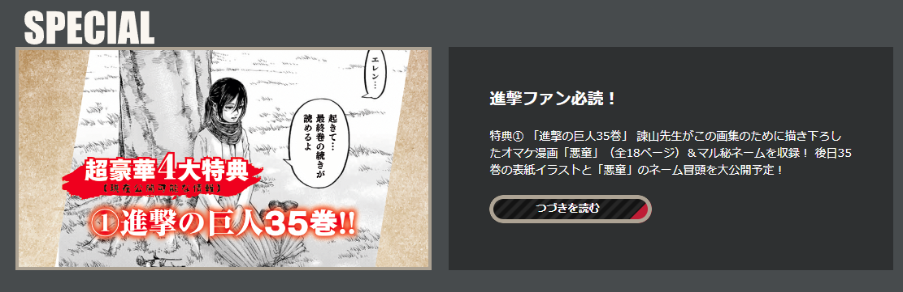

## 来源频道：[チカチローニ【進撃の巨人 考察】](https://www.youtube.com/@user-sm7jw2gm4i)

### [一个比较直观的时间线解说 - 观点来自于【進撃の巨人】#14 長い夢考察 スピンオフ作品ミカサ外伝からループ説を徹底検証 いってらっしゃいエレンの意味とは？【最終話考察】](https://www.youtube.com/watch?v=6SHeLQ8TERs)

03:57 认为米卡莎和艾伦在“道路”中度过了4年，在这里，艾伦告诉了米卡莎自己在嘴巴里这件事。而由于米卡莎的记忆不能被修改，所以只能认为这在道路里的4年发生在米卡莎决断前的一瞬间。

另外，艾伦在和阿尔敏和米卡萨对话的末尾，脸部都发生了变化，代表要发动巨人力量消除记忆，只不过对米卡莎无效。

【终part2. 01:08:17】

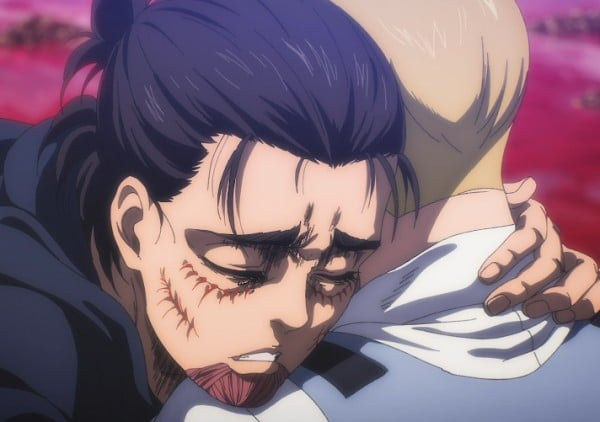

【终part2. 00:53:56】

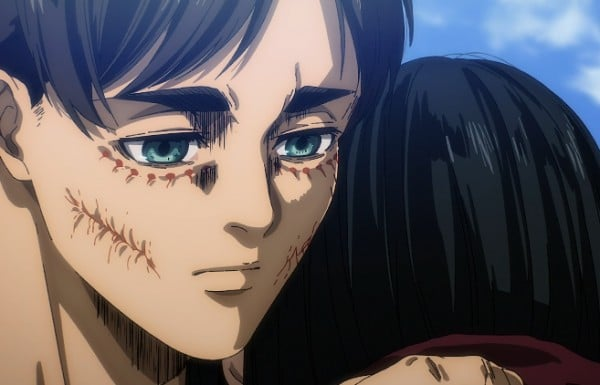

这种假设下的时间关会抛弃平行世界，即艾伦带不同的人进出坐标，并都保持同一性。这种解释的优点是，分镜就是两个世界交替叙述，仿佛交代了同一个米卡莎 在现实中不忍下手 -> 在小屋世界待4年好日子，被劝说忘记艾伦，被告诉位置 -> 在现实中知晓位置，杀了艾伦，貌似是有行为因果链的。视频没有提这个解释的弊端，我来说，最大的弊端当然是无法说明“米卡莎这是你的选择”

【终part2. 00:53:10】 逃亡生活

要知道 艾伦无法篡改米卡莎的记忆，即使能把米卡莎带到坐标中过4年日子，米卡莎也应该具有完整的现实世界的记忆，能马上识别出艾伦在胡扯。所以这一假设会颠覆关于阿卡曼最基本的假设。其他的一些弊端可能不是这个解释独有的，这里就不重复讨论。

- 但理解为演出也不是不行：米卡莎选择性地欺骗自己。这样能讲通但有些“演出化”，这是从现实主义角度解读巨人不想承认的。

## 这个频道 [13万回目の真実【進撃の巨人考察ラジオ】](https://www.youtube.com/@shingeki_truth) 的解释多数是我觉得最有道理的，我将在这一层转述一些他的观点。

先转载这个频道的宣言：
> 当チャンネルは、エレンが物語の黒幕ではない「エレン全知不全能説」を提唱してはいますが

### [共犯者们 - 观点来自于【進撃の巨人】もう一人の共犯者「ヒストリア・レイス」が導き出した答え【アニメ最終回考察】#28](https://www.youtube.com/watch?v=fzzlF9AOAgs)

在和阿尔敏对话的最后，阿尔敏认为自己“想看海”的愿望一定程度上激发了艾伦想看外面世界的愿望，所以是毁灭80%人类的共犯者。

本视频复盘了希斯特里亚如何也是一个“共犯”。之前剧情中，希斯特里亚准备继承獣の巨人，让帕拉迪岛随时能发动地鸣，威慑世界而不被侵犯。但艾伦不希望牺牲希斯特里亚，不想重复之前的亲人相食，想彻底解决这个问题。

【ep87. 17:53】

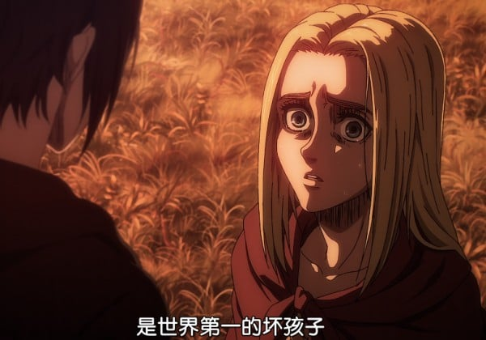

“世界第一坏的孩子”是希斯特里亚为了艾伦生命，没有重新继承王室以往以来的工作，这里恰好被艾伦反过来使用，既然我们都是坏孩子，那就接受为了身边在乎的人而毁灭多数其他人的决定吧。

【ep87. 18:57】怀个孩子

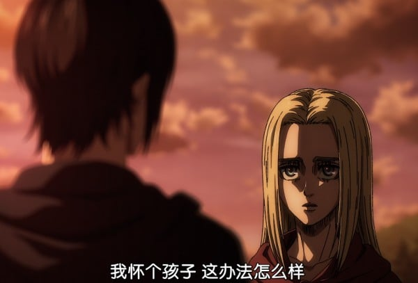

这里突然说生个孩子是表明被说服，同意了艾伦发动地鸣的想法，然后为了防止宪兵团强迫自己去继承毛子巨人，先怀孕争取时间，然后在这期间艾伦发动地鸣即可。

【终part2. 01:19:48】

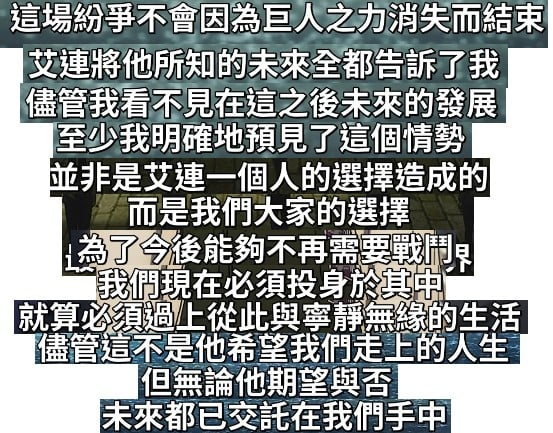

这个视频对希斯特里亚最后的信解进行了解读，强调了艾伦牺牲了世界的和平选择了自己人的自由，并把他所看到的未来（没有巨人的世界）告诉了希斯特里亚，但是，希斯特里亚为了选择自由和和平，选择了战斗（无法过上宁静生活），这是艾伦不希望的，但是这是由他们共同决定的未来。希斯特里亚背起了这一责任。

### [孩子是艾伦的 - 观点来自于【進撃の巨人】「エレン父親説」の5つの根拠【最終回考察】#18](https://www.youtube.com/watch?v=NN8siV6vooo)

证据1：互为理解者：除了上面 共犯者们 中提到的“坏孩子”的双向呼应。有过一些暖心的对话。

【ep48. 03:53】艾伦希斯特里亚

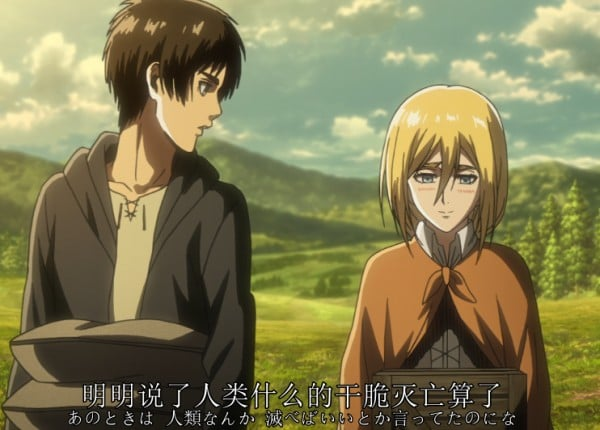

证据2：孤儿院帮忙的青年小时候对希斯特里亚扔过石子，那么即使孩子是艾伦的，艾伦希斯特里亚也能利用这一点让青年当形式上的养父，也是很自然的事。

证据3：ep87的镜头语言似乎暗示了什么，镜头展示艾伦和希斯特里亚的对话，然后插叙后来艾伦问吉克关于阿卡曼的习性问题，然后又接“我怀个孩子怎么样”的镜头。

【ep87. 18:16】

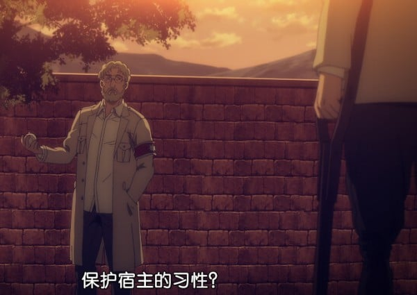

本视频认为，倘若认为孩子是艾伦的，那么艾伦是怀着罪恶感向吉克询问，倘若米卡莎是因为族性，则罪恶感能淡一些。这能很好解释这里镜头的穿插，反之就不知道为什么这么设计。
证据4：生死对照的构图和遗传特征。

【终part2. 01:15:26】【终part2. 01:15:03】 【终part1.00:10:56】

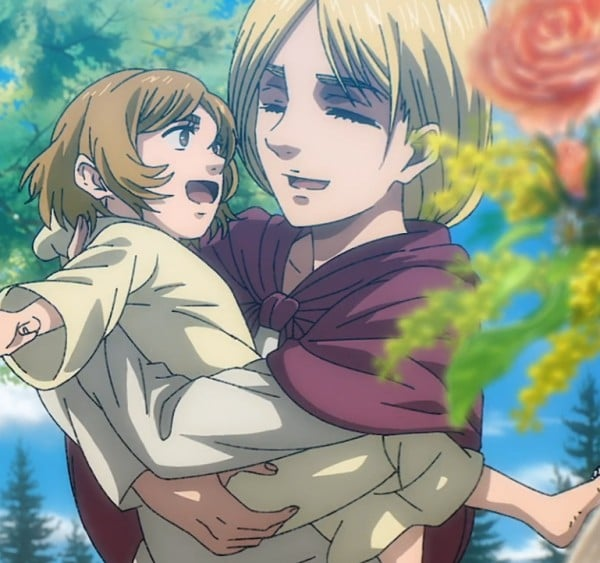 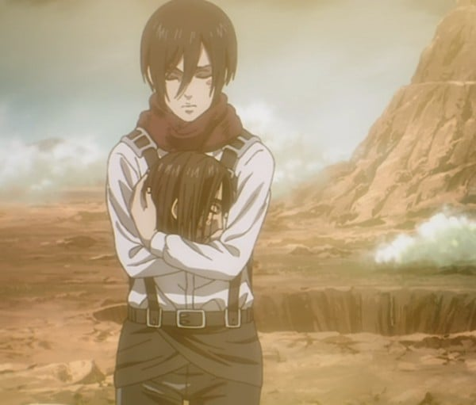

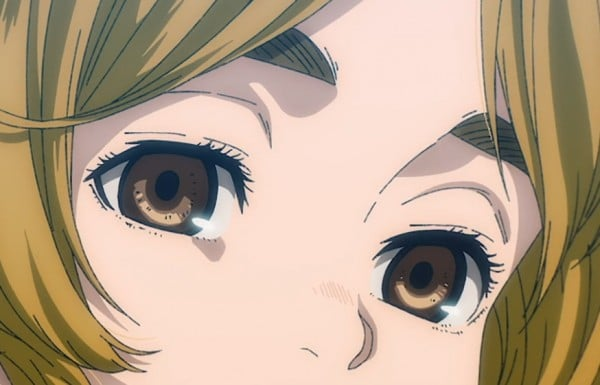 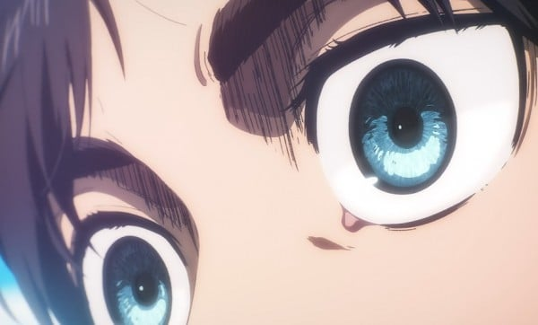

----

自己的想法：

【ep69. 05:46】

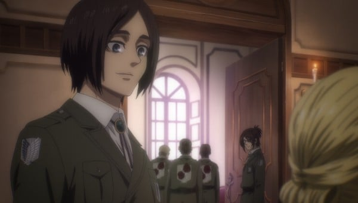

希斯特里亚发现米卡莎作为种族的后裔，手腕上有一个标识，于是和米卡莎逗趣。艾伦在旁边，却看着希斯特里亚微笑而不是米卡莎。是否意味着两个女人中，还是更在乎希斯特里亚？

在谏山创的画集中，特典漫画标题是“悪童”。如果上面的推理正确，那么大概率会对应两个“悪い子”生的孩子吧，会官宣这是艾伦的孩子吗？

### [进击的巨人的能力，艾伦的特殊性 - 观点来自于【進撃の巨人】「エレン＝全能」がミスリードである理由【未来視特性考察】#13](https://www.youtube.com/watch?v=c339Ou_jJvU)

进击的巨人的能力: 持有者在“状态”和“欲求”符合条件时能看到其他继承者的记忆
- A的记忆指A在某时间的视觉图像等
    --视觉图像是第一视角，所以除了照镜子等，很难分辨“我”是谁，容易出现混乱感
- 不能看到自己的未来记忆
    --艾伦不能直接看到自己未来的记忆
- 不能随心所欲地看到什么记忆
- 记忆可迭代，A能看到“看到A的记忆”的G的记忆
    --艾伦接触希斯特里亚看到的是“看到艾伦未来记忆”的格里沙的记忆
- 不可传送记忆，A不能主动让G看到自己的记忆
    --艾伦无法主动让格里沙看到“妈妈被吃了”的自己的记忆

[进击的巨人继承者之间的记忆的关系图](https://gitmind.com/app/docs/fybr8jdo)

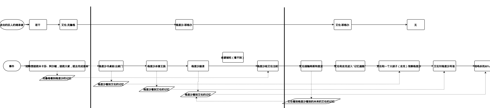

**原创讨论**：如何避免祖母悖论，完成因果闭环
理解进击的巨人的能力是理解艾伦和吉克在道路中和过去“互动”的关键，艾伦并非是在道路中影响到格里沙，而是把此刻在道路中的所见用进击的巨人的能力传给过去的格里沙。结果是道路中艾伦眼前看到的格里沙看到了此时看格里沙的艾伦的记忆。这样一来，进入道路并不是坐时光机回到过去，而是没有因果关系地观看过去罢了。

但倘若我们追问因果关系的开头，似乎还是会出现传统穿越时空的祖母悖论:
- **艾伦在道路中看到格里沙放弃杀人**
- ->艾伦故意让格里沙看到自己记忆
- ->格里沙看到艾伦的记忆
- ->格里沙杀人
- ->**艾伦在道路中看到格里沙杀人** 【矛盾】
- ->艾伦就没必要故意让格里沙看到自己的记忆
- ->格里沙就不会看到艾伦的记忆
- ->格里沙就不会杀人
- ->**艾伦在道路中看到格里沙放弃杀人**
- ->……

片中解决这一悖论的手法极为高明，用格里沙先放弃后受艾伦记忆影响杀人两个步骤表现，让我们用t1和t2表示。这样因果链成了：
- 艾伦在道路中看到t1格里沙放弃杀人
- ->艾伦故意让t2格里沙看到自己记忆
- ->t2格里沙看到艾伦的记忆
- ->t2格里沙杀人

这样就是让人接受的因果链。换句话说，艾伦进入道路总是先看到t1时间，格里沙放弃杀人，t1时间在前，所以当下会决定艾伦把记忆给格里沙看。（当然要假设艾伦没有我这样写出一个分析的反思过程，否则通过自省过程，可能会意识到“假设我现在不影响格里沙，会发生什么？”）

## [Charis0294](https://www.youtube.com/@charis0294/videos)
### [【进击的巨人】三笠的隐藏能力［无人注意到的秘密］](https://www.youtube.com/watch?v=IXdlbnE-9lE)

**能力原因**：将军家族+阿卡曼家族 血液
**能力**：对不同时间的自己发送当下的记忆；对不同时间的空间刻出伤痕，伤痕旁边的人能接收记忆。

证据：【第一季12集04:12】

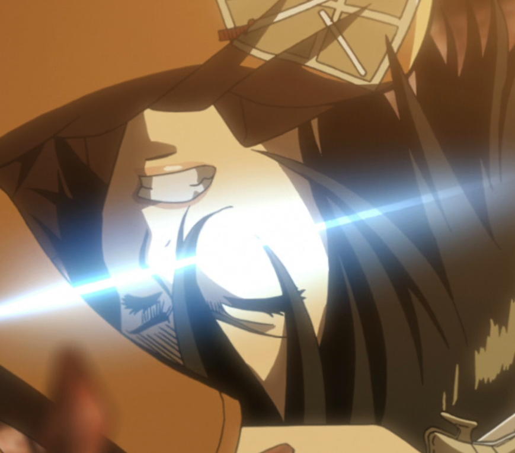

这里是艾伦还不受控制，挥拳打三笠，激起碎石的场景。这处的刀光显然不是碎石划破脸部的表现。非常的违和。如果认为这个伤痕是米卡莎能力做到的，艾伦想起记忆出现在【12:38】，时间上相隔稍微有点远，浮现的是艾伦第一人称的记忆。

还有一个证据是树木的刻痕让艾伦做梦。但这是米卡莎的主动行为吗？似乎缺少详尽的说明。

**接受记忆的结果**：收记忆影响会分出一个不同的世界线，这样就存在多个发展下去的世界线。

证据：【未找到第几集】

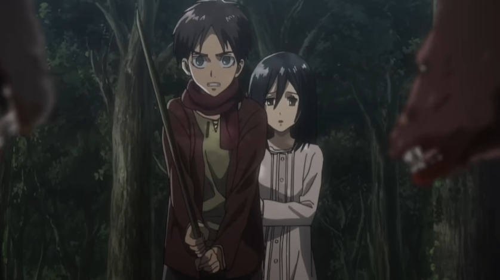

这里狗预攻击，三笠头疼，狗走开，确实没有其他好的解释，仿佛有种超自然力量的影响。

头痛是三笠面对残酷世界时，尤米尔对她的反应。有时她忘记记忆，是为了创造出一个艾伦还活着的世界线。三笠在不同世界线中探索，寻找保护艾伦的结果。其中有个世界线就是我们看到的艾伦发动地鸣的世界线。但最后，面对艾伦，米卡莎还是很痛苦，又头痛，不经意把记忆传给了山中小屋地世界线，这个世界分歧点在于山坡上，米卡莎向艾伦表白，两人一起逃离住在小屋。但是通过画面展示，似乎二人还是不快乐。所以小屋线的米卡莎发出记忆给分歧点的自己，回答了是家人。并且从未能击败ハルキゲニア的世界线发送了在嘴里的记忆。

讨论：这个视频对于三笠多世界线的分析是很吸引人的，证据也很多。其最吸引人的一个解释好处是，世界小屋线是米卡莎的选择的一条线，这非常符合“如果在山坡上告白”的分歧点的意味，重点在于米卡莎的选择。这一解释比认为是艾伦带米卡莎进入小屋线要合适的多。但次视频没有对各个证据都详细地解释一遍，只是笼统地说了一遍。怎么完美地解释米卡莎的头痛真的是一个解密巨人的核心命题。