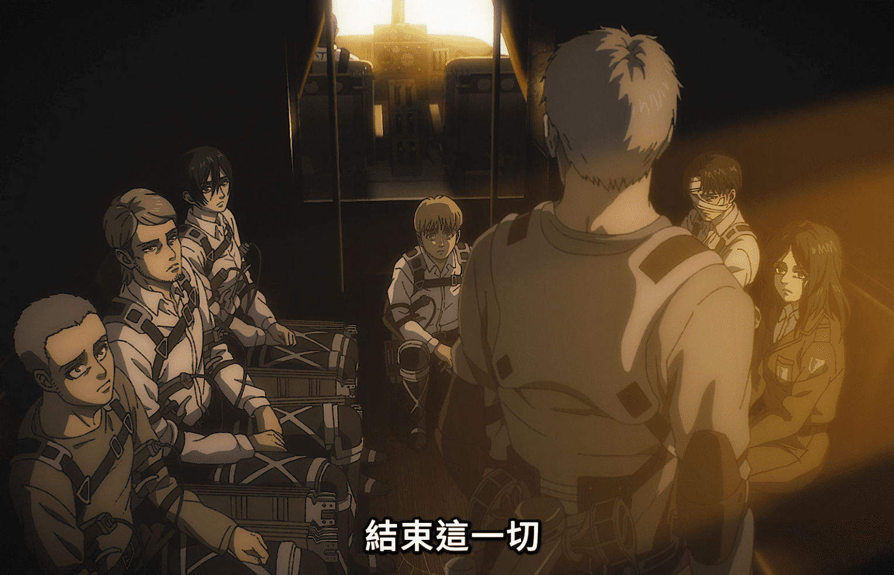

# 对他人解读的转述总结和自己的讨论（逐渐更新中，欢迎讨论）：

## [尤米尔、艾伦等的愿望是什么 - 观点来自于【進撃の巨人考察】エレンに理解できてジークに理解できなかったユミルの気持ち、から分かる「エレンの気持ち」。「モテとは何か」ジークの気持ちとリヴァイの気持ち。](https://www.youtube.com/watch?v=7xU6_TBH4Zo)：

【137话】【终part2. 00:32:34】：吉克：能确定她确实有一些留恋，那是艾伦能理解，而我无法理解的事。

通过图中可知道尤米尔的未練（留恋）是（和弗利茨王）结婚。由于艾伦以往对米卡莎对自己的心意都很迟钝，而这里又说艾伦能理解尤米尔的留恋，只能得出是艾伦某个自己对他人的情感和尤米尔共鸣，那便是
`艾伦想和米卡莎结婚`。

侧面辅证：莱纳和艾伦呈现为里表一对的主人公，而莱纳也对希斯特里亚有一句很冒失的台词:

【x话】【x】“想要结婚”。

【x话】【ep64. 19:00】“我也和你一样”这也能应证艾伦想和米卡莎结婚的观点。

同时也能推断出，吉克虽然能看出别人的恋情，但自己没有恋爱过，所以才能理性地选择安乐死计划。当然本视频还对比了吉克和李维的对话，认为吉克的“モテ”没有包含感情，进一步体现了吉克缺少恋爱的经验。

## [授勋式上艾伦看到了什么 - 观点来自于【進撃の巨人考察】授与式でエレンは未来の記憶を見ていない。「見ていないエレン」と「見ているエレン」。エレン全知全能を検証するシリーズ②の補足。](https://www.youtube.com/watch?v=1PhN6hRXtAg)：

【ep59.14:25】授勋式

在授勋式上，艾伦是否看到了故事的结局（巨人之力消失，尤米尔释然）？

【x话】【终part2. 01:00:28】和阿尔敏的对话

对比这里，可以得知`艾伦确实在授勋式上看到了整个结局`。

【108话】【ep69. 17:55】艾伦商讨进击的巨人继承问题……你说的话矛盾了

如果在授勋式上看到了整个结局，艾伦就不会讨论进击的巨人继承问题。这里柯尼和莎夏有段无厘头的对话，“矛盾”的用词也有些唐突，如果这是作者刻意为之，实际上指的是`艾伦如果看到巨人消失的未来还讨论继承问题两者是矛盾的`。关于“矛盾”一词，在埃尔文爸爸的台词中也有出现。

【x话】【x】埃尔文爸爸的台词

我们能看出，也许《进击的巨人》这个作品也像王控制墙里的人一样，控制着我们观众的记忆，想要发现真相，我们就要像埃尔文爸爸一样，从剧情中寻找矛盾的地方。矛盾的地方用平行世界解释？

## [动画结局部分的时间线 -观点来源于【進撃の巨人考察】未来は確定済み？いいえ。過去も未来も、あなたの目の前で変化しています。【改訂版】「山小屋ルートは100％パラレル」シリーズ・エレン＝全知全能を検証する②](https://www.youtube.com/watch?v=FqV_8zIdjQc&t=1s)：

首先弄清一个本剧的核心设定：`巨人之力无法“看”到阿卡曼人也无法操纵阿卡曼人记忆`。在“看”方面，证据是：

【x话】【终part2. 01:00:28】和阿尔敏的对话

艾伦说看不到米卡莎会做什么，自然指看不到米卡莎把自己砍死这一场景。同时艾伦看到了，因为米卡莎做了什么，导致了巨人之力消失、尤米尔解脱，从剧情需要角度考虑，如果尤米尔能看到米卡莎，尤米尔也不需要在最后才解脱，尤米尔也许可以看到自己解脱，也不清楚自己为什么解脱，所以需要等待到那个时刻。综上，艾伦和尤米尔都无法“看”到米卡莎。

在控制方面:【】【ep47. 04:25】阿卡曼人无法消除记忆

可以知晓阿卡曼人无法被消除记忆，这意味着在任何世界线上发生什么，那个世界线上的`米卡莎具有从始至终的同一性`，其行为动机必须被严格解释，这一点很重要。

最复杂的部分是`阿尔敏和艾伦的谈话`。

【】【终part1. 00:11:24】

【】【终part1. 00:11:27】 and 【】【终part2. 01:08:49】

根据镜头提示，这段对话发生在阿尔敏在甲板上的时候。part1中只有艾伦发表“终于到达自由”的部分，可见确实删除了阿尔敏的记忆和观众的记忆。

关键的矛盾点在于：【】【终part2. 01:09:46】 阿尔敏和米卡莎的说法有矛盾

米卡莎明确地说艾伦来见我们的时候，那么三人对谈时一定说了什么影响到结局的事，并且米卡莎一直知道这一点，但阿尔敏记忆被削除了。米卡莎和艾伦说了什么？自然是蕴含“希望让巨人之力从世界消失”的选择，甚至艾伦可能在这时告诉了米卡莎自己在嘴部。

【终part2. 00:54:28】艾伦的在嘴巴里

米卡莎直接知道艾伦在嘴巴里是很奇怪的，一定是艾伦告诉她的，尽管这里的镜头接着那个共度余生4年的世界，但认为在另一个世界告诉米卡莎然后这个世界的米卡莎也知道，会让米卡莎也有某种“神力”，这违背基本设定。所以我更倾向于认为这里两个世界的交叉叙事仅仅是一种镜头呼应，没有任何因果联系。那么，这个世界里，艾伦什么时候告诉米卡莎的呢？视频没说（我觉得可能是飞机上艾伦见所有人那次）。`这么有冲击力的一段剧情为什么不展示出来？我觉得可能是作者的一个手法，那个2024年要加入画集的35卷很有可能就是补全这里的对话。`

另一方面，【】【终part2. 00:53:10】 逃亡

一定发生在会谈之前，说明这个共度余生4年的世界和观众看到的巨人之力消失的世界是不同的世界，两者为平行关系。

再看阿尔敏的话语，“我都听他说了，米卡莎你选择带来的结果，就是让巨人之力消失”，可是在观众看到的和阿尔敏的对话中，艾伦并没有告诉阿尔敏结果是什么。这说明这一段和观众看到的阿尔敏和艾伦的对话并非发生在同一世界。这两者又是在不同的平行世界里。自然的疑问是，为什么要这样设计？一种解释是，为了演出效果。（防止剧透）艾伦和阿尔敏的谈话可以消除记忆，理应毫无避讳地全盘托出，告诉阿尔敏艾伦所有知道的结果，包括巨人之力消失，但倘若把这句话在对话中就说出来，观众就提前了10分钟得知这一点，似乎观看效果会差一点。所以叙事镜头把俩个平行世界的一部分各取出来放在一起。这个视频里把这种手法称为“自动填充”，仿佛是过去可以改变一般，但更好的解释应该是“我们之前看的是另一个艾伦没有选则的平行世界”，现实世界已经发生的不能改变。

根据视频观点我做了一个表现up主观点的示意图： [所认为的最后部分的时间线图](https://gitmind.com/app/docs/mrn855xb)。

我自己的观点稍有不同，我在视频下方和up主进行了讨论。up主也觉得我的说法有一定道理。我的观点的时间图：[我的观点的时间线图](https://gitmind.com/app/docs/mto84do9)。 

## 原创讨论1：“就是艾伦来见我们的那时候”到底指哪一次？
<!-- 
【】【终part1. 00:40:25】

在这里莱纳说，希望谁来结束这一切，然后看向米卡莎，米卡莎“诶”了以下，然后几人被拽入道路世界。 -->

可能的备选答案：

1.像 [这个视频](#%E5%8A%A8%E7%94%BB%E7%BB%93%E5%B1%80%E9%83%A8%E5%88%86%E7%9A%84%E6%97%B6%E9%97%B4%E7%BA%BF--%E8%A7%82%E7%82%B9%E6%9D%A5%E6%BA%90%E4%BA%8E%E9%80%B2%E6%92%83%E3%81%AE%E5%B7%A8%E4%BA%BA%E8%80%83%E5%AF%9F%E6%9C%AA%E6%9D%A5%E3%81%AF%E7%A2%BA%E5%AE%9A%E6%B8%88%E3%81%BF%E3%81%84%E3%81%84%E3%81%88%E9%81%8E%E5%8E%BB%E3%82%82%E6%9C%AA%E6%9D%A5%E3%82%82%E3%81%82%E3%81%AA%E3%81%9F%E3%81%AE%E7%9B%AE%E3%81%AE%E5%89%8D%E3%81%A7%E5%A4%89%E5%8C%96%E3%81%97%E3%81%A6%E3%81%84%E3%81%BE%E3%81%99%E6%94%B9%E8%A8%82%E7%89%88%E5%B1%B1%E5%B0%8F%E5%B1%8B%E3%83%AB%E3%83%BC%E3%83%88%E3%81%AF100%EF%BC%85%E3%83%91%E3%83%A9%E3%83%AC%E3%83%AB%E3%82%B7%E3%83%AA%E3%83%BC%E3%82%BA%E3%83%BB%E3%82%A8%E3%83%AC%E3%83%B3%EF%BC%9D%E5%85%A8%E7%9F%A5%E5%85%A8%E8%83%BD%E3%82%92%E6%A4%9C%E8%A8%BC%E3%81%99%E3%82%8B%E2%91%A1)中所认为的，可能作品里根本没有描写，所以在一个没有展示的平行世界里，这样在3个平行世界里，阿尔敏都和艾伦进行了一次对话。

2.在【】【ep.80 21:09】

倘若认为可能是这个时候，那更可能是下面这个时候，因为更符合“来见我们”，几个关键人物比较合理。

【】【终part1. 00:40:29】

这个时候大家都在飞机上，站在一起，符合“我们”。并且这些人对应着终part2.中恢复记忆的人物，不止阿尔敏和米卡莎，所以这个时候对后面的呼应来说是个不错的时候。但这个解释也有缺陷，这里阿尔敏也在场，加上之前那次接甲板场景的阿尔敏的对话，艾伦和阿尔敏进行了2次对话，这看上去十分没必要。换一种说法，如果“来见我们”发生在这里，那么和阿尔敏的对话完直接接着飞机场景里不就好了吗？为什么要接甲板的场景？还是要用不剧透观众的理由吗？可是这就必须要和阿尔敏对话两次，这会显得略微不自然。设想一种不自然中尽量自然的场景：沙子上，艾伦站在他们中央说：“`我之前和阿尔敏谈过了，现在再和你们谈一遍，我看到了最后结果，那就是巨人之力消失了，尤米尔也消失了，你们都能活的久一点了，科尼你的妈妈也会变回来……米卡莎，我看不见你做了什么，但是，我觉得我应该告诉你，我在巨人的口中。`”

我的观点的优势：认为 

## [另一个时间线解说 - 观点来自于【進撃の巨人】#14 長い夢考察 スピンオフ作品ミカサ外伝からループ説を徹底検証 いってらっしゃいエレンの意味とは？【最終話考察】](https://www.youtube.com/watch?v=6SHeLQ8TERs)

03:57开始，认为米卡莎和艾伦在“道路”中度过了4年，在这里，艾伦告诉了米卡莎自己在嘴巴里这件事。而由于米卡莎的记忆不能被修改，所以只能认为这在道路里的4年发生在米卡莎决断前的一瞬间。

