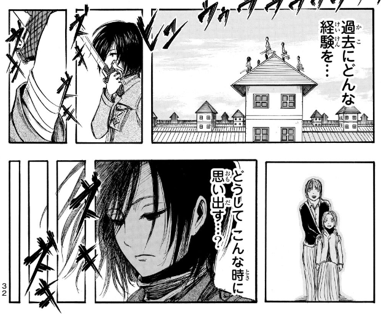
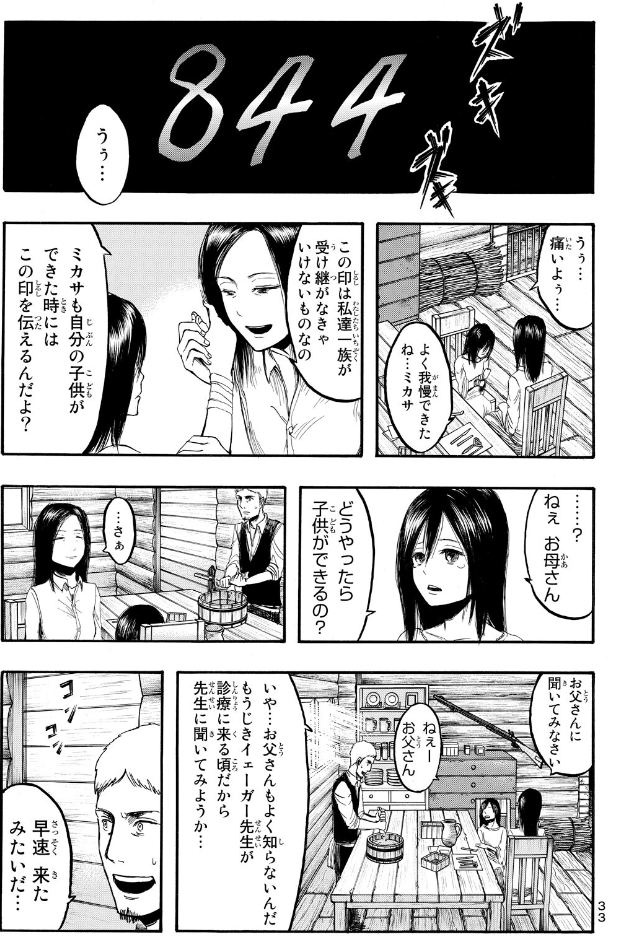
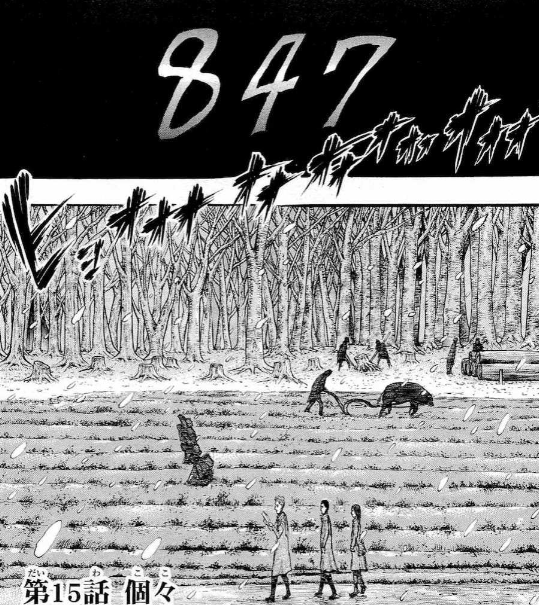
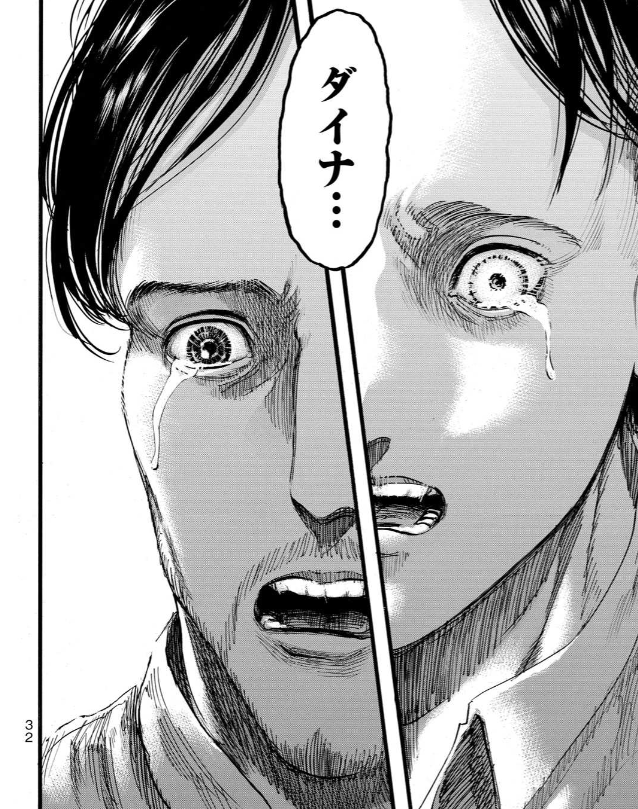
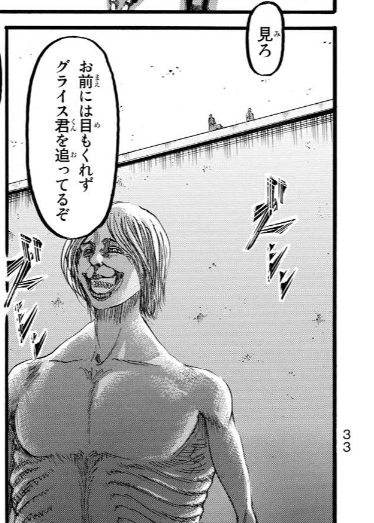
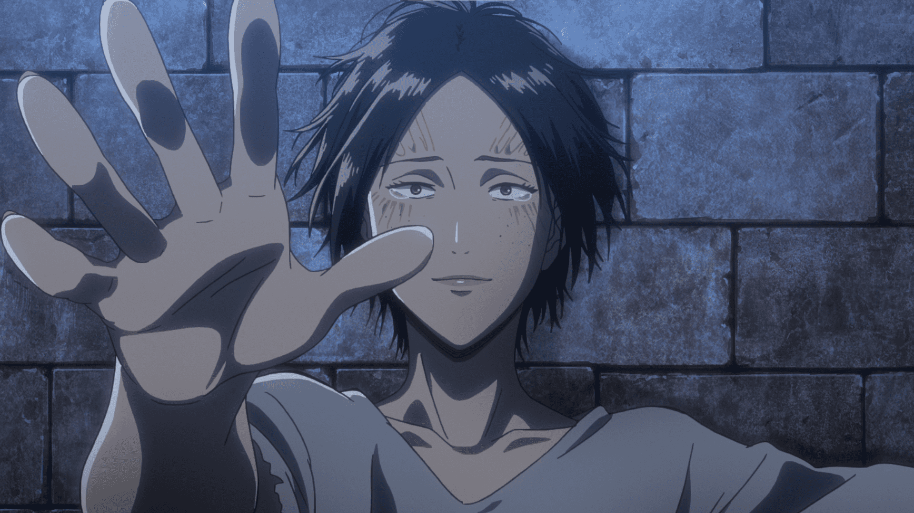
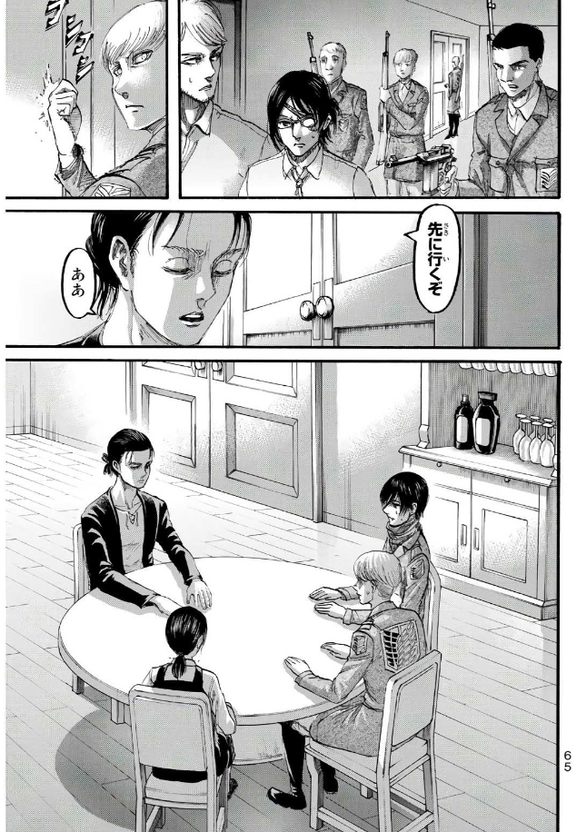

# 进击的巨人情节问题整理

**前言**：进击的巨人是一部跨度10年以上的漫画/动画，我在完全没有剧透的情况下，2013年在爱奇艺上开始看第一季动画，2023年看完动画结局，整个过程经历了恐怖、疑惑 
、震撼等等许多高强度的情感体验。当抛去这些情绪，问这究竟是一个什么故事时，可以这么回答：
- 地下室前是一个架空悬疑故事，主要问题是巨人从何而来；
- 地下室到艾伦和吉克接触是战争历史剧，主要问题是纷争如何解决。

忽略一些伏笔细节，我们不难看懂这两个部分的剧情内容，但对于艾伦和吉克接触后的剧情，尤其是结尾部分，对于巨人能力、尤弥尔能力等「设定」的理解成为了看懂剧情的关键。

**编写原则**：本文档的目的是为了看懂上述内容，对动画和漫画的重要情节进行梳理，努力看懂这部作品，特别是结尾发生了什么，为什么发生。在编写中，~~尽量不展开推理~~，适当推理，立足于原作，防止脑补过多。完整的解释理论的提出放在其他文档编写。

**标记说明**：除了特别篇和完结篇单独说明，其他动画集数采用「总集数」的标记方法，例如 ep.87 表示最终季最后一集「人类的黎明」。对照可参考 [進擊的巨人集數列表](https://zh.wikipedia.org/wiki/%E9%80%B2%E6%93%8A%E7%9A%84%E5%B7%A8%E4%BA%BA%E9%9B%86%E6%95%B8%E5%88%97%E8%A1%A8)。对于漫画来说，因为我看电子版的单行本，所 
以页数为每卷的第几页，并且因为几乎每一面都没有页码，所以我直接用电子版漫画的显示页数作为标记数字，例如第一卷中显示「13」的那一页在电子版中是第「15」页。每一
话的标题可参考 [進擊的巨人漫畫章節列表](https://zh.wikipedia.org/wiki/%E9%80%B2%E6%93%8A%E7%9A%84%E5%B7%A8%E4%BA%BA%E6%BC%AB%E7%95%AB%E7%AB%A0%E7%AF%80%E5%88%97%E8%A1%A8)。下方标题的「第*话」使用漫画的话数和标题。

<!-- TOC -->

- [进击的巨人情节问题整理](#%E8%BF%9B%E5%87%BB%E7%9A%84%E5%B7%A8%E4%BA%BA%E6%83%85%E8%8A%82%E9%97%AE%E9%A2%98%E6%95%B4%E7%90%86)
    - [第1话 - 给两千年后的你 二千年後の君へ](#%E7%AC%AC1%E8%AF%9D---%E7%BB%99%E4%B8%A4%E5%8D%83%E5%B9%B4%E5%90%8E%E7%9A%84%E4%BD%A0-%E4%BA%8C%E5%8D%83%E5%B9%B4%E5%BE%8C%E3%81%AE%E5%90%9B%E3%81%B8)
    - [第2话 - 那一天 その日](#%E7%AC%AC2%E8%AF%9D---%E9%82%A3%E4%B8%80%E5%A4%A9-%E3%81%9D%E3%81%AE%E6%97%A5)
    - [第5话 - 绝望之中发出微微的亮光 絶望の中で鈍く光る](#%E7%AC%AC5%E8%AF%9D---%E7%BB%9D%E6%9C%9B%E4%B9%8B%E4%B8%AD%E5%8F%91%E5%87%BA%E5%BE%AE%E5%BE%AE%E7%9A%84%E4%BA%AE%E5%85%89-%E7%B5%B6%E6%9C%9B%E3%81%AE%E4%B8%AD%E3%81%A7%E9%88%8D%E3%81%8F%E5%85%89%E3%82%8B)
    - [第7话 - 小刀 小さな刃](#%E7%AC%AC7%E8%AF%9D---%E5%B0%8F%E5%88%80-%E5%B0%8F%E3%81%95%E3%81%AA%E5%88%83)
    - [外传 - Lost Girls chapter 2. Lost in the Cruel World](#%E5%A4%96%E4%BC%A0---lost-girls-chapter-2-lost-in-the-cruel-world)
    - [第10话 - 左手的下落 左腕の行方](#%E7%AC%AC10%E8%AF%9D---%E5%B7%A6%E6%89%8B%E7%9A%84%E4%B8%8B%E8%90%BD-%E5%B7%A6%E8%85%95%E3%81%AE%E8%A1%8C%E6%96%B9)
    - [第12话 - 偶像 偶像](#%E7%AC%AC12%E8%AF%9D---%E5%81%B6%E5%83%8F-%E5%81%B6%E5%83%8F)
    - [第13话 - 伤 傷](#%E7%AC%AC13%E8%AF%9D---%E4%BC%A4-%E5%82%B7)
    - [第15话 - 个别 個々](#%E7%AC%AC15%E8%AF%9D---%E4%B8%AA%E5%88%AB-%E5%80%8B%E3%80%85)
    - [第45话 - 追赶者 追う者](#%E7%AC%AC45%E8%AF%9D---%E8%BF%BD%E8%B5%B6%E8%80%85-%E8%BF%BD%E3%81%86%E8%80%85)
    - [第62话 - 罪 罪](#%E7%AC%AC62%E8%AF%9D---%E7%BD%AA-%E7%BD%AA)
    - [第69话 - 友人 友人](#%E7%AC%AC69%E8%AF%9D---%E5%8F%8B%E4%BA%BA-%E5%8F%8B%E4%BA%BA)
    - [第85话 - 地下室 地下室](#%E7%AC%AC85%E8%AF%9D---%E5%9C%B0%E4%B8%8B%E5%AE%A4-%E5%9C%B0%E4%B8%8B%E5%AE%A4)
    - [第88话 - 进击的巨人 進撃の巨人](#%E7%AC%AC88%E8%AF%9D---%E8%BF%9B%E5%87%BB%E7%9A%84%E5%B7%A8%E4%BA%BA-%E9%80%B2%E6%92%83%E3%81%AE%E5%B7%A8%E4%BA%BA)
    - [第90话 - 前往城墙的另一端 壁の向こう側へ](#%E7%AC%AC90%E8%AF%9D---%E5%89%8D%E5%BE%80%E5%9F%8E%E5%A2%99%E7%9A%84%E5%8F%A6%E4%B8%80%E7%AB%AF-%E5%A3%81%E3%81%AE%E5%90%91%E3%81%93%E3%81%86%E5%81%B4%E3%81%B8)
    - [第91话 - 大海的另一端 海の向こう側](#%E7%AC%AC91%E8%AF%9D---%E5%A4%A7%E6%B5%B7%E7%9A%84%E5%8F%A6%E4%B8%80%E7%AB%AF-%E6%B5%B7%E3%81%AE%E5%90%91%E3%81%93%E3%81%86%E5%81%B4)
    - [第98话 - 太好了 よかったな](#%E7%AC%AC98%E8%AF%9D---%E5%A4%AA%E5%A5%BD%E4%BA%86-%E3%82%88%E3%81%8B%E3%81%A3%E3%81%9F%E3%81%AA)
    - [第106话 - 义勇兵 義勇兵](#%E7%AC%AC106%E8%AF%9D---%E4%B9%89%E5%8B%87%E5%85%B5-%E7%BE%A9%E5%8B%87%E5%85%B5)
    - [第109话 - 引导者 導く者](#%E7%AC%AC109%E8%AF%9D---%E5%BC%95%E5%AF%BC%E8%80%85-%E5%B0%8E%E3%81%8F%E8%80%85)
    - [第115话 - 支え 支持](#%E7%AC%AC115%E8%AF%9D---%E6%94%AF%E3%81%88-%E6%94%AF%E6%8C%81)
    - [第119话 - 兄与弟 兄と弟](#%E7%AC%AC119%E8%AF%9D---%E5%85%84%E4%B8%8E%E5%BC%9F-%E5%85%84%E3%81%A8%E5%BC%9F)
    - [第120话 - 刹那 刹那](#%E7%AC%AC120%E8%AF%9D---%E5%88%B9%E9%82%A3-%E5%88%B9%E9%82%A3)
    - [第121话 - 未来的记忆 未来の記憶](#%E7%AC%AC121%E8%AF%9D---%E6%9C%AA%E6%9D%A5%E7%9A%84%E8%AE%B0%E5%BF%86-%E6%9C%AA%E6%9D%A5%E3%81%AE%E8%A8%98%E6%86%B6)
    - [第122话 - 从两千年前的你 二千年前の君から](#%E7%AC%AC122%E8%AF%9D---%E4%BB%8E%E4%B8%A4%E5%8D%83%E5%B9%B4%E5%89%8D%E7%9A%84%E4%BD%A0-%E4%BA%8C%E5%8D%83%E5%B9%B4%E5%89%8D%E3%81%AE%E5%90%9B%E3%81%8B%E3%82%89)
    - [第126话 - 矜持 矜持](#%E7%AC%AC126%E8%AF%9D---%E7%9F%9C%E6%8C%81-%E7%9F%9C%E6%8C%81)
    - [第127话 - 终末之夜 終末の夜](#%E7%AC%AC127%E8%AF%9D---%E7%BB%88%E6%9C%AB%E4%B9%8B%E5%A4%9C-%E7%B5%82%E6%9C%AB%E3%81%AE%E5%A4%9C)
    - [第130话 - 人类的黎明 人類の夜明け](#%E7%AC%AC130%E8%AF%9D---%E4%BA%BA%E7%B1%BB%E7%9A%84%E9%BB%8E%E6%98%8E-%E4%BA%BA%E9%A1%9E%E3%81%AE%E5%A4%9C%E6%98%8E%E3%81%91)
    - [第131话 - 地鸣 地鳴らし](#%E7%AC%AC131%E8%AF%9D---%E5%9C%B0%E9%B8%A3-%E5%9C%B0%E9%B3%B4%E3%82%89%E3%81%97)
    - [第134话 - 在绝望的深渊 絶望の淵にて](#%E7%AC%AC134%E8%AF%9D---%E5%9C%A8%E7%BB%9D%E6%9C%9B%E7%9A%84%E6%B7%B1%E6%B8%8A-%E7%B5%B6%E6%9C%9B%E3%81%AE%E6%B7%B5%E3%81%AB%E3%81%A6)
    - [第135话 - 天与地的战斗 天と地の戦い](#%E7%AC%AC135%E8%AF%9D---%E5%A4%A9%E4%B8%8E%E5%9C%B0%E7%9A%84%E6%88%98%E6%96%97-%E5%A4%A9%E3%81%A8%E5%9C%B0%E3%81%AE%E6%88%A6%E3%81%84)
    - [第137话 - 巨人 巨人](#%E7%AC%AC137%E8%AF%9D---%E5%B7%A8%E4%BA%BA-%E5%B7%A8%E4%BA%BA)
    - [第138话 - 漫长的梦 長い夢](#%E7%AC%AC138%E8%AF%9D---%E6%BC%AB%E9%95%BF%E7%9A%84%E6%A2%A6-%E9%95%B7%E3%81%84%E5%A4%A2)
    - [第139话（最終話） - 朝着那座山丘上的树 あの丘の木に向かって](#%E7%AC%AC139%E8%AF%9D%E6%9C%80%E7%B5%82%E8%A9%B1---%E6%9C%9D%E7%9D%80%E9%82%A3%E5%BA%A7%E5%B1%B1%E4%B8%98%E4%B8%8A%E7%9A%84%E6%A0%91-%E3%81%82%E3%81%AE%E4%B8%98%E3%81%AE%E6%9C%A8%E3%81%AB%E5%90%91%E3%81%8B%E3%81%A3%E3%81%A6)
        - [阿尔敏和艾伦的对话](#%E9%98%BF%E5%B0%94%E6%95%8F%E5%92%8C%E8%89%BE%E4%BC%A6%E7%9A%84%E5%AF%B9%E8%AF%9D)
        - [大家想起被抹去的记忆](#%E5%A4%A7%E5%AE%B6%E6%83%B3%E8%B5%B7%E8%A2%AB%E6%8A%B9%E5%8E%BB%E7%9A%84%E8%AE%B0%E5%BF%86)
        - [三笠对尤弥尔说](#%E4%B8%89%E7%AC%A0%E5%AF%B9%E5%B0%A4%E5%BC%A5%E5%B0%94%E8%AF%B4)
        - [希斯特里亚的独白](#%E5%B8%8C%E6%96%AF%E7%89%B9%E9%87%8C%E4%BA%9A%E7%9A%84%E7%8B%AC%E7%99%BD)
        - [片尾](#%E7%89%87%E5%B0%BE)
    - [最后的进击 电影](#%E6%9C%80%E5%90%8E%E7%9A%84%E8%BF%9B%E5%87%BB-%E7%94%B5%E5%BD%B1)

<!-- /TOC -->

## 第1话 - 给两千年后的你 二千年後の君へ

manga-1-13：标记页码的一页「13」，这之后只有三笠的番外篇有类似的页码标记。
<details>
<summary>13</summary>
 
</details>

manga-1-15-845：看似是介绍年份：「845年」
<details>
<summary>845</summary>
 
</details>

manga-1-14：树上有一个十字架刻痕
<details>
<summary>刻痕</summary>
 
</details>

## 第2话 - 那一天 その日

三笠说：「又是 这样吗……」，结合循环说，字面上有两种解读可能，「又是头疼吗」 or 「又是这样的结局」吗
<details>
<summary>头疼</summary>
 
</details>

anime-ep02-1758：漫画没有描写艾伦3人小时候往城内躲避的场景，也没有新兵训练的场景。动画在这部分做了很多补充。其中一个场景中，甚至有疑似艾伦的身影。这个穿着和
艾伦和吉克进入格里沙记忆的穿着一致。
<details>
<summary>艾伦的身影</summary>
 
</details>

## 第5话 - 绝望之中发出微微的亮光 絶望の中で鈍く光る

manga-2-34：三笠救下少女，回想往事，旁边有页码和年份标记。这个场景在后期得到回收，仰慕三笠的少女加入了耶格尔派。艾伦救下三笠和三笠救下少女，形成了对照。
<details>
<summary>32, 33, 844</summary>


</details>

## 第7话 - 小刀 小さな刃

manga-2-102：三笠说：
- 「又是这样吗……又失去了家人，又想起了这**疼痛**，又……**从这里开始**。」

这里又是模棱两可的表达：如果是指「之前失去了妈妈卡露拉，现在又失去了艾伦」，「疼痛」和「从这里开始」显得很违和。

结合三笠的外传，时间上三笠的外传结尾正好接着这里。所以也许「疼痛」指的是「失去艾伦的痛」，「从这里开始」指的是之前「从这里逃离」到梦中世界，暂时避免了失去艾
伦，可是梦中世界结尾又不可避免失去艾伦，所有不如「回到这里再从这里开始」。这样理解，和梦中世界的魔术师的对话非常吻合。但如果接受这种解释，「从这里逃离」变成
了一种主动选择，主动做一个艾伦还活着的梦？还是实质上的一种循环能力或跨可能（平行）世界能力？

<details>
<summary>三笠躺</summary>
 
</details>

manga-3-167 | anime-ep12-0449：「家人」前的停顿，和后面那次如出一辙。
<details>
<summary>家人</summary>
 
 
</details>

## 外传 - Lost Girls chapter 2. Lost in the Cruel World

介绍：
```
原本是作为电视动画《进击的巨人》Blu-ray&DVD初回特典附赠的视觉小说剧本《Lost in the cruel world（三笠外传）》和《Wall Sina, Goodbye（阿妮外传）》，后经小说化并新增创作了《Lost Girls》收录其中。作者：濑古浩司，协力：《进击的巨人》制作委员会。该作曾于《别册少年Magazine》2015年9月号至2016年6月号期间连载由不二凉介执笔的漫画版。2017年至2019年间，该外传以OAD形式分前后篇动画化。其中阿妮外传作为《进击的巨人》本篇限定版第24卷（2017年12月8日发售 前篇）和限定版第25卷（2018年4月9日发售 后篇）的特典光碟发布，三笠外传则作为限定版第26卷（2018年8月9日发售）的附赠光碟面世。
```

动画标题为 第???话 - Lost Girls Lost in the Cruel World。从开头结尾的连接，暂且理解为三笠得知艾伦被吃后，有些自暴自弃，滑行到没气，摔倒后的脑中幻想。       

<details>
<summary>？？？</summary>

</details>

anime-ova-Lost Girls Lost in the Cruel World-0118：这个镜头一个蝴蝶分裂成多个蝴蝶，不免想到三笠的世界分裂成多个可能世界的意味，「庄周梦蝶」/「蝴蝶效应」。（
漫画没有）
<details>
<summary>蝴蝶分裂</summary>

</details>

anime-ova-Lost Girls Lost in the Cruel World-0303：这里蝴蝶站在一个石榴状的东西上用三笠的声音对三笠说话，台词颇有深意。（漫画没有）
<details>
<summary>蝴蝶对话</summary>

</details>

- 蝴蝶三笠：**如果你不接受这个现实的话，就重新来过吧，从你想要的地方重新开始**，在那个世界，一切都能如你所愿，但是，即使如此，你依旧无法阻止艾伦的死亡，因为
艾伦………

漫画版和动画版有很大出入，漫画中有更多细节。

艾伦告诉三笠，不要像肉鸡一样，什么都不思考。哪样哪一天说不定就被杀掉吃了。森林比想象中要小。「我要继续探险，你怎么打算？」然后三笠跟上了艾伦。
<details>
<summary>你打算怎么样</summary>
 
</details>

在发现狗群杀人的场景前，艾伦说「うんざり」这个台词和后面的镜男相同。
<details>
<summary>我受够了</summary>
 
</details>

anime-ova-Lost Girls Lost in the Cruel World-0606：二人看到本来杀掉父母的土匪被狗咬死了，恶狗面向二人，三笠头痛，狗走开了。
<details>
<summary>狗不咬</summary>
  
</details>

manga-LOSTGIRLS-2-35: 漫画中并没有头痛的描写，而强调狗眼睛中三笠的倒影。
<details>
<summary>头疼狗不咬</summary>
 
</details>

anime-ova-Lost Girls Lost in the Cruel World-0726：「不再走进森林」这台词铺垫的也很有深意，这个爹妈没被杀的世界看似很美好。
<details>
<summary>不再走进森林</summary>

</details>

anime-ova-Lost Girls Lost in the Cruel World-1044：同样去看调查兵团，但这个世界穿的漂亮。
<details>
<summary>三笠帽子</summary>
 
</details>

艾伦被打，三笠看这碎酒瓶，有行动的冲动但是最终还是抑制住了。
<details>
<summary>酒瓶子</summary>

</details>

三笠和格里沙谈话，提到艾伦动不动就生气。他有着某种宿命般的邪恶的**巨大力量**。这呼应了后面镜男的话。**「也许只有你三笠能够从巨大力量手上保护他。」**
<details>
<summary>巨大力量</summary>

</details>

后来，太想见艾伦，妈妈得病所以搬到艾伦家附近，三笠觉得是自己造成的，很内疚。（呼应了「一切都如你所愿」）

后来得知，暴打艾伦的两个人被马车撞死，三笠意识到自己的想法又被实现。然后看到了另一个（真实）世界的盗贼被杀的画面。
<details>
<summary>报应</summary>

</details>


见到艾伦，得知调查兵团解散，城门被封，艾伦决定和阿尔敏坐热气球出去，三笠也要去，艾伦为其围上围巾，约定3天后出发。快到时间时，三笠被镜男拦下。

镜男（かがみおとこ）的造型在动画版遮住了头发部分，从漫画上色来看，镜男的头像是毛线团，或是绕起来的女人的头发，颜色和三笠的黑色头发相反，非黑色。

<details>
<summary>镜男</summary>


</details>

- 镜男的「奇怪」台词：我乃旷世奇才，是知名**催眠师**，名叫镜男，接下来，我将为各位表演精彩的催眠术。我会将这位天真无邪的少女彻底变成一个无情的杀人犯。……请仔细看
我的脸（镜子中映出三笠）……我不能轻易就让你离开这里呢，为了这场表演，我必须用催眠术让你亲手杀人才行呢。所以不如这样吧，我提议，你在这里动手杀了我吧，虽然可以按照刚说的用催眠术让你下手，不过得花点时间。（**此处漫画独有台词**：这也是没办法的，世界是不讲理的，人类也不想被巨人吃……巨人就什么也不说地吃人，不讲理极了对吧，所以……）
  <details>
  <summary>不讲道理</summary>
  
  </details>

  注意看这里也出现了标记「129」

- （此处漫画独有台词：……小姐我告诉你一个秘密，**我已经忍不下去了，在这一晚上工作，向观众表演催眠术，结束了又要到另一个聚会表演**）
  <details>
  <summary>秘密</summary>
  
  </details>

- （此处漫画独有台词：……**一遍又一遍地，无数遍地重复，这就是我的人生**。怎么样？实在是无聊，没有意义地人生吧。但是……这也是没办法的，我没有选择。但是，**我已经发自内心地忍不下去了**……所以今夜，我要表演绝无仅有的催眠术，用催眠术把纯洁无邪的少女操控，在大家面前让她把我杀了）
  - 这段摸不着头脑的台词一定藏有什么线索。重复，忍无可忍这些关键词，最可能指向**尤弥尔**。
  <details>
  <summary>无数遍</summary>
  
  </details>

- （此处漫画独有台词：**这就是我最后的催眠术，对这个世界的复仇**……想好了吗？**再不决定时间要没了哦**）
  <details>
  <summary>复仇</summary>
  
  </details>

- （此处漫画独有台词：你不会再见到**艾伦**了 三笠：你是谁？你为什么会知道艾伦？ **我任何人也不是，同时也是任何人。**我是旷世催眠术师，催眠术师什么都知道。小姐你迷路了，你出自自己的心愿误入到这里，这没事，但是呆久了…… **此处有数字标记「134」** 差不多该回去**自己所属的地方了**，如果不你就再也回不去了，艾伦的脸都想不起来，一生被关在这里，如果不想这样就把我杀了，要回到原来的地方不得不流血。当然，如果你想这样就呆在这吧，回去好还是留下来好，自己决定吧）
  <details>
  <summary>134</summary>
  
  
  </details>

- 动画台词：……我是任何人又不是任何人，而且催眠术师无所不知（亮出5把印着三笠脸的刀子），你是出于自愿来到这座迷宫的，因为**无法接受艾伦死亡的事实**，从而**自己创造出，这个新世界**，可是，无论你在哪个世界，**你都无法阻止艾伦死亡的结局**（变成三笠的声音），那是因为艾伦本身就抱着死亡的冲动，不管你再怎么保护他，死亡都一定会降临到他身上，如果你觉得我说谎了，自己去确认吧，**只不过你必须杀了我才能前往**，你必须变得坚强，回到原来的世界才行。……（三笠：你为什么要阻止我，我仅仅想和艾伦在一起而已，为什么）没有办法，世界就是这么残酷。
  <details>
  <summary>镜男</summary>
  
  </details>

- 三笠：为什么要妨碍我？因为世界是残酷的

然后，三笠像现实世界里一样爆发了力量（觉醒），扎了镜男，找到阿尔敏，阿尔敏说热气球失去控制，艾伦推开阿尔敏自己撞上墙壁。三笠震惊，镜头接回真实世界。所以，三笠必须杀人才能回到原来世界的条件之一可能就是「觉醒」，觉醒的阿卡曼人具有创造世界的能力？

manga-LOSTGIRLS-2-162：「……又从这里开始……」呼应了前面蝴蝶所说的「如果你不接受这个现实的话，就重新来过吧，从你想要的地方重新开始」。并且这里比正篇漫画中多了台词「那真的是梦吗」，更是有种暗示意味。
  <details>
  <summary>真的是梦吗 左lostgirls 右第7话</summary>
   
  </details>

动画中最后的台词「不管艾伦去哪里，我都想待在他的身边」，呼应了镜男说的「自己去确认吧」。不知能否这么总结这集，三笠在现实中失去艾伦，痛苦到逃到另一个（想象的可能）世界，却（被神秘力量阻碍）经历更早艾伦的死亡，又回到现实，在现实世界接受了艾伦的死，意外的是，现实世界里艾伦还没死。

**疑惑**：
- 「无论你在哪个世界，你都无法阻止艾伦死亡的结局」这句台词在当下剧情点会让人摸不着头脑，看完巨人，我们得知这是一个铺垫。但是，这里的剧情是理解为元层次的表现
，还是理解为故事内剧情呢？
- 如果把镜男的话当作事实接受，我们知道这个世界是三笠无法接受艾伦死掉的事实，自己创造出的，但她却不能创造出一个艾伦不死的世界。为什么？做出这个决定论预言的人
是谁？镜男是谁？尤弥尔？谏山创？为什么用三笠的声音？

ED的歌词富有深意 [TVアニメ「進撃の巨人」Season 1前期ノンクレジットED｜日笠陽子「美しき残酷な世界」](https://www.youtube.com/watch?v=eN_rq3FvJUs)，[翻译参考](https://home.gamer.com.tw/artwork.php?sn=5164105)。
> 嗚呼ボクたちは　この強さ　弱さで
>
> 啊啊我們究竟　要用這份堅強、軟弱
>
> 何を護るのだろう　もう理性など
>
> 來守護些什麼呢　若是理性之類的
>
> 無いならば
>
> 已蕩然無存

这个外传有多处标注页码「32,33,41,64,68,84,96,134,160」，这和本篇开头「13」是否有同样的意义？放在 [進撃の巨人解読]() 中讨论。

## 第10话 - 左手的下落 左腕の行方

anime-09-2057:这里的台词强调了记忆，这在后面得到解释，并且说了之后克鲁格会说的台词：如果你想拯救三笠，阿尔敏……
<details>
<summary>黑影</summary>
 
</details>

## 第12话 - 偶像 偶像

manga-3-158：艾伦还控制不了变身，失去控制，攻击三笠，背景中有奇怪的两个黑影
<details>
<summary>黑影</summary>
  
</details>

## 第13话 - 伤 傷

manga-3-163 | anime-ep12-0412：三笠的脸被刀划破，这在漫画中容易被误解为溅起的飞石造成，但是动画表明并不是这样。动画镜头中是一个慢动作，周围的石头都在慢慢移 
动，这时伴随刀声，一道快速的刀影划过（[动画疯0412](https://ani.baha.tw/3506/04_12)），结合这集标题这里的刀伤应该有特殊用意。
<details>
<summary>伤</summary>
 
</details>

## 第15话 - 个别 個々

漫画把新兵训练的剧情放在堵住墙壁之后，动画则是反过来的顺序。这里出现了年份。

<details>
<summary>847</summary>
 
</details>

## 第45话 - 追赶者 追う者

manga-11-123-头疼：艾伦被夺走，三笠头疼。台词仍是：又是这样吗
<details>
<summary>头疼</summary>
 
</details>

## 第53话 - 狼烟 狼煙

看到弗丽达照镜子的记忆，在看到之前艾伦先是思考为什么是自己获得这力量，担负起拯救人类的使命，又想父亲现在在哪。
<details>
<summary>看到弗丽达</summary>
 
</details>

## 第62话 - 罪 罪

anime-ep43-1633：李维问三笠有没有经历过突然觉醒的体验，三笠回答有。
<details>
<summary>觉醒</summary>
 
</details>

anime-ep43-0206：罗斯家族二人触碰艾伦，艾伦看到老爹杀人的记忆，老爹视角里自己吃老爹的记忆。（两个罪人）希斯特里亚恢复了被弗丽达消除的记忆。

<details>
<summary>接触</summary>

</details>

## 第69话 - 友人 友人

anime-ep47-1719 manga-17-124 肯尼：
<details>
<summary>某种东西的奴隶</summary>

</details>

```
今ならヤツのやったこと　わかる気がする。俺が見てきた奴ら　みんな　そうだった　酒だったり　女だったり　神様だったりもする　一族　王様　夢　子供　力　みんな　
何かに酔っ払ってねえと　やってられなかったんだな　みんな　なにかの奴隷だった　あいつでさえも　お　お前は何だ？　英雄か？
```

现在我感觉我能理解他做的事了。我见过的人们，都是那样，不管是酒（？）、女人（罗德·雷斯）、神（教徒），族人（肯尼爷爷）、国王（？）、梦想（肯尼部下）、孩子（ 
妹妹？）、力量（肯尼），每个人都陶醉于某种东西，否则就活不下去。大家都是某种东西的奴隶，就连他（乌利王）也是。你，你呢？（问李维）成为英雄吗？

这句话在第三季出现，却貌似概括到了很多关键人物的剧情。把“大家都是某种东西的奴隶”推广到这里没提到的人物：

- 艾伦：自由
- 三笠：对艾伦的爱
- 阿尔敏：大海？
- 尤弥尔：对弗里兹王的爱
- 艾尔文：真相

（这句话似乎有助于理解尤弥尔的解脱，首先尤弥尔没有完全死掉，活在道路里，是虫子的能力+她有留恋的结果，换成这里的说法就是对某种事物的陶醉，是某种事物的奴隶， 
这种不释怀的执着是道路（坐标）形成的必要条件。问题是最后艾伦解脱了吗？在和阿尔敏的对话中，艾伦说希望三笠10年想着她，这是否也是一种执着？反过来，三笠10年守着
艾伦意味着10年内也没有解脱？）

## 第85话 - 地下室 地下室

阿尔敏忘记了自己继承巨人的事，反映了继承巨人会造成记忆丧失的特性。此处强调贝尔托特变巨人之后的时间是动画独有内容。

<details>
<summary>丧失变巨人时的记忆</summary>
 
</details>

## 第88话 - 进击的巨人 進撃の巨人

manga-22-35：得知戴娜是微笑女巨人。旁边有页码「32」和「33」，这是单行本独有的页码标记，不是此话的页数。
<details>
<summary>戴娜32 33</summary>
 

</details>

manga-22-36: 15年，交代了时间：
<details>
<summary>15年</summary>
 
</details>

manga-22-68：克鲁格的小时候故事。

<details>
<summary>克鲁格</summary>
 
</details>

manga-22-73：尤弥尔的诅咒，这里严谨点理解的话，只是说一定会少于尤弥尔的13年，并且会越来越虚弱，并非是一定能活到第13年。

<details>
<summary>尤弥尔的诅咒</summary>
 
</details>

manga-22-76：关于道路的内容，「有时候，记忆和谁的意志也会以同样的方式通过道路」这里呼应之后格里沙在地下说的看见记忆的设定，但这个「有时候」说法似乎不像是能 
操控的，更像是不可控的某些条件下。

<details>
<summary>道路</summary>
 
  
</details>

anime-ep58：通过后面的原理，我们知道，克鲁格此时接受到了格里沙的记忆。

<details>
<summary>克鲁格的话</summary>
 
</details>

## 第90话 - 前往城墙的另一端 壁の向こう側へ

anime-ep59-1332: 亲吻希斯特里亚的手，艾伦不想牺牲希斯特里亚，要保护她。然后接触到手时，艾伦看到了一些记忆。
<details>
<summary>不想牺牲希斯特里亚</summary>
 
</details>

其中知道了格里沙对弗丽达·雷斯说的台词：...快去杀了正在攻入城墙的巨人，在我的妻子，孩子，民众被吃之前。这段台词里有孩子，而实际上他的孩子没有被吃，说明格里沙
此时并不知道之后发生了什么，只知道了巨人破坏了墙壁，家人有危险。

<details>
<summary>阻止</summary>
 
</details>

- 积雪融化时（851春），玛利亚墙内巨人清理干净
- 托洛斯特区遭到攻击一年后(850+1 = 851)，人们返回故乡
- 超大巨人攻击6年后（845+6 = 851），调查兵团出墙

## 第91话 - 大海的另一端 海の向こう側
manga-23-7：法尔科看着鸟，对鸟说这里很危险，非走吧。这里和法尔克变成会飞的巨人，以及和艾伦是否有实质上的联系？
<details>
<summary>法尔克</summary>
 
</details>

anime-ep60：这个姿势和尤弥尔相似。
<details>
<summary>法尔克</summary>
  
</details>

anime-ep60：法尔克犯迷糊。这里的台词明显是描述作为调查兵团的梦，可推测法尔克看到了作为调查兵团的尤弥尔的梦。这从侧面应证了，**巨人继承者可能在继承之前就看到
之前继承者的记忆**。
<details>
<summary>法尔克</summary>
 
</details>

## 第98话 - 太好了 よかったな
manga-24-188：说明之间关系的台词。
<details>
<summary>4年不见</summary>
 
</details>

## 第106话 - 义勇兵 義勇兵

manga-26-179：阿尔敏看到了贝尔托特的记忆。
<details>
<summary>各个回忆</summary>
 
</details>

## 第109话 - 引导者 導く者

三笠在和露易泽对话完后，出现了头疼，看到了小时候杀人时的艾伦。

<details>
<summary>露易泽</summary>


</details>

## 第111话 - 森林里的孩子们 森の子ら

## 第112话 - 无知 無知

这里的圆桌谈话，从后面来看似乎是艾伦的演技。但是，从表情等来看，不像是演的。并且三笠出手制止阿尔敏这动作也太离谱，如果不存在身体的条件反射，稍微过一脑子，最多也是站在两人中间，不会单方面擒拿手阿尔敏。所以从演出角度，用演戏解释很违和。

<details>
<summary>圆桌</summary>


</details>

## 第115话 - 支え 支持
回过头看，为什么艾伦和吉克谈妥的时候，不直接接触呢？尽管两人目的不同，但这里的发动条件和最终发动时的条件没什么不同，为什么要经历两次突袭行动后才接触呢？    

<details>
<summary>信赖的人</summary>
 
</details>

可能这里是一个铺垫，吉克不是发动者，所以需要充分信任艾伦和自己想法一样才行。能否这样说，吉克想要伪装成自己已经死亡，然后在小岛上两人发动断子绝孙，可为什么不
一回到小岛就接触？把脊髓液放到酒里等这些操作是为了什么？

## 第118话 - 暗算 騙し討ち
manga-29-165: 放下围巾
<details>
<summary>放下围巾</summary>

</details>

## 第119话 - 兄与弟 兄と弟

manga-30-19-等等：艾伦阻止了吉克吼叫，然后法尔克哥哥拉着法尔克出现。这里非常奇怪，应该是艾伦某个目的。先随便写个猜想防止遗忘，艾伦之前看到过法尔克出现在未来
，有关键作用，发现此时法尔克可能会被变，很恐慌。

<details>
<summary>法尔克</summary>
 
</details>

## 第120话 - 刹那 刹那

manga-30-62-63：艾伦脑袋接触到吉克时看到的内容。盘点一下，**全是进击的巨人或是始祖巨人的继承者的第一人称记忆画面**。包括未来艾伦的记忆（小孩，未来的希斯特里
亚），艾伦过去的记忆（幼时三笠），芙丽达的记忆（照镜子，幼时希斯特里亚），格里沙的记忆（妹妹），克鲁格（踢人下去，第二张右下方最大的是不是也是克鲁格小时候的
记忆？）。

<details>
<summary>各个回忆</summary>
 
 
</details>

动画的内容：

<details>
<summary>各个回忆</summary>
     
" width="30%">                
</details>

其中有一个蒸桑拿的情景，这似乎对应着NHK在2023年10月23日播放的「仕事の流儀 エレン・イェーガー」中提到艾伦从讨厌桑拿（サウナ）到喜欢桑拿，这似乎是原作完全没有
提到的一个内容，这里特地添加。第33卷的スクールカースト中也有这样一个桥段，但是人物站位和动画里的这张图并不对应。考虑到这里是有胡茬的莱纳，李维，让等人，如果
本篇中存在这样的场景，能在哪里呢？

<details>
<summary>各个回忆</summary>
  
</details>

还有两个人脸在本篇中没有出现过。后两者是21卷到34卷在卷尾添加的「スクールカースト」neta小故事，用和本篇相同的人名，个性，貌似架空在美国学校（霸凌之类的“等级”事件）发生的故事。其中三笠是哥特装扮，阿尔敏是geek模样。虽然是搞笑漫画，但其中neta了不少本篇中的桥段。并且在34卷的最后一篇中提到这是巨人消失后的100年，明确 
地指明了这个系列和主线在同一个世界。

<details>
<summary>各个回忆</summary>
  
</details>

能在记忆碎片中看到不知道是neta还是有严格的原因。难道这个系列里的爱伦是进击的巨人继承者？这不就和巨人之力消失矛盾了嘛。

## 第121话 - 未来的记忆 未来の記憶

这部分的综合讨论部分放在解读中。

现在看来标题也许是个巨大的剧透。未来的记忆，意思是某个或某些主体在未来产生的记忆，而非未来本身，这两者有很重要的不同。更具体地说，如果不存在主体，未来依旧存
在，而未来的记忆的存在必须依靠某些主体在未来存在。

manga-30-85：艾伦这句台词如果如字面意思，那么会产生问题，因为艾伦和吉克是从第三人称视角来观看整个场景的，而非格里沙的第一视角，不能说是格里沙的记忆，而是记 
忆里的世界。

<details>
<summary>老爸的记忆</summary>
 
</details>

但这里可能是表现手法受限。让我们假设艾伦和吉克看到的场景确实是第一人称的，这会和“艾伦是通过看格里沙的脸让格里沙看到自己的记忆从而意识到什么”理论矛盾，因为这
时艾伦在第一人称不可能能看到格里沙的脸。所以，排除掉夸张表现手法，而应当把艾伦的站位等信息全部当作有意义的信息。

艾伦的视线正好看到吉克，暗示实现互动的原理是通过艾伦的视线。即格里沙此时看到了此时艾伦的记忆。

<details>
<summary>看到吉克</summary>
 
</details>

anime-ep79-1218: 镜头做成两人对视的样子，通过后来的“未来的记忆”可以知道此时格里沙看到了自己的脸。

<details>
<summary>对视</summary>
 
</details>

manga-30-117: 逐字分析，不是未来，也不是自己未来的记忆，而是未来的继承者的记忆，换句话说格里沙看不到自己未来的记忆，但能看到艾伦的记忆。可为什么能看到？    

<details>
<summary>进击的巨人的特性</summary>
 
</details>

manga-30-124-经典互动：什么是记忆？应该不仅包含视觉，还有听觉、嗅觉、味觉、触觉和心情、思想。在这个基础上，这里不仅仅是看到艾伦看自己的侧脸，还因为体验到了 
艾伦整个愤怒的情感和冲动。

<details>
<summary>经典互动</summary>
 
</details>

manga-30-125：这里格里沙的表情和之后授勋式上艾伦的表情一致，可知就是在此时，格里沙看到了艾伦未来的记忆。

<details>
<summary>经典互动</summary>
 
</details>

manga-30-128-129：为什么这里要插入希斯特里亚的手。我觉得有两种可能性，一种是说此时得格里沙看到了授勋式上艾伦的记忆；第二种是说艾伦在授勋式上看到了此时的记忆
。从第一人称角度来说，第一种反而可能性更大。

<details>
<summary>希斯特里亚的手</summary>
     
</details>

manga-30-130：为什么不给我看全部，这句台词值得注意，似乎意味着艾伦能够主动把自己的记忆传给格里沙，从而有选择地没让格里沙看到自己母亲被吃的记忆。但这个传递记
忆的能力的条件是什么，是始祖进击王室到手后的能力吗？

“艾尔迪亚这样就真的得救了吗？”可以看出，艾伦此时的心情和意志也随着记忆传递给了格里沙，艾伦确实是想让希斯特里亚等艾尔迪亚人活下去。

<details>
<summary>为什么不给我看全部</summary>
 
</details>

manga-30-132,135：

<details>
<summary>亲手</summary>
  
</details>

manga-30-139：还没看到父亲被我吃地记忆。

<details>
<summary>还没看到父亲被我吃地记忆</summary>
 
</details>

manga-30-139：这句话没有什么可怀疑的。艾伦直接说了，**自己亲吻希斯特里亚手的时候，通过父亲（看到未来自己的记忆）的记忆看到了未来自己的记忆，那个景色（地鸣）
**。动画版的台词基本一样，只是改成了“我通过老爸的记忆看到了自己的未来”，没有像漫画一样说“看到了未来的自己的记忆”。

<details>
<summary>依靠父亲看到未来</summary>
 
</details>

## 第122话 - 从两千年前的你 二千年前の君から

manga-30-145: 插叙了希斯特里亚看书的回忆，补充解释了希斯特里亚的人设。尤弥尔是个对他人善良的人，所以希斯特里亚也一直这样。之后，在扮演尤弥尔的尤弥尔的帮助下
，更加自我，任性地救了艾伦，成为“坏女孩”。而艾伦帮助尤弥尔，摆脱奴隶身份，自己决定。这里补充，穿起来了4个人的行为动机。

<details>
<summary>像尤弥尔一样</summary>
 
</details>

manga-30-146: 割舌头，大概率尤弥尔也被割了舌头，无法说话。

<details>
<summary>割舌头</summary>
 
</details>

manga-30-169: 花瓣有9片，和九大巨人数量一样。不知有什么关系。

<details>
<summary>花瓣</summary>
 
</details>

manga-30-180: 艾伦说出这样的台词，意味着艾伦了解尤弥尔的身世，他是如何知道的呢？是否是接触希斯特里亚时就看到了？

<details>
<summary>两千年</summary>
 
</details>


## 第126话 - 矜持 矜持

manga-31-167：这里是一处关键的对话。三笠从露易泽手上拿回围巾。
<details>
<summary>拿回围巾</summary>
 
</details>

## 第127话 - 终末之夜 終末の夜

<details>
<summary>让的妄想</summary>
  
</details>

## 第130话 - 人类的黎明 人類の夜明け

anime-ep87-0447：动画版增加了插叙，众人第一次到海对岸地场景，以及艾伦提前看到小孩，艾伦和三笠在上坡上的场景。这句台词说明能看到其他继承者继承巨人之前的记忆 
。因为冰淇淋的记忆是格里沙被注射之前的记忆。

<details>
<summary>看到冰淇淋</summary>
 
</details>

manga-32-147-147：画面上是众人乘坐的船，天上有白鸟，接着艾伦的独白。可能是暗示艾伦能通过鸟看到这里的景象？艾伦问自己，是从哪里开始的，紧接着一些回忆。      

<details>
<summary>各个回忆</summary>
 
</details>

manga-32-148：艾伦问自己，是从哪里开始的，紧接着一些回忆。
- 树下 第三视角
- 🐖 尤弥尔的第一视角
- 格里沙 艾伦的第一视角
- 亲手 第三视角

<details>
<summary>各个回忆</summary>
 
</details>

manga-32-149：

<details>
<summary>各个回忆</summary>
 
</details>

- 亲手 第三视角
- 李维 艾伦第一视角
- 火车上 艾伦第一视角
- 皮克拿枪指着自己 艾伦第一视角
- ※　三笠 艾伦的第一视角
- ※　希斯特里亚 艾伦(？)第一视角
- ※　法尔克 鸟的视线
- 三笠来马莱见面 艾伦的第一视角
- 老爹侧脸 老爹记忆世界时艾伦的第一视角
- 吉克抓住自己脑袋 艾伦的第一视角
- 被打的阿尔敏 艾伦的第一视角
- ※　超大巨人破坏墙壁后的贝尔托特 第一视角or第三视角
- 爷爷 艾伦的第一视角
- ※　韩吉 ？的第一视角

对于第三视角画面，我觉得可以理解为像进入格里沙记忆世界一样，进入艾伦自己的记忆世界，就能从第三视角来看。（艾伦大概也多次徘徊在自己的记忆世界里寻找答案吧）  

对于其他的记忆，※标注的画面都很重要，需要认真分析。

## 第131话 - 地鸣 地鳴らし

出现了尤弥尔的身影 manga-33-31-尤弥尔的身影

<details>
<summary>尤弥尔的身影</summary>
 
</details>

艾伦说，这就是自由。然后转头看阿尔敏。这里铺垫了艾伦和阿尔敏在道路中的对话，根据后面可以推测是艾伦删除了阿尔敏的记忆。manga-33-43，manga-33-44：

<details>
<summary>到达自由和阿尔敏</summary>
  
</details>

## 第134话 - 在绝望的深渊 絶望の淵にて

阿尔敏说，「再让我问一遍」，你哪里自由了。此处的「再」回溯回去应该是相对艾伦，三笠，阿尔敏，贾比圆桌打架后说的。

<details>
<summary>再问一遍</summary>
 
</details>

## 第135话 - 天与地的战斗 天と地の戦い

尤弥尔在这里出现，是什么意思
<details>
<summary>尤弥尔</summary>
 
</details>

这里，虐杀人类，是尤弥尔的意志，而不一定是艾伦的意志。
<details>
<summary>尤弥尔的意志</summary>
 
</details>

## 第137话 - 巨人 巨人

manga-34-130：吉克被砍头，地鸣停止，证明王室对维持地鸣的不可或缺。

<details>
<summary>地鸣停止</summary>
 
</details>

anime-终part2-004333：艾伦在此出现，动画独有镜头接着希斯特里亚接生的场景。有一种可能性出生的孩子继承了之前死去的吉克的长毛巨人，这个想法十分合理。但如何利于解释其他内容还不清楚以及她如何能在巨人之力“消失”后继续保留，值得研究。

<details>
<summary>生孩子</summary>

</details>

## 第138话 - 漫长的梦 長い夢

manga-143：三笠想起艾伦的讨厌，竟然那是最后一面，难以接受而头疼。
<details>
<summary>艾伦死头疼</summary>
 


 
</details>

manga-34-170：艾伦又活过来，和大家打到一起。三笠又头疼。这里第一刻三笠想到的是树下睡着的艾伦，之后才是二人小屋的世界。
 

manga-34-175：这个世界，是在山坡上回答「家人」时如果给出不同回答分歧后形成的世界。

<details>
<summary>逃亡生活</summary>
 
</details>

艾伦说，无论牺牲希斯特里亚重复纷争历史，还是屠杀岛外的人，他都做不到，于是他选择了和三笠私奔，度过4年余生。反向推理，13年的寿命，山坡上说话应该是第9年，845 
是第一年，第九年是853年，到854年春有点短，认为从艾伦消失到大战的时间在一年以内的话，勉强说的过去。认为这里和真实世界的时间是同步的。所以作为平行世界的同时间
剧情理解较自然，但会有其他的挑战，此处略。
<details>
<summary>小屋线</summary>

</details>

manga-34-176：艾伦说「拜托忘掉我」
<details>
<summary>忘掉我</summary>

</details>

manga-34-179：接着小屋世界艾伦的「拜托忘掉我」，三笠回答「做不到」。这是两个世界的两个三笠做出了相同的回答，仅仅是镜头放在一起呼应，还是同一个三笠在脑中模拟
了一个可能世界后又回到现实世界？以及造成观众看到这个小屋世界的是艾伦还是三笠，还是其他人？这些是关于理解结尾的关键问题。
<details>
<summary>做不到</summary>

</details>

manga-34-185：第138话（漫长的梦境，長い夢）的第45页（此话一共46页，第46页是接吻画面），三笠说「艾伦，一路小心」。呼应了「第1话 给两千年后的你」，两处数字连 
起来的结果「13845」。
<details>
<summary>一路走好</summary>

</details>

尤弥尔笑了。
<details>
<summary>笑</summary>

</details>

## 第139话（最終話） - 朝着那座山丘上的树 あの丘の木に向かって

### 阿尔敏和艾伦的对话

【第一段】：**艾伦的目的是把阿尔敏等塑造为讨伐艾伦的英雄。** 阿尔敏拿戴巴家族作类比（戴巴家族用巨人之力杀掉巨人，成为英雄，保护艾尔迪亚人？现在，阿尔敏等用 
巨人之力杀掉艾伦，成为英雄，保护帕拉迪岛）漫画中艾伦紧接着说因为会死80%的人类，岛外无法报复帕拉迪岛。动画中删去了这部分。

【第二段】： **巨人之力的存在是因为尤弥尔2000年来一直服从着弗里茨王。** 尤弥尔爱着弗里茨王是束缚她2000年的原因。**她一直寻求着帮她解脱的人，那就是三笠。** **为什么是三笠？只有尤弥尔才知道**

这段漫画比动画多一个艾伦脑海中「围巾」的分镜，这个分镜和 manga-12-169 manga-34-237 都不完全一致。

manga-12-169 和 manga-34-237：
<details>
<summary>三笠围巾</summary>


</details>

我猜测是 manga-34-237 之后鸟飞起来后，「给我围上围巾，谢谢」这句话时的分镜，只不过观众没有看到。如果是这样，艾伦能看到这个画面，是因为看到了鸟的记忆？动画删掉此处又是为何？

<details>
<summary>三笠</summary>

</details>

艾伦说三笠做了什么，他不知道，只知道他做的一切是 **为了** 到达那个结果。说明艾伦「看」到了结果，但没看到三笠砍自己。结合希斯特里亚的独白，看到的结果是**巨人之力消失之后的世界。**

之后阿尔敏说：这就是你在授勋式上看到的未来。艾伦没有否定。始祖力量让艾伦脑袋混乱，「过去」「未来」同时存在。那一天，贝尔托特 **不该死** ，让巨人朝着妈妈卡露拉过去的是……（我）。

<details>
<summary>不该死</summary>

</details>

这句话说明，始祖力量能控制不同时间上的巨人，但 **不该死** 是谁定下的呢？ **为了到达那个结果** 是艾伦对多种结果的权衡结果，还是别人让艾伦不得不到达那个结果？如果是前者，艾伦是自由的，但也是时间悖论的，毕竟艾伦自己也经历过没有始祖力量的时间。如果是后者，那尤弥尔自然是最可能决定一切的那个人，艾伦只是感觉能控制一切，感觉能做出选择的决定论奴隶。

【第三段】：艾伦对阿尔敏说“正如你说的”，我是自由的奴隶。阿尔敏什么时候对艾伦说过？是指终章中到达艾伦背上时，阿尔敏对艾伦说的吗？如果是的话，此时艾伦和阿尔敏
的对话发生在船上的一瞬，早于阿尔敏的话。

这句话**想让三笠在自己死后至少想自己10年** 动画在这一段有做改动，添加了：

  anime-终part2-010415
  <details>
  <summary>艾伦是笨蛋</summary>
  
  
  
  </details>

  似乎还是关于艾伦矛盾的叙述的演出效果，一方面觉得自己无可奈何被决定着怎么做，一方面又觉得自己确实想这么做。对解答之前的疑问没有什么帮助。

二人对话之后紧接着在船上的剧情，可以确定对话发生在这时候，并消除了阿尔敏的记忆。一只鸟飞过，仿佛暗示着或者实质上就是艾伦。

manga-34-207-船上：

<details>
<summary>船上</summary>

</details>

### 大家想起被抹去的记忆

manga-34-211：这两句台词十分令人疑惑：

<details>
<summary>阿尔敏想起了</summary>

</details>

  - 三笠：「阿尔敏的记忆 **也** 恢复了吧，就是 **艾伦来见我们的时候**」 暗示三笠也失忆过？但阿卡曼不能被篡改记忆。
    - 「也」只是相对其他人说的？
  - 艾伦来见我们的时候是什么时候？如果是不同时间见了不同的人，这样说「来见我们的时候」似乎有点怪。如果是相同的时间，阿尔敏和艾伦谈话时是在甲板上被对话的。其他人显然没有一起。纵使其他人可能一起，三笠不可能一起，因为这意味着三笠早就知道了什么。
  - 三笠自然属于「我们」，但这部分谈话完全没有呈现出来，还是说是指小屋世界？如果是小屋世界，似乎是大战时才被传过去的。而且只是二人世界，更让「来见我们的时候」这种说法显得奇怪。
  - 阿尔敏：我都听他说了，三笠你带来的结果就是让巨人之力从世上消失。但观众看到的对话中，艾伦说知道结果，但没有告诉阿尔敏结果是什么。矛盾。
    - 平行世界？量子纠缠？

manga-34-213：大家也想起来，只有皮克没有和艾伦说过话。

<details>
<summary>大家想起</summary>


</details>

「见我们的时候」=「见我们的各个时候」这种理解，我认为非常不自然。而且是在这个时候，阿尔敏得知了「结果」，大概是巨人之力会消失，帕拉迪岛会怎么样之类的。所以，是某次没有展现的把大家一起叫来的传送，在那次传送中艾伦把结果告诉了所有人。也许也把自己的位置告诉了三笠。这种想法下值得排查一下是在哪个时间点可能发生。

### 三笠对尤弥尔说

<details>
<summary>尤弥尔</summary>

</details>

- 在我的脑袋里窥视：似乎和头疼联系起来比较自然。
- 三笠：你的爱是一个长长的恶梦。**被夺走的生命**（尤弥尔你的生命？地鸣死掉的人？还是指另一种结果的弗里茨王的生命？）已经不能回来，但正因为你生下的生命（你的女儿），才有了我。画面出现了「另一个结果」弗里茨王被矛插死，尤弥尔活了下来。

如何理解这段话？
- 如果想说「地鸣死了很多人已经不能复活」，这好像意味着尤弥尔在忏悔发动了地鸣一样，但此处的台词应该是关于尤弥尔的心结的。这句话放在前后两句中间，总觉得很无关。
- 假设有两个可能世界：
  - A: 弗里茨王被救，尤弥尔死，死时还没被怜惜，对爱求而不得，一直手搓巨人2000年。
  - B: 弗里茨王死，尤弥尔活。（但是尤弥尔因为弗里茨王死了而痛苦，不想让他死，经常幻想自己如果能保护他，结果是否就不一样了）

- 如果「被夺走的生命」指的是弗里茨王，三笠的话实际上是对世界B的尤弥尔说的。正如魔术师让三笠回到原本的世界一样，此处的三笠让尤弥尔解脱接受原本的世界。这样对照的话，世界A和三笠的梦都属于不想让「爱的寄托」死掉而诞生出的世界。这样解释看上去很工整。
  - 如果当时让弗里茨王死，放弃这求而不得的爱情，还能和女儿们一起，获得母女爱。三笠的台词让尤弥尔意识到母女爱，从而从苦苦求而不得的痛苦中解脱出来，去接受弗里茨王死的世界。
- 艾伦对尤弥尔的理解——「自由」，可能是一种伪理解。没有证据表明尤弥尔作为奴隶渴望自由，只是因爱求而不得所痛苦。这时候跟着艾伦发泄，发动地鸣去报复这个世界，实现消极自由，是痛苦后的释放。而三笠的理解是「爱」，点出了「除了爱情的母女爱」。但这样解释如何和杀掉艾伦的动机关联？因为最重要的应该是杀掉艾伦这个行为触动了尤弥尔而不仅是这句话触动了尤弥尔。
  - 可能是，杀掉艾伦说明「爱」不一定就要让他活着。分别和爱不冲突。
  - 这里三笠和尤弥尔不那么对称的点在于，三笠和艾伦是真爱（艾伦和阿尔敏的对话表明这一点）。所以艾伦或三笠的选择有着更丰富的含义。绝不是「杀掉艾伦如让弗里茨王死」如此机械的对比让尤弥尔释然。

### 希斯特里亚的独白

manga-34-227：战争时出生的孩子满三岁。
<details>
<summary>三岁</summary>

</details>

manga-34-230：漫画这里比动画说的更直白一些，可知晓艾伦在潜伏到海对岸之前就告诉了希斯特里亚他看到的未来（之后回来没机会接触），**艾尔迪亚人和世界某一方消失之前战争都不会结束**。注意这个未来的时间已经超过了巨人之力消失的时间。所以，艾伦能看到巨人之力消失之后的未来记忆。是谁的记忆？

<details>
<summary>艾伦告诉希斯特里亚</summary>

</details>

### 片尾

manga-34-235-墓碑：根据日本网友的推理和在作品中的多次验证，把日语的每个片假名旋转180°就能得到进击的巨人世界观里的文字，所以这段碑文的内容是：
- 「最愛の　あなた　永久にここで　眠りにつく 854」

<details>
<summary>墓碑</summary>

</details>

anime-终part2-012220：大家在三年后，857年，春天来看艾伦，之后一共出现了8次雪天，再到春天（865年春），（865春-854春）过了完整的11年，三笠和男人、小孩出现（说明在第11年期间生的小孩），完美符合艾伦的期待，完整的10年单身。

<details>
<summary>十年后</summary>

</details>

## 最后的进击 电影

新镜头 三人在过斑马线时，远处的山头上是那棵参天大树。说明此处是帕拉迪岛。呼应着艾伦脑袋接触吉克时看到两个人的脸，他们也是艾尔迪亚人。但具体原理仍然是谜团。 

<details>
<summary>进击等级学校</summary>
 