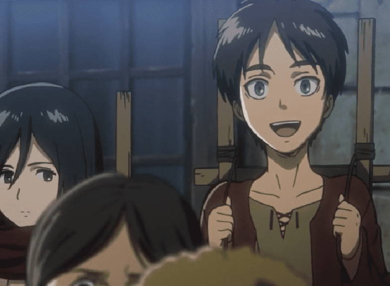
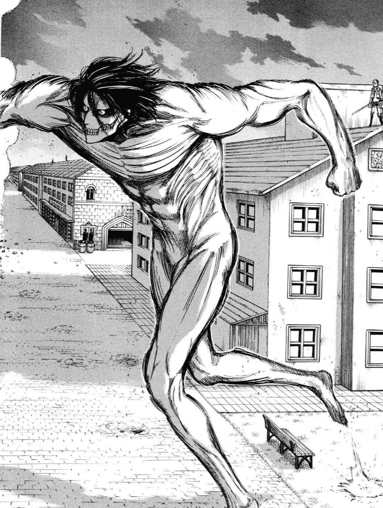
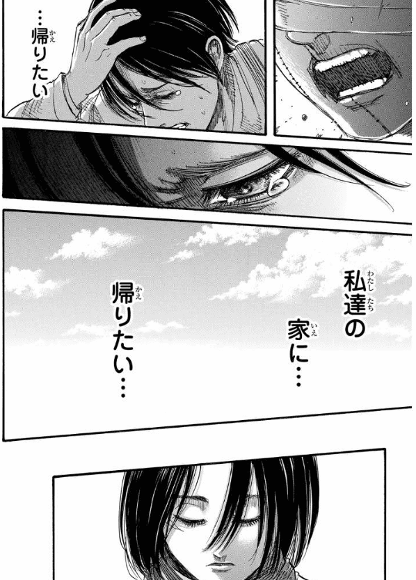
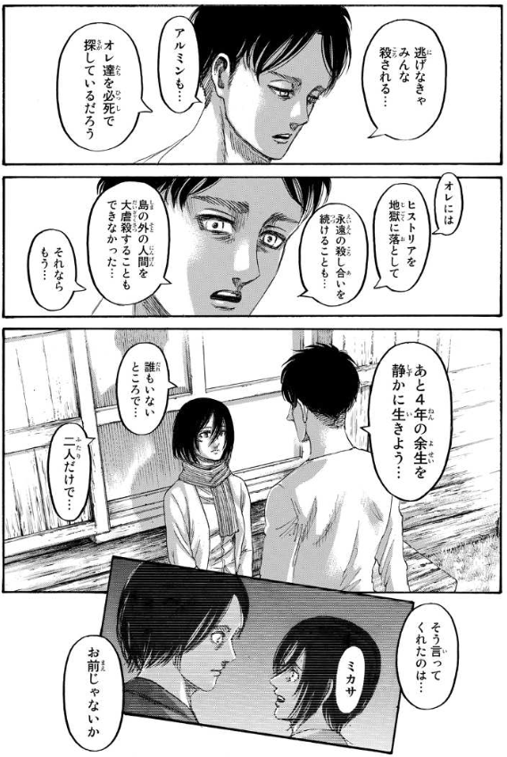
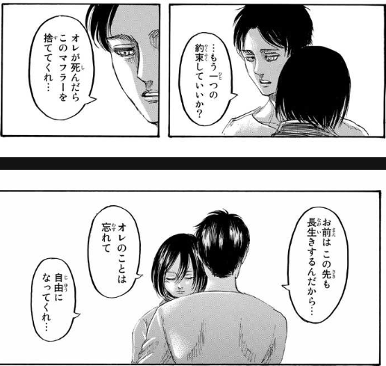

# 进击的巨人情节问题整理

**前言**：进击的巨人是一部跨度10年以上的漫画/动画，我在完全没有剧透的情况下，2013年在爱奇艺上开始看第一季动画，2023年看完动画结局，整个过程经历了恐怖、疑惑、震撼等等许多高强度的情感体验。当抛去这些情绪，问这究竟是一个什么故事时，可以这么回答：
- 地下室前是一个架空悬疑故事，主要问题是巨人从何而来；
- 地下室到艾伦和吉克接触是战争历史剧，主要问题是纷争如何解决。

忽略一些伏笔细节，我们不难看懂这两个部分的剧情内容，但对于艾伦和吉克接触后的剧情，尤其是结尾部分，对于巨人能力、尤米尔能力等「设定」的理解成为了看懂剧情的关键。

**编写原则**：本文档的目的是为了看懂上述内容，对动画和漫画的重要情节进行梳理，努力看懂这部作品，特别是结尾发生了什么，为什么发生。在编写中，尽量不展开推理，以便立足于原作，防止脑补过多。解释理论的提出等放在其他文档编写。

**标记说明**：除了特别篇和完结篇单独说明，其他动画集数采用「总集数」的标记方法，例如 ep.87 表示最终季最后一集「人类的黎明」。对照可参考 [進擊的巨人集數列表](https://zh.wikipedia.org/wiki/%E9%80%B2%E6%93%8A%E7%9A%84%E5%B7%A8%E4%BA%BA%E9%9B%86%E6%95%B8%E5%88%97%E8%A1%A8)。对于漫画来说，因为我看电子版的单行本，所以页数为每卷的第几页，并且因为几乎每一面都没有页码，所以我直接用电子版漫画的显示页数作为标记数字，例如第一卷中显示「13」的那一页在电子版中是第「15」页。每一话的标题可参考 [進擊的巨人漫畫章節列表](https://zh.wikipedia.org/wiki/%E9%80%B2%E6%93%8A%E7%9A%84%E5%B7%A8%E4%BA%BA%E6%BC%AB%E7%95%AB%E7%AB%A0%E7%AF%80%E5%88%97%E8%A1%A8)。下方标题的「第*话」使用漫画的话数和标题。

## 第1话 给两千年后的你 二千年後の君へ

manga-1-13：唯一标记页码的一页「13」
> 

manga-1-15-845：看似是介绍年份：「845年」
> 

manga-1-14：树上有一个十字架刻痕
> 

## 第7话 小刀 小さな刃

manga-2-102：
> 

manga-3-167 | anime-ep12-0449：「家人」前的停顿，和后面那次如出一辙。
> 
> 

## Lost Girls chapter 2. Lost in the Cruel World

动画标题为 第???话 - Lost Girls Lost in the Cruel World。从开头结尾的连接，暂且理解为三笠得知艾伦被吃后，有些自暴自弃，滑行到没气，摔倒后的脑中幻想。

>

anime-ova-Lost Girls Lost in the Cruel World-0118：这个镜头一个蝴蝶分裂成多个蝴蝶，不免想到三笠的世界分裂成多个可能世界的意味。「庄周梦蝶」/「蝴蝶效应」，
>

anime-ova-Lost Girls Lost in the Cruel World-0303：这里蝴蝶站在一个石榴状的东西上用三笠的声音对三笠说话，台词颇有深意。（漫画没有）
>

- 蝴蝶三笠：**如果你不接受这个现实的话，就重新来过吧，从你想要的地方重新开始**，在那个世界，一切都能如你所愿，但是，即使如此，你依旧无法阻止艾伦的死亡，因为艾伦………

anime-ova-Lost Girls Lost in the Cruel World-0606：二人看到本来杀掉父母的土匪被狗咬死了，恶狗面向二人，三笠头痛，狗走开了。
>  

anime-ova-Lost Girls Lost in the Cruel World-0726：「不再走进森林」这台词铺垫的也很有深意，这个爹妈没被杀的世界看似很美好。
>

anime-ova-Lost Girls Lost in the Cruel World-1044：同样去看调查兵团，但这个世界穿的漂亮。
> 

后来，太想见艾伦，妈妈得病所以搬到艾伦家附近，三笠觉得是自己造成的，很内疚。（呼应了「一切都如你所愿」）见到艾伦，得知调查兵团解散，城门被封，艾伦决定和阿尔敏坐热气球出去，三笠也要去，艾伦为其围上围巾，约定3天后出发。快到时间时，三笠被镜男拦下：

>
- 镜男的台词：我必须使用催眠术让你亲手杀人才行呢……不管你多么想去都来不及的……我是任何人又不是任何人，而且催眠术师无所不知（亮出5把印着三笠脸的刀子），你是出于自愿来到这座迷宫的，因为**无法接受艾伦死亡的事实**，从而**自己创造出，这个新世界**，可是，无论你在哪个世界，**你都无法阻止艾伦死亡的结局**（变成三笠的声音），那是因为艾伦本身就抱着死亡的冲动，不管你再怎么保护他，死亡都一定会降临到他身上，如果你觉得我说谎了，自己去确认吧，**只不过你必须杀了我才能前往**，你必须变得坚强，回到原来的世界才行。……（三笠：你为什么要阻止我，我仅仅想和艾伦在一起而已，为什么）没有办法，世界就是这么残酷。

然后，米卡莎像在「现实世界」里一样爆发了力量，扎了镜男，找到阿尔敏，阿尔敏说热气球失去控制，艾伦推开阿尔敏自己撞上墙壁。三笠震惊，镜头接回真实世界。

manga-LOSTGIRLS-2-162：「……又从这里开始……」呼应了前面蝴蝶所说的「如果你不接受这个现实的话，就重新来过吧，从你想要的地方重新开始」。
>

本集最后的台词「不管艾伦去哪里，我都想待在他的身边」，呼应了镜男说的「自己去确认吧」。不知能否这么总结这集，三笠在现实中失去艾伦，痛苦到逃到另一个（想象的可能）世界，却（被神秘力量阻碍）经历更早艾伦的死亡，又回到现实，在现实世界接受了艾伦的死，意外的是，现实世界里艾伦还没死。

**疑惑**：
- 「无论你在哪个世界，你都无法阻止艾伦死亡的结局」这句台词在当下剧情点会让人摸不着头脑，看完巨人，我们得知这是一个铺垫。但是，这里的剧情是理解为元层次的表现，还是理解为故事内剧情呢？
- 如果把镜男的话当作事实接受，我们知道这个世界是三笠无法接受艾伦死掉的事实，自己创造出的，但她却不能创造出一个艾伦不死的世界。为什么？做出这个决定论预言的人是谁？镜男是谁？尤米尔？谏山创？为什么用三笠的声音？

## 第12话 - 偶像 偶像
  
manga-3-158：艾伦还控制不了变身，失去控制，攻击三笠，背景中有奇怪的两个黑影
>  

## 第13话 - 伤 傷

manga-3-163 | anime-ep12-0412：三笠的脸被刀划破，这在漫画中容易被误解为溅起的飞石造成，但是动画表明并不是这样。动画镜头中是一个慢动作，周围的石头都在慢慢移动，这时伴随刀声，一道快速的刀影划过 [动画疯0412](https://ani.baha.tw/3506/04_12)，结合这集标题这里的刀伤应该有特殊用意。
>   

## 第138话 - 漫长的梦 長い夢

manga-34-170：最后一次头痛，首先问为什么头疼？眼前艾伦和大家打到一起，让三笠受不了，或者三笠意识到自己不得不面对杀艾伦的决定所以头痛？
> 
- 观看不舒服的一点是，似乎三笠杀艾伦是一件不需要功夫只需要下决心就能做到的事。阿卡曼是想做就能做到的存在。

manga-34-175：这个世界，是在山坡上「回答家人」or「告白」的分歧点的后者形成的世界。艾伦说，无论牺牲希斯特里亚重复纷争历史，还是屠杀岛外的人，他都做不到，于是他选择了和三笠私奔4年。
>

manga-34-176：艾伦说「拜托忘掉我」
>

manga-34-179：接着小屋世界艾伦的「拜托忘掉我」，三笠做出了「做不到」的回答。这是两个世界的两个三笠做出了相同的回答，仅仅是镜头放在一起呼应，还是同一个三笠逃到可能世界（做了个梦）又回到现实世界？这是关于理解结尾的关键分歧。
>

manga-34-185：第138话（漫长的梦境，長い夢）的第45页（此话一共46页，第46页是接吻画面），三笠说“艾伦，一路小心”。呼应了两处标记连起来的结果「13845」。
>