# 进击的巨人情节问题整理
<!-- TOC -->

- [进击的巨人情节问题整理](#%E8%BF%9B%E5%87%BB%E7%9A%84%E5%B7%A8%E4%BA%BA%E6%83%85%E8%8A%82%E9%97%AE%E9%A2%98%E6%95%B4%E7%90%86)
    - [第1话 给两千年后的你 二千年後の君へ](#%E7%AC%AC1%E8%AF%9D-%E7%BB%99%E4%B8%A4%E5%8D%83%E5%B9%B4%E5%90%8E%E7%9A%84%E4%BD%A0-%E4%BA%8C%E5%8D%83%E5%B9%B4%E5%BE%8C%E3%81%AE%E5%90%9B%E3%81%B8)
    - [第2话 那一天 その日](#%E7%AC%AC2%E8%AF%9D-%E9%82%A3%E4%B8%80%E5%A4%A9-%E3%81%9D%E3%81%AE%E6%97%A5)
    - [第7话 小刀 小さな刃](#%E7%AC%AC7%E8%AF%9D-%E5%B0%8F%E5%88%80-%E5%B0%8F%E3%81%95%E3%81%AA%E5%88%83)
    - [外传 Lost Girls chapter 2. Lost in the Cruel World](#%E5%A4%96%E4%BC%A0-lost-girls-chapter-2-lost-in-the-cruel-world)
    - [第12话 - 偶像 偶像](#%E7%AC%AC12%E8%AF%9D---%E5%81%B6%E5%83%8F-%E5%81%B6%E5%83%8F)
    - [第13话 - 伤 傷](#%E7%AC%AC13%E8%AF%9D---%E4%BC%A4-%E5%82%B7)
    - [第45话 追赶者 追う者](#%E7%AC%AC45%E8%AF%9D-%E8%BF%BD%E8%B5%B6%E8%80%85-%E8%BF%BD%E3%81%86%E8%80%85)
    - [第137话 - 天与地的战斗 天と地の戦い](#%E7%AC%AC137%E8%AF%9D---%E5%A4%A9%E4%B8%8E%E5%9C%B0%E7%9A%84%E6%88%98%E6%96%97-%E5%A4%A9%E3%81%A8%E5%9C%B0%E3%81%AE%E6%88%A6%E3%81%84)
    - [第137话 - 巨人 巨人](#%E7%AC%AC137%E8%AF%9D---%E5%B7%A8%E4%BA%BA-%E5%B7%A8%E4%BA%BA)
    - [第138话 - 漫长的梦 長い夢](#%E7%AC%AC138%E8%AF%9D---%E6%BC%AB%E9%95%BF%E7%9A%84%E6%A2%A6-%E9%95%B7%E3%81%84%E5%A4%A2)
    - [第139话（最終話） - 朝着那座山丘上的树 あの丘の木に向かって](#%E7%AC%AC139%E8%AF%9D%E6%9C%80%E7%B5%82%E8%A9%B1---%E6%9C%9D%E7%9D%80%E9%82%A3%E5%BA%A7%E5%B1%B1%E4%B8%98%E4%B8%8A%E7%9A%84%E6%A0%91-%E3%81%82%E3%81%AE%E4%B8%98%E3%81%AE%E6%9C%A8%E3%81%AB%E5%90%91%E3%81%8B%E3%81%A3%E3%81%A6)
        - [阿尔敏和艾伦的对话](#%E9%98%BF%E5%B0%94%E6%95%8F%E5%92%8C%E8%89%BE%E4%BC%A6%E7%9A%84%E5%AF%B9%E8%AF%9D)
        - [大家想起被抹去的记忆](#%E5%A4%A7%E5%AE%B6%E6%83%B3%E8%B5%B7%E8%A2%AB%E6%8A%B9%E5%8E%BB%E7%9A%84%E8%AE%B0%E5%BF%86)
        - [三笠对尤米尔说](#%E4%B8%89%E7%AC%A0%E5%AF%B9%E5%B0%A4%E7%B1%B3%E5%B0%94%E8%AF%B4)
        - [片尾](#%E7%89%87%E5%B0%BE)

<!-- /TOC -->

**前言**：进击的巨人是一部跨度10年以上的漫画/动画，我在完全没有剧透的情况下，2013年在爱奇艺上开始看第一季动画，2023年看完动画结局，整个过程经历了恐怖、疑惑、震撼等等许多高强度的情感体验。当抛去这些情绪，问这究竟是一个什么故事时，可以这么回答：
- 地下室前是一个架空悬疑故事，主要问题是巨人从何而来；
- 地下室到艾伦和吉克接触是战争历史剧，主要问题是纷争如何解决。

忽略一些伏笔细节，我们不难看懂这两个部分的剧情内容，但对于艾伦和吉克接触后的剧情，尤其是结尾部分，对于巨人能力、尤米尔能力等「设定」的理解成为了看懂剧情的关键。

**编写原则**：本文档的目的是为了看懂上述内容，对动画和漫画的重要情节进行梳理，努力看懂这部作品，特别是结尾发生了什么，为什么发生。在编写中，尽量不展开推理，以便立足于原作，防止脑补过多。解释理论的提出等放在其他文档编写。

**标记说明**：除了特别篇和完结篇单独说明，其他动画集数采用「总集数」的标记方法，例如 ep.87 表示最终季最后一集「人类的黎明」。对照可参考 [進擊的巨人集數列表](https://zh.wikipedia.org/wiki/%E9%80%B2%E6%93%8A%E7%9A%84%E5%B7%A8%E4%BA%BA%E9%9B%86%E6%95%B8%E5%88%97%E8%A1%A8)。对于漫画来说，因为我看电子版的单行本，所以页数为每卷的第几页，并且因为几乎每一面都没有页码，所以我直接用电子版漫画的显示页数作为标记数字，例如第一卷中显示「13」的那一页在电子版中是第「15」页。每一话的标题可参考 [進擊的巨人漫畫章節列表](https://zh.wikipedia.org/wiki/%E9%80%B2%E6%93%8A%E7%9A%84%E5%B7%A8%E4%BA%BA%E6%BC%AB%E7%95%AB%E7%AB%A0%E7%AF%80%E5%88%97%E8%A1%A8)。下方标题的「第*话」使用漫画的话数和标题。

## 第1话 给两千年后的你 二千年後の君へ

manga-1-13：唯一标记页码的一页「13」
> 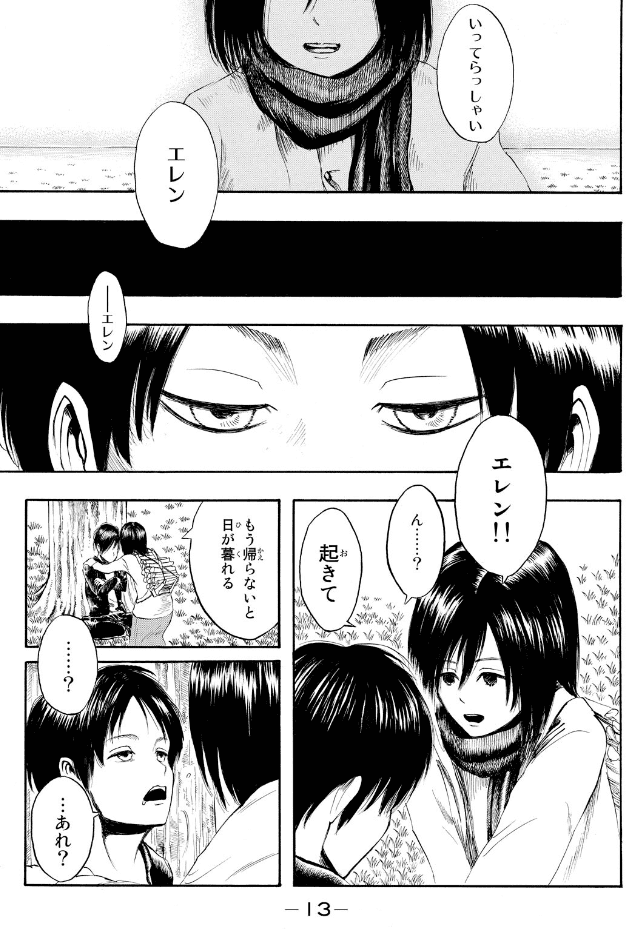

manga-1-15-845：看似是介绍年份：「845年」
> 

manga-1-14：树上有一个十字架刻痕
> 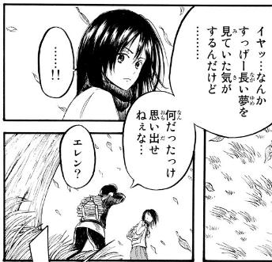

## 第2话 那一天 その日

三笠说：又是 这样吗…… 有两种解读，又是这个头疼吗 or 又是这样的结局（妈被吃）吗
> 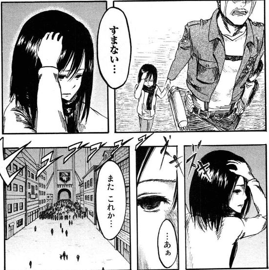

## 第7话 小刀 小さな刃

manga-2-102：三笠说：又是这样吗……又失去了家人，又想起了这疼痛，又不得不从从这里开始。这里又是模棱两可的表达：做了一个梦又从这里开始 or 真的循环过几次又从这里开始？
> 

manga-3-167 | anime-ep12-0449：「家人」前的停顿，和后面那次如出一辙。
> 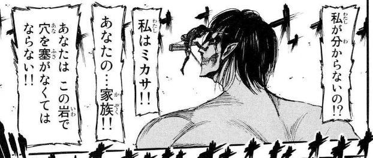
> 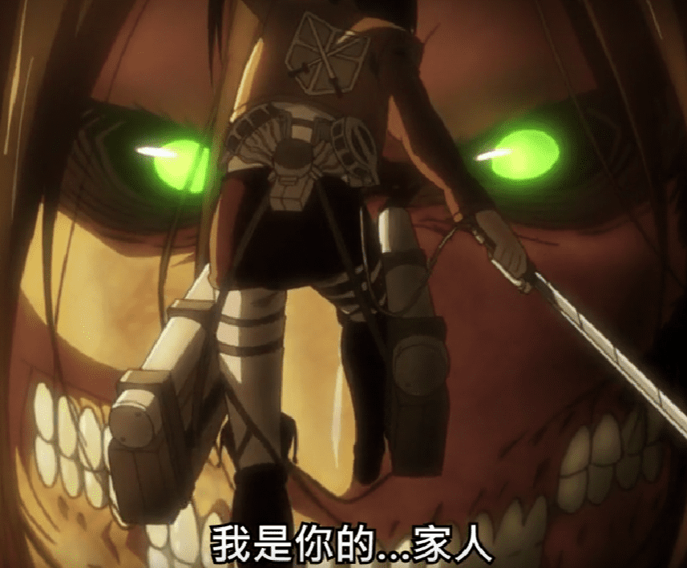

## 外传 Lost Girls chapter 2. Lost in the Cruel World

动画标题为 第???话 - Lost Girls Lost in the Cruel World。从开头结尾的连接，暂且理解为三笠得知艾伦被吃后，有些自暴自弃，滑行到没气，摔倒后的脑中幻想。

>

anime-ova-Lost Girls Lost in the Cruel World-0118：这个镜头一个蝴蝶分裂成多个蝴蝶，不免想到三笠的世界分裂成多个可能世界的意味，「庄周梦蝶」/「蝴蝶效应」。（漫画没有）
>

anime-ova-Lost Girls Lost in the Cruel World-0303：这里蝴蝶站在一个石榴状的东西上用三笠的声音对三笠说话，台词颇有深意。（漫画没有）
>

- 蝴蝶三笠：**如果你不接受这个现实的话，就重新来过吧，从你想要的地方重新开始**，在那个世界，一切都能如你所愿，但是，即使如此，你依旧无法阻止艾伦的死亡，因为艾伦………

漫画版和动画版有很大出入，漫画中有更多细节，例如漫画中有蝴蝶的箱子，想不起艾伦的脸等情节。并且漫画中并没有要和艾伦一起，而是嘱托艾伦不要死。这里待补充。

anime-ova-Lost Girls Lost in the Cruel World-0606：二人看到本来杀掉父母的土匪被狗咬死了，恶狗面向二人，三笠头痛，狗走开了。
>  

manga-LOSTGIRLS-2-35: 漫画中并没有头痛的描写，而强调狗眼睛中三笠的倒影。
> 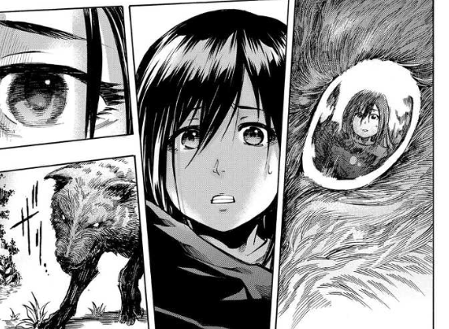

anime-ova-Lost Girls Lost in the Cruel World-0726：「不再走进森林」这台词铺垫的也很有深意，这个爹妈没被杀的世界看似很美好。
>

anime-ova-Lost Girls Lost in the Cruel World-1044：同样去看调查兵团，但这个世界穿的漂亮。
> 

后来，太想见艾伦，妈妈得病所以搬到艾伦家附近，三笠觉得是自己造成的，很内疚。（呼应了「一切都如你所愿」）见到艾伦，得知调查兵团解散，城门被封，艾伦决定和阿尔敏坐热气球出去，三笠也要去，艾伦为其围上围巾，约定3天后出发。快到时间时，三笠被镜男拦下：

镜男的造型在动画版遮住了头发部分，从漫画上色来看，镜男的头像是毛线团，或是绕起来的女人的头发，颜色和三笠的黑色头发相反，非黑色。

>
>

- 镜男的「奇怪」台词：我乃旷世奇才，是知名催眠师，名叫镜男，接下来，我将为各位表演精彩的催眠术。我会将这位天真无邪的少女彻底变成一个无情的杀人犯。……请仔细看我的脸（镜子中映出三笠）……我不能轻易就让你离开这里呢，为了这场表演，我必须用催眠术让你亲手杀人才行呢。所以不如这样吧，我提议，你在这里动手杀了我吧，虽然可以按照刚说的用催眠术让你下手，不过得花点时间。（**此处漫画独有台词**：这也是没办法的，世界是不讲理的，人类也不想被巨人吃……巨人就什么也不说地吃人，不讲理极了对吧，所以……）
  
  >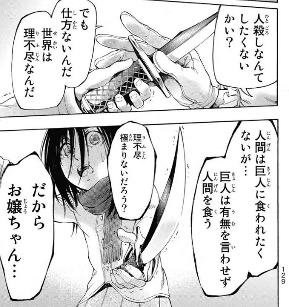
  
  注意看这里也出现了标记「129」

- （此处漫画独有台词：……小姐我告诉你一个秘密，我已经忍不下去了，在这一晚上工作，向观众表演催眠术，结束了又要到另一个聚会表演）
  >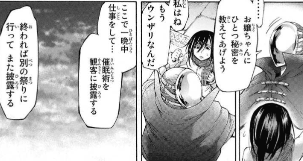

- （此处漫画独有台词：……**一遍又一遍地，无数遍地重复，这就是我的人生**。怎么样？实在是无聊，没有意义地人生吧。但是……这也是没办法的，我没有选择。但是，**我已经发自内心地忍不下去了**……所以今夜，我要表演绝无仅有的催眠术，用催眠术把纯洁无邪的少女操控，在大家面前让她把我杀了）
  - 这段台词可能是 `镜男 = 尤米尔` 的最强证据。

  >

- （此处漫画独有台词：**这就是我最后的催眠术，对这个世界的复仇**……想好了吗？**再不决定时间要没了哦**）

  >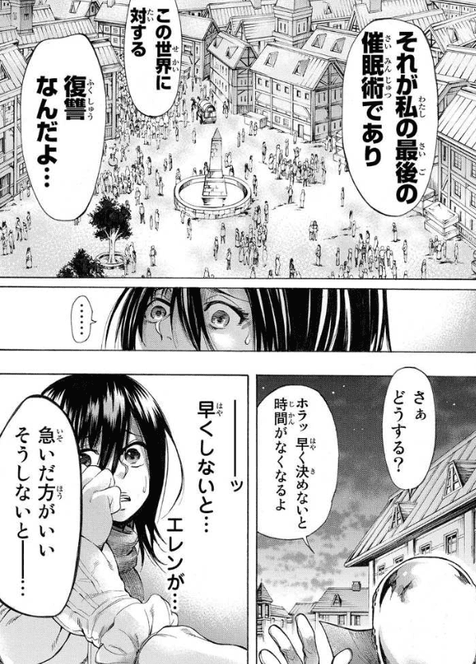

- （此处漫画独有台词：你不会再见到**艾伦**了 三笠：你是谁？你为什么会知道艾伦？ 我任何人也不是，同时也是任何人。我是旷世催眠术师，催眠术师什么都知道。小姐你迷路了，你出自自己的心愿误入到这里，这没事，但是呆久了…… **此处有数字标记「134」** 差不多该回去自己所属的地方了，如果不你就再也回不去了，艾伦的脸都想不起来，一生被关在这里，如果不想这样就把我杀了，要回到原来的地方不得不流血。当然，如果你想这样就呆在这吧，回去好还是留下来好，自己决定吧）

  >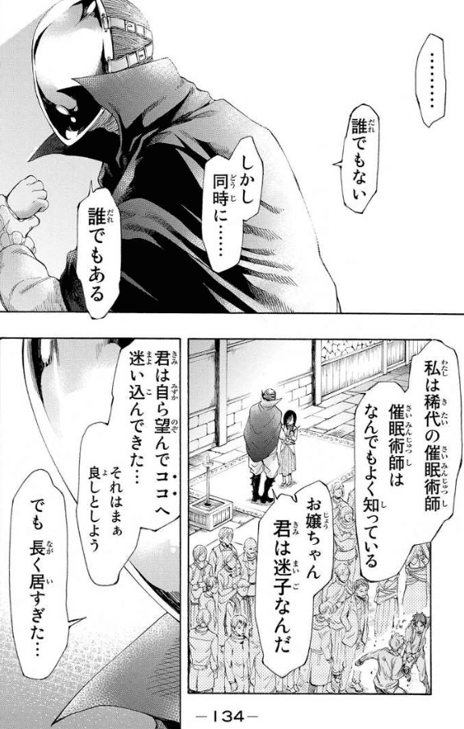
  >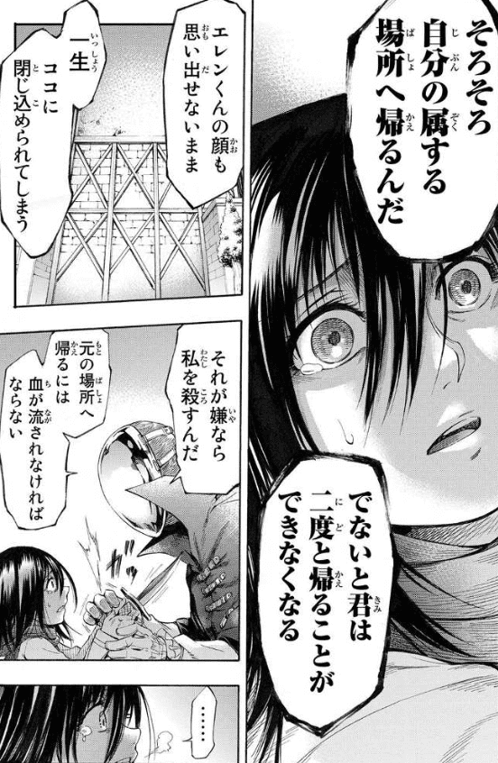
  
- 动画台词：……我是任何人又不是任何人，而且催眠术师无所不知（亮出5把印着三笠脸的刀子），你是出于自愿来到这座迷宫的，因为**无法接受艾伦死亡的事实**，从而**自己创造出，这个新世界**，可是，无论你在哪个世界，**你都无法阻止艾伦死亡的结局**（变成三笠的声音），那是因为艾伦本身就抱着死亡的冲动，不管你再怎么保护他，死亡都一定会降临到他身上，如果你觉得我说谎了，自己去确认吧，**只不过你必须杀了我才能前往**，你必须变得坚强，回到原来的世界才行。……（三笠：你为什么要阻止我，我仅仅想和艾伦在一起而已，为什么）没有办法，世界就是这么残酷。

  >

- 三笠：为什么要妨碍我？因为世界是残酷的

然后，米卡莎像现实世界里一样爆发了力量，扎了镜男，找到阿尔敏，阿尔敏说热气球失去控制，艾伦推开阿尔敏自己撞上墙壁。三笠震惊，镜头接回真实世界。

manga-LOSTGIRLS-2-162：「……又从这里开始……」呼应了前面蝴蝶所说的「如果你不接受这个现实的话，就重新来过吧，从你想要的地方重新开始」。
  >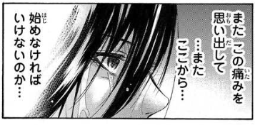

本集最后的台词「不管艾伦去哪里，我都想待在他的身边」，呼应了镜男说的「自己去确认吧」。不知能否这么总结这集，三笠在现实中失去艾伦，痛苦到逃到另一个（想象的可能）世界，却（被神秘力量阻碍）经历更早艾伦的死亡，又回到现实，在现实世界接受了艾伦的死，意外的是，现实世界里艾伦还没死。

**疑惑**：
- 「无论你在哪个世界，你都无法阻止艾伦死亡的结局」这句台词在当下剧情点会让人摸不着头脑，看完巨人，我们得知这是一个铺垫。但是，这里的剧情是理解为元层次的表现，还是理解为故事内剧情呢？
- 如果把镜男的话当作事实接受，我们知道这个世界是三笠无法接受艾伦死掉的事实，自己创造出的，但她却不能创造出一个艾伦不死的世界。为什么？做出这个决定论预言的人是谁？镜男是谁？尤米尔？谏山创？为什么用三笠的声音？

ED的歌词富有深意 [TVアニメ「進撃の巨人」Season 1前期ノンクレジットED｜日笠陽子「美しき残酷な世界」](https://www.youtube.com/watch?v=eN_rq3FvJUs)，[翻译参考](https://home.gamer.com.tw/artwork.php?sn=5164105)。
> 嗚呼ボクたちは　この強さ　弱さで
> 
> 啊啊我們究竟　要用這份堅強、軟弱
> 
> 何を護るのだろう　もう理性など
> 
> 來守護些什麼呢　若是理性之類的
> 
> 無いならば
> 
> 已蕩然無存

## 第12话 - 偶像 偶像
  
manga-3-158：艾伦还控制不了变身，失去控制，攻击三笠，背景中有奇怪的两个黑影
>  

## 第13话 - 伤 傷

manga-3-163 | anime-ep12-0412：三笠的脸被刀划破，这在漫画中容易被误解为溅起的飞石造成，但是动画表明并不是这样。动画镜头中是一个慢动作，周围的石头都在慢慢移动，这时伴随刀声，一道快速的刀影划过（[动画疯0412](https://ani.baha.tw/3506/04_12)），结合这集标题这里的刀伤应该有特殊用意。
>  

## 第45话 追赶者 追う者

manga-11-123-头疼：艾伦被夺走，三笠头疼。台词仍是：又是这样吗
> 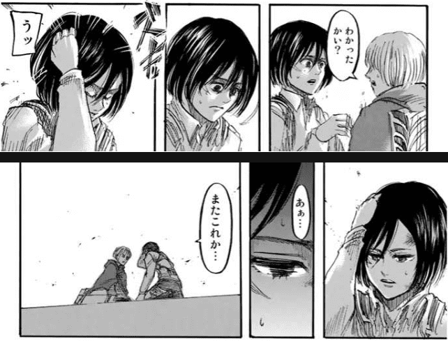

## 第137话 - 天与地的战斗 天と地の戦い

尤米尔在这里出现，是什么意思
> 

这里，虐杀人类，是尤米尔的意志，而不一定是艾伦的意志。
> 

## 第137话 - 巨人 巨人

manga-34-130：吉克被砍头，地鸣停止，证明王室对维持地鸣的不可或缺。
> 

## 第138话 - 漫长的梦 長い夢

manga-143：米卡莎想起艾伦的讨厌，竟然那是最后一面，难以接受而头疼。
> 
>

manga-34-170：艾伦又活过来，和大家打到一起。三笠又头疼。这里第一刻三笠想到的是树下睡着的艾伦，之后才是二人小屋的世界。

> 
> 

manga-34-175：这个世界，是在山坡上「回答家人」/「告白」的分歧点的后者形成的世界。艾伦说，无论牺牲希斯特里亚重复纷争历史，还是屠杀岛外的人，他都做不到，于是他选择了和三笠私奔4年。
>

manga-34-176：艾伦说「拜托忘掉我」
>

manga-34-179：接着小屋世界艾伦的「拜托忘掉我」，三笠回答「做不到」。这是两个世界的两个三笠做出了相同的回答，仅仅是镜头放在一起呼应，还是同一个三笠在脑中模拟了一个可能世界后又回到现实世界？以及造成观众看到这个小屋世界的是艾伦还是三笠，还是其他人？这些是关于理解结尾的关键问题。
>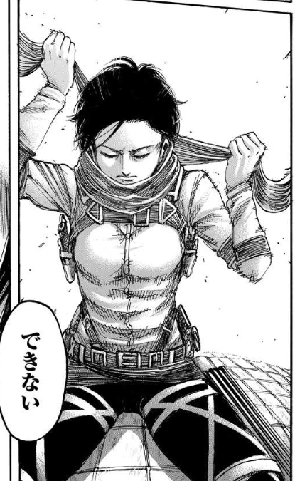

manga-34-185：第138话（漫长的梦境，長い夢）的第45页（此话一共46页，第46页是接吻画面），三笠说「艾伦，一路小心」。呼应了[第1话 给两千年后的你 二千年後の君へ](#%E7%AC%AC1%E8%AF%9D-%E7%BB%99%E4%B8%A4%E5%8D%83%E5%B9%B4%E5%90%8E%E7%9A%84%E4%BD%A0-%E4%BA%8C%E5%8D%83%E5%B9%B4%E5%BE%8C%E3%81%AE%E5%90%9B%E3%81%B8)两处数字连起来的结果「13845」。
>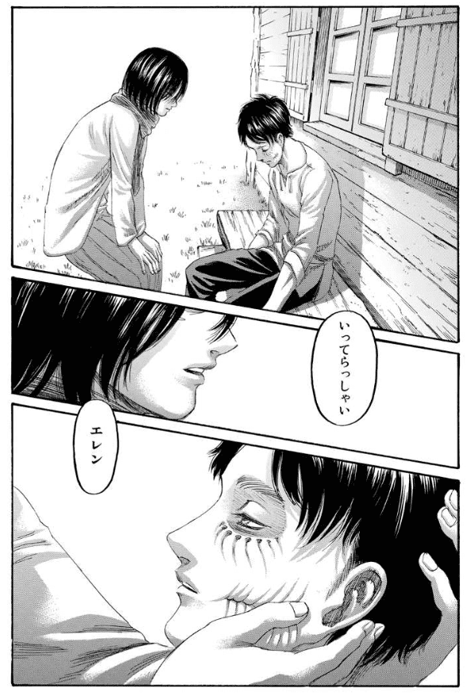

尤米尔笑了。这是全剧唯一一次笑容。
>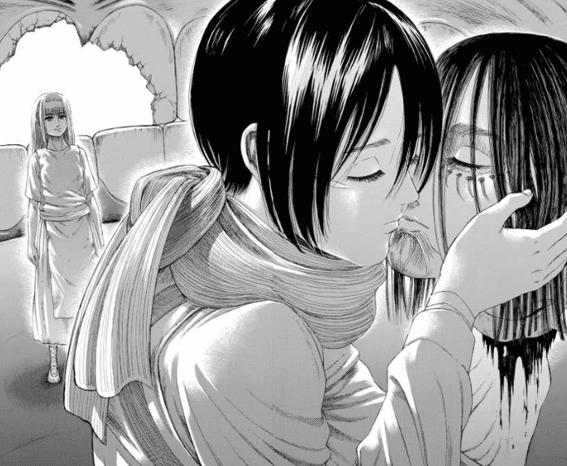

## 第139话（最終話） - 朝着那座山丘上的树 あの丘の木に向かって

### 阿尔敏和艾伦的对话
- 第一段：**艾伦的目的是把阿尔敏等塑造为讨伐艾伦的英雄。** 阿尔敏拿戴巴家族作类比（戴巴家族用巨人之力杀掉巨人，成为英雄，保护艾尔迪亚人？现在，阿尔敏等用巨人之力杀掉艾伦，成为英雄，保护帕拉迪岛）漫画中艾伦紧接着说因为会死80%的人类，岛外无法报复帕拉迪岛。动画中删去了这部分。
- 第二段：**巨人之力的存在是因为尤米尔2000年来一直服从着弗利兹王。** 尤米尔爱着弗利兹王是束缚她2000年的原因。她一直寻求着帮她解脱的人，那就是三笠。漫画比动画多一个「围巾」的分镜，这个分镜和 manga-12-169 不一致，也和 manga-34-237 不一致。

    >
    >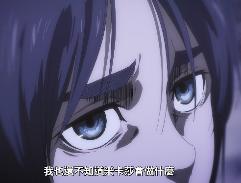
    manga-12-169 和 manga-34-237：
    >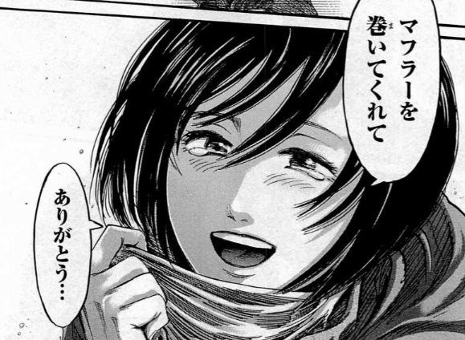
    >

    最大可能是 manga-34-237 之后鸟飞起来后，「给我围上围巾，谢谢」这句话时的分镜，只不过观众没有看到。如果是这样，艾伦能看到是因为看到了鸟的记忆？动画删掉此处又是为何？

    艾伦说三笠做了什么，他不知道，只知道他做的一切是 **为了** 到达那个结果。这句话是否和第一段矛盾？究竟是 **为了到达那个结果** 还是 **为了把阿尔敏等塑造为讨伐艾伦的英雄** ？

    之后阿尔敏说：这就是你在授勋式上看到的未来。艾伦没有否定。始祖力量让艾伦脑袋混乱，「过去」「未来」同时存在。那一天，贝尔托特 **不该死** ，让巨人朝着妈妈过去的是……（我）。

    >

    这句话说明，始祖力量能控制不同时间上的巨人，但 **不该死** 是谁定下的呢？ **为了到达那个结果** 是艾伦对多种结果的权衡结果，还是别人让艾伦不得不到达那个结果？ 如果是前者，艾伦是自由的，但也是时间悖论的，毕竟艾伦自己也经历过没有始祖力量的时间。如果是后者，那尤米尔自然是最可能决定一切的那个人，艾伦只是感觉能控制一切，感觉能做出选择的决定论奴隶。如何解释这里的对话，十分关键。

- 第三段：**想让三笠在自己死后至少想自己10年** 动画在这一段改动很大，添加了：

    anime-终part2-010415
    >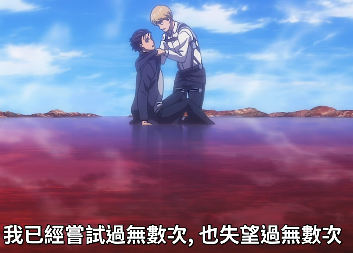

    >

    >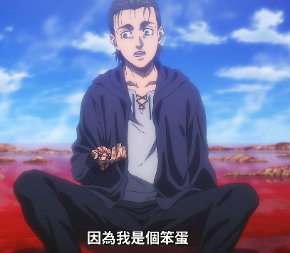

    似乎还是关于艾伦矛盾的叙述的演出效果，一方面觉得自己无可奈何被决定着怎么做，一方面又觉得自己确实想这么做。对解答之前的疑问没有什么帮助。

二人对话之后紧接着在船上的剧情，可以确定对话发生在这时候，并消除了阿尔敏的记忆。一只鸟飞过，仿佛暗示着或者实质上就是艾伦。

manga-34-207-船上：

>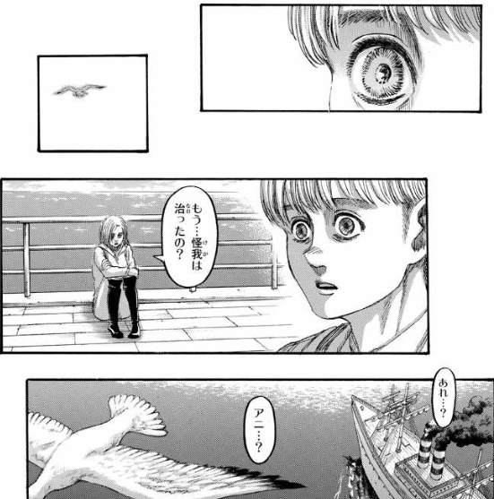

### 大家想起被抹去的记忆

- manga-34-211：这两句台词十分令人疑惑：
  >
  - 三笠：阿尔敏的记忆 **也** 恢复了吧，就是 **艾伦来见我们的时候**
    -  暗示三笠也失忆过？但阿卡曼能被篡改记忆吗？
    -  艾伦来见我们的时候是什么时候？好像和阿尔敏一个人在船上不太符合？
  - 阿尔敏：我都听他说了，三笠你带来的结果就是让巨人之力从世上消失
    - 观众看到的对话中，艾伦并不知道也没有告诉阿尔敏结果是什么，和这句话矛盾

- manga-34-213：大家也想起来，只有皮克没有和艾伦说过话。
    >
    >

    如果每个人是单独说的，三笠怎么知道是「见我们的时候」？如果是一起说的，那观众看到的和阿尔敏的单独对话是怎么回事，为什么皮克不在场？「见我们的时候」是哪个时候是一个重要的问题。

### 三笠对尤米尔说

>

- 在我的脑袋里窥视：似乎和头疼联系起来比较自然。
- 三笠：被夺走的生命（尤米尔你的生命）已经不能回来，但正因为你生下的生命（你的女儿），才有了我（所有艾尔迪亚人）。画面出现了「另一个结果」弗利兹王被矛插死，尤米尔活了下来。这是否是尤米尔一直渴望的另一个结果？这种渴望通过三笠得到了实现。

### 片尾

manga-34-227：战争时出生的孩子满三岁。

>

anime-终part2-012220：大家在三年后（第4个春天）来看艾伦，之后一共出现了8次雪天，再到春天，共12个春天，过了11年，三笠和男人、小孩出现，说明和艾伦期待的一样，完整的10年单身，在第11年间谈了丈夫，生了小孩。
>