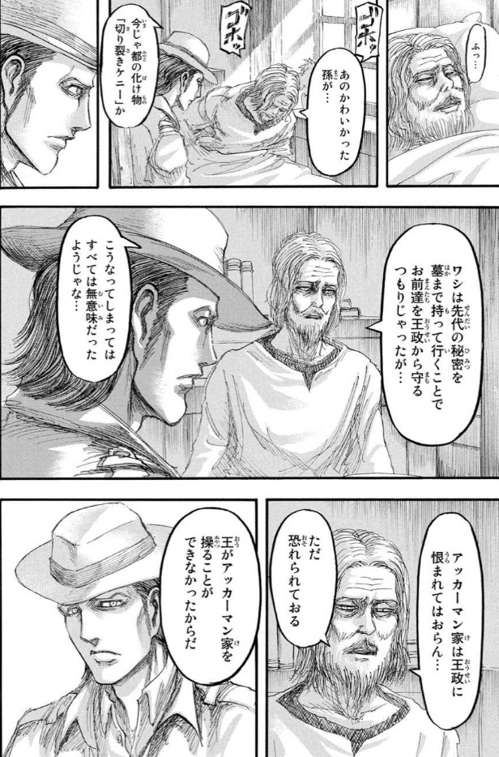
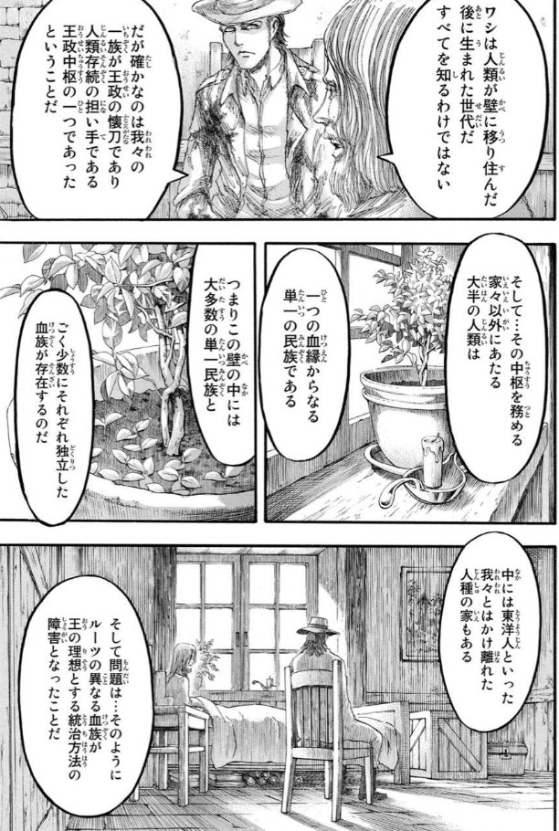
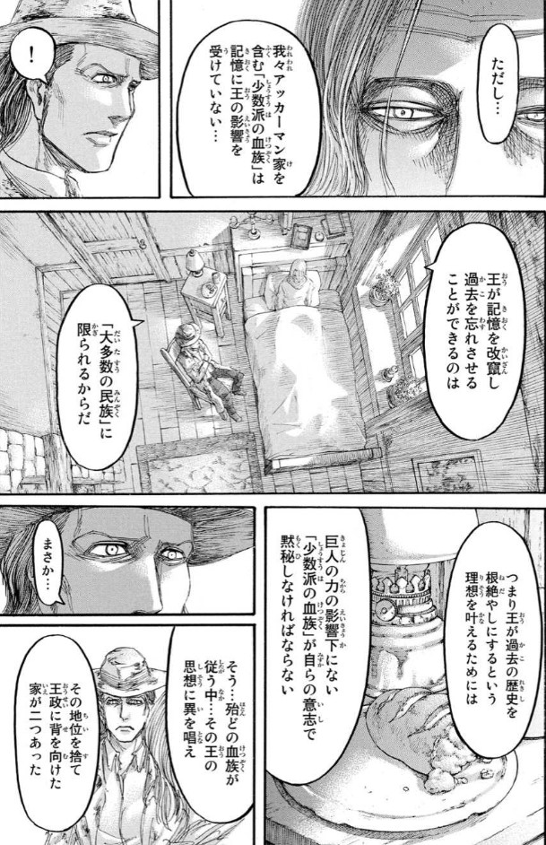
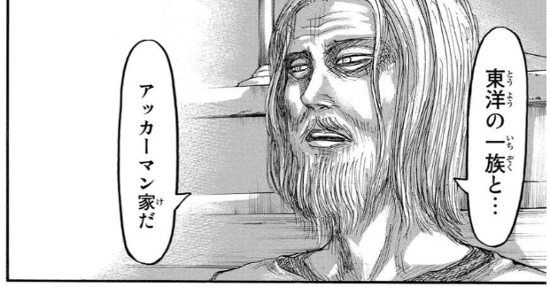
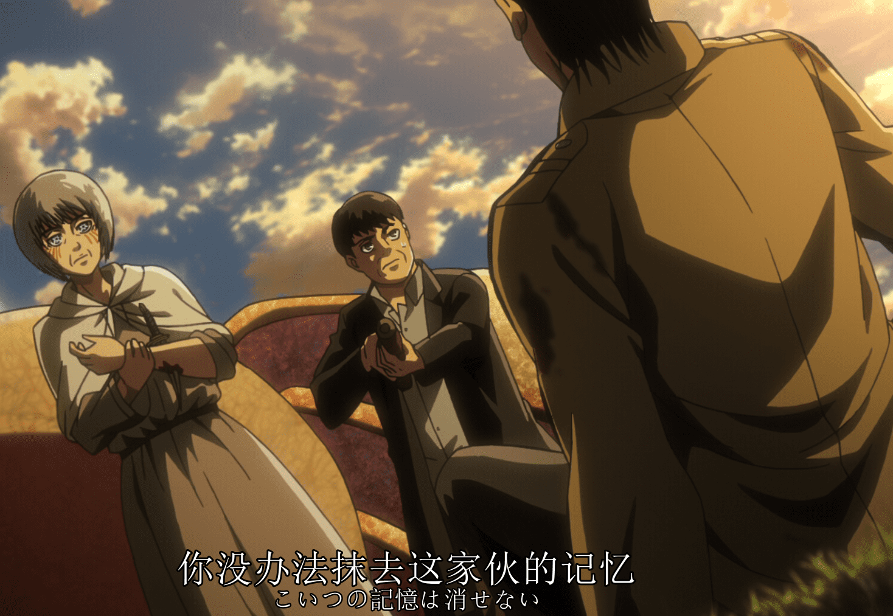
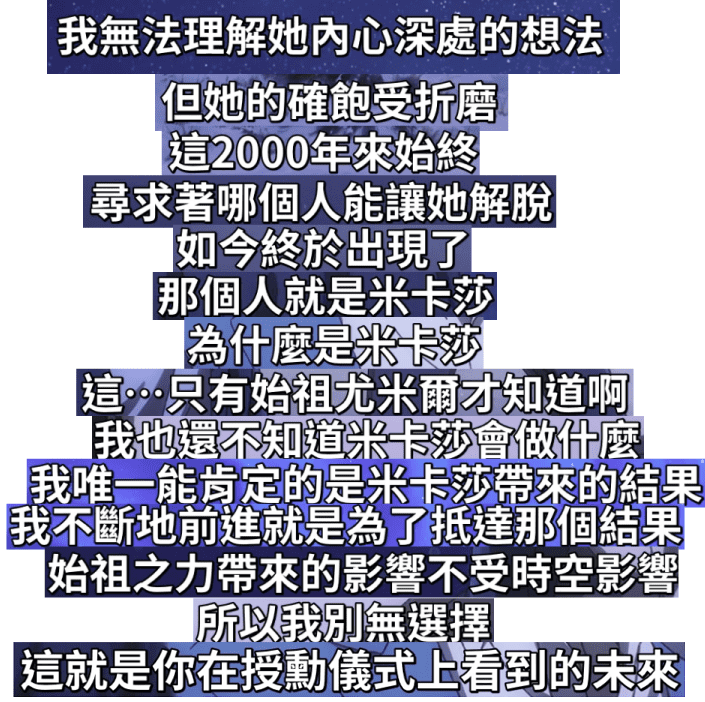

**设定大览**：
- 尤米尔的能力
- 始祖巨人的能力
- 王室始祖巨人的能力
- 进击的巨人的能力
- 阿卡曼人的特性
- 三笠的头疼
- 道路的原理
- 刻痕

## 阿卡曼人的特性

阿卡曼人不能被篡改记忆

关键性证据：肯尼爷爷的交代。
- manga-16-102:
  > 

  >
  >
- 始祖力量无法消除肯尼的记忆。

  anime-ep47-0425：

  >

阿卡曼的记忆无法被篡改，这呼应了故事中只言片语提到的阿卡曼人被追杀的背景。而且，这对我们理解三笠的多世界问题至关重要，因为三笠无法被艾伦篡改记忆。所以以下这种对小屋世界的解读就站不住脚了：
> 艾伦在最后把三笠召唤到道路中，消除了三笠部分记忆，然后一起过了一个安逸的小屋世界，再回到现实，消除掉三笠在小屋世界的记忆

如果说三笠被动地被带到小屋世界，却主动遗忘真实世界的记忆，这是不自洽的。所以，创造出小屋世界的不可能是艾伦。

以下是一个被我自己否定的特性：~~涉及阿卡曼人的记忆不能被看到。~~
- ~~和阿尔敏的对话中，艾伦说看不到米卡莎会做什么，换句话说艾伦看不到米卡莎把自己砍死的场景。~~

  anime-终part2-010028：

  > 
  
  否定理由：manga-32-147 艾伦的记忆中有阿卡曼人。以上是以偏盖全了。

    > 

  这说明为什么艾伦不知道“三笠的选择”（没看到她砍向自己的场景）需要其他解释。

## 三笠的多世界问题

主要依据动画第???集 - Lost Girls Lost in the Cruel World中所说的，「如果你不接受这个现实的话，就重新来过吧，从你想要的地方重新开始，在那个世界，一切都能如你所愿，但是，即使如此，你依旧无法阻止艾伦的死亡，因为艾伦………」

需要说明，同很多穿越作品一样，每个分支点后的两个世界都可以看作是互为「平行世界」，支持这种可能世界地位相同观点的人相当于承认实质上存在多个三笠；另一种看法是做梦式的，即可能世界和现实世界地位不等价，可能世界只是三笠脑中模拟的可能性，让我把这种观点下的可能世界叫做「假想世界」。这可能涉及一些可能性（模态）的哲学讨论，这两种观点不同点在于，可能世界分歧点由什么决定，如果是「平行世界」，分歧点是上帝视角（世界外的人）决定的，是世界里的人认识论不可达的，只有谏山创可达。而对于「假想世界」，分歧点是现实世界里的人（三笠）设想的，每个假想世界需要一个认识论说明，即为什么她会这么设想。

总结：
- 可能世界：
  - 平行世界：多个三笠，等价世界，独立于三笠心理状态
  - 假想世界：一个三笠，一个现实世界，取决于三笠心理状态

具体到三笠的例子，倘若用平行世界理解，作品仅仅是展示了多个平行世界的不同三笠的故事，用剪辑手法放在一起，这是说的通的，但在「**如果你不接受这个现实的话，就重新来过吧，在那个世界，一切都能如你所愿**」上的解释力很差。所以，我偏向于采取第二种假想世界的解读，三笠的每个可能世界是由于三笠的心理状态产生的。本动画至少有这两处假想世界：
  - 得知艾伦被吃 --> 父母没被强盗杀死的话...妈妈得病...艾伦
  - 纠结杀艾伦前 --> 夜晚山坡上告白的话...逃亡...小屋

但让问题复杂的是到现在我没考虑后半句：「**但是，即使如此，你依旧无法阻止艾伦的死亡**」，如果按照假想世界的解释，凭什么三笠设想不出艾伦不会死亡的世界？而且，这时候三笠还不知道艾伦变成巨人，也不了解巨人之力继承年限的知识。另外，在假想世界里遇到「镜男」也无法用三笠的心理认知去解释，「镜男」完全是一个超越三笠认知想象的存在，不留情面地宣告了艾伦死亡的决定论。

那么，如果兼顾这两句话，妥协的解释就是三笠可以凭借心理状态创造出一些假想世界，但是这些假想世界又有不受三笠意愿控制的必然结果，艾伦的死亡。那么追问，为什么艾伦必然死亡？这一问题只能在三笠的世界外回答。

在继续讨论之前我想先讨论「是什么让我们觉得一个故事情节合理」，例如一个故事里，A开枪打中B的脑袋，B死亡，我们可能觉得「B死亡」是合理的，但如果没有其他说明，不会觉得「A开枪」合理，甚至挑剔的观众会把「A开枪」不合理感传递到「B死亡」上。一般说来，观众需要一个因果链来构建合理性，因果链的开端往往是日常我们随处可见的事件或可接受的设定背景。现在让我们面对「艾伦必死」的结论，我们会觉得它合理吗？不会，因为我们不习惯接受把主角必死直接作为故事的背景设定。

上一段说明如果巨人的故事是合理的，那么「艾伦必然死亡」的合理性只能由三笠之上，谏山创之下的人给出，所以，唯一可能的理由来自于尤米尔。

- 让我插入一种我不喜欢的合理性理由，镜男有句话「你都无法阻止艾伦死亡的结局……**那是因为艾伦本身就抱着死亡的冲动**」也就是说，我们可以认为艾伦就是这样「必死」的人，「必死」是艾伦的性格使然。但单是这样，显然无法接受，除非补充更多前提，例如我们能接受艾伦就是「永远自由，永远进击」的人，但这也不够推出「必死」。所以我还是倾向于认为艾伦「必死」是有上位者操控的。
- 让我插入一种我不喜欢的合理性理由，把镜男说的「艾伦必然死亡」理解为一种观测完历史所有可能后的发言。不是谁让艾伦死的，而是确实没有一种可能性艾伦不死。但如果我是三笠，我能选择重新开始的地方，我就回到艾伦没被打药之前，例如父母没被杀的时候，我就用蛮力把艾伦绑在小屋子里，圈养起来，艾伦还会必然死亡吗？当然反驳意见是，三笠不可能这么做，或者不应该把镜男说的话滴水不漏地去理解，此处的「必然」也许只是一种戏剧性说法。而且「在那个世界，**一切都能如你所愿**……除了艾伦必死」这本身也很夸张，假设三笠所愿是突然有神迹降临，墙消失，巨人消失，大家一起去海边旅游，艾伦还会死吗？这更说明不该滴水不漏地理解镜男说的内容。

结合这两段不那么舒服的理由，也许可以变成勉强能接受的理由。「一切如你所愿」「必然」只是一种夸张说法。镜男想说的也许只是：由于艾伦向往自由，一定会和「墙」「巨人」形成冲突，这种冲突大概率会导致艾伦死亡，继承巨人力量反而是续了命。三笠只是进行一些非极端的重来的话，都不足以改变艾伦会死的结果。

总结这部分，关于「为什么艾伦必死」这个问题，合理的回答有两种：
- 尤米尔决定艾伦必死。
- 由于艾伦的性格和世界有冲突，艾伦大概率会死。

-----