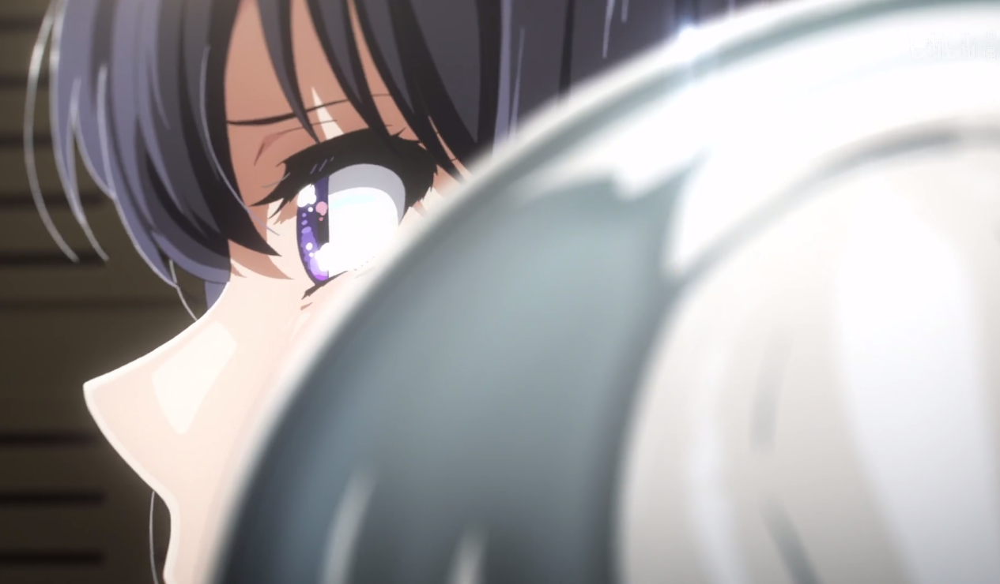

# 響け！ユーフォニアム３感想

| 两种对立目标 | 快乐地吹奏 | 全国大会金奖 |
| :--- | :---: |:---:|
| 选拔依据 | 考虑人情世故，老生优先的选拔 | 实力至上的选拔 |
| 好处 | 更易保住友谊 | 拿奖「死ぬほど嬉しい」 |
| 坏处 | 不得已服从的实力派会「死ぬほど悔しい」 | 选拔伤友情 |
| 代表人物 | 入学的久美子 | 入学的麗奈 |

由前者变为后者的契机：他人の「死ぬほど悔しい」気持ちを理解したい　と　自分は「音楽に嘘をつけない」

| 人物变化 | 久美子一年级 | 久美子二年级 | 久美子三年级 |
| :--- | :---: |:---:| :---:|
| 久美子 | 想要理解麗奈的「死ぬほど悔しい」，逐渐转变，最后理解，加入实力至上派 | 受到奏的挑战，拉入阵营 | 受到真由的挑战，对和麗奈一起吹的挑战，痛苦万分，最后坚持振奋 |
| 麗奈 | 「特別になりたい」，坚定的实力至上派 | - | 一起吹的破灭，痛苦但坚持了立场 |
| 真由 | 实力至上派 | 友情受伤，转变为和气吹奏派 | 在久美子的理解下，得到救赎 |

第三季展示了一个有意思的结构，和第一季相呼应的同时，通过视角的互换，从「挑战者」到「被挑战者」，把两个立场的矛盾再次展现出来。

|  | 受害者视角 | 挑战者视角 | 原因
| :---  | :---: |:---:| :---:|
| 久美子一年级 | 香織，優子 | 麗奈，久美子 | 改为实力选拔，导致不能一起吹
| 久美子三年级 | 麗奈，久美子 | 真由 | 坚持实力选拔，导致不能一起吹

可以想象，久美子刚加入吹奏部时，听说的师姐们的矛盾也是围绕这两种情况发生的吧。这种循环感的结构和视角的互换很有日本文学作品的非个人英雄主义特色，让观众即体验「正确」的快乐，也体验「正确」的痛苦，从而更加理解之前被挑战者的心情。主角看似是麗奈和久美子，但讲述的实际上是古往今来所有吹奏部员都会面对的心理历程。

##  滝先生的行为逻辑

我在看10-11集时，很愤愤不平。选完人安抚一下落选者并且说明一下理由不行吗，为什么这么冷酷，真的能代表「正しい」吗？再加上麗奈的咋咋呼呼，让我觉得这似乎是盲信，更加怀疑这里有什么猫腻。

最后去拜访明日香前辈时，我们获得了老师行为的解释。首先，二人的实力差距不大，但久美子确实差一点，所以老师选择了真由。但是，老师其实也考虑到「非实力因素」，久美子作为部长不当选，可能会造成混乱。明日香对老师犹豫但是还是遵从「一切为了全国大会金奖」而做出的选择表示理解。

为什么不给出说明，假如对部员说，说了「两人实力差距不大」，这反而更会激起既然不大，那么为什么不选部长的反对声音。假如只对久美子说，也似乎并不那么顺利，「我认为你比真由差一点点，尽管不多」，听到这话，久美子会更好受吗。而且凭什么对久美子特殊照顾，这么多人因为选拔落选都需要一一说明吗？

以上是我做出的一些推测性设想，怎么处理这个问题对于滝老师确实也不好办，把一切毫无保留地说出来，并不一定让部内更加团结。所以最后解决问题的关键还是久美子自身。只能像一年级时的前辈们一样，快乐吹奏，放弃目标；或者痛苦地坚持「为了全国大会金奖」「实力至上」。正如明日香所说，想让老师给说明，不是因为老师可能有什么问题，难不成老师会害自己？会害吹奏部？只是自己不甘心罢了。观众的心理这一刻也和久美子完美的共鸣了。没错，就是不甘心。这三年走过来，和最好的朋友想在仪式上走到完美，最后没做到，多么可惜。不甘心。

##  坚持正确的痛苦

对于选拔手段，哪种正确？直观上，既然搞音乐，谁搞的好就让谁上这是正确的。所以作为久美子视角，在第一季坚持正确的东西，取得快乐的结果，这让人心情很舒畅。作为受害者的香織，優子，纵使有很多描写，终究不是观众视角，观众能否真正理解那种心情，是值得怀疑的。

对于理解不了的观众来说，第三季的剧情设计显得尤为冷酷和现实。这回，坚持正确的事情的受害者转换到了久美子和麗奈，观众之前作为挑战者有多爽，这里就会有多难受。当我们感到不爽的时候，很容易会想让代表「正确」的老师给出解释，难道当年的優子不是这么想的吗？让老师给个说法。说到底，观众又不是真的需要从音乐上判断谁吹得好，我自己当年听麗奈和香織选拔时，也没有觉得「哇，确实麗奈吹的好啊」，观众懂个屁音乐啊。第一季能轻易接受「正确」，第三季却难接受「正确」，主要原因仅仅是从「正确」的受益者转换为了「正确」的受害者。

稍微联想一点，古往今来的君王多数不都是这样，打着「正确」的旗号推翻前朝，获得江山后，开始为了自己的利益，背弃「正确」。很少有人能不关乎自己利益地坚持「正确」。现在网上一些没头没尾的争论也是一样，没当公务员时骂都是一些国家蛀虫，自己当公务员时说一切为了生存等等。这些基于立场的讨论真的很廉价。

综合来看，这个故事还是太现实了，把现实的人情世故和矛盾争锋，如此赤裸裸地让观众接受，会使得没打算在动画中体验「坚持正确的痛苦」的观众感到别扭。我个人倒是挺接受的，距离第一季9年了，各位也都不小了，比起常见的happy ending，这个酸涩但闪耀的结尾，更能作为成人获得审美体验。

但再次反思，高中生真的需要承受这么多东西吗？以全国金奖为目标就真的像一个机器人一样一丝不苟地执行吗？对这一教育问题，我不确定哪种更好。我所了解的是，「既然说了目标是什么，我做的全部是为这个目标，有什么问题吗？」确实是日本社会的特色，咬住约定和规则就不放，一板一眼，这在滝老师身上体现的淋淋尽致。

##  人物弧光

（第一季有点久远，记不太清，可能有说错的地方）

在我的印象里，前两季里，久美子的角色线索是：没有明确的目标-不理解为什么不甘心-对不甘心的人产生兴趣-自己也不甘心-要和麗奈一起拿金奖。与此相比，麗奈其实是个扁形人物，前两季除了和久美子的互动，没看到自身性格方面的变化。

第三季的剧情使得两个角色都得到了升华。首先，麗奈在最后选择和山上的大哭，是第一次遇到「自己对音乐的坚持」被挑战，因为久美子已经成为对自己很重要的人，所以麗奈是如此的痛苦，但还是最后选择了对音乐本身的坚持。这被久美子称为「特别」。

另一方面，久美子在本季遇到了过去的自己-真由，怎么样都行，大家开心就行，但是「不想对音乐撒谎」。主题再次回归，但也让我有了更丰富的感受。「不想对音乐撒谎」和「想把音乐做到最好」不一样，前者是久美子，后者是麗奈。后者是已经有了明确的目标，全力以赴为了这个目标努力。而前者虽然讲的是音乐，但其实对什么事都是「不想撒谎」吧，这其实等价于「正确」。具体做什么并不重要，久美子也只是因为恰好初中是吹奏部，所以高中是吹奏部，因为麗奈的影响理解了不甘心，想要努力拿金奖，这里的原动力可能并不是音乐本身。这也呼应了两人的人生道路，麗奈继续为成为顶尖音乐家努力，而久美子成为了「正确」的指路人——老师。所以，最后情节里，久美子哪怕牺牲了自己友情上的愿望，抱着了不起的觉悟振奋了全员，坚持了一年级时改革换来的「正确」。

##  问题

这里麗奈的眼睛是先紧再大再紧，紧是皱眉，是难过的情绪可以理解。但睁大眼睛是一种惊讶的表情。说明麗奈并不知道自己选择的是谁。但后续山上的剧情里，麗奈说自己知道久美子的声音。这两个地方似乎是矛盾的。不知道是我对表情的理解有误还是什么。

>

##  一些小确幸

>
>

>
>

>
>

>
>

相关帖：

https://x.com/8_uhw/status/1807337107494760653

https://x.com/ryouyashiyuke/status/1807348072084853049

https://x.com/Giru_0304/status/1807330915192029614

https://x.com/394_meguri/status/1807331843743866895

https://x.com/mgsui_trp924/status/1807375991112708271

https://x.com/TomoyoKurosawa/status/1807328765447684211

https://x.com/fumia_/status/1808726665893458204

https://x.com/SilentvoiceApp/status/1808363857125298404